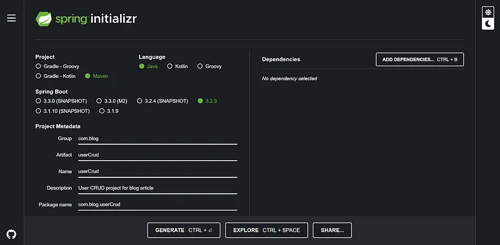
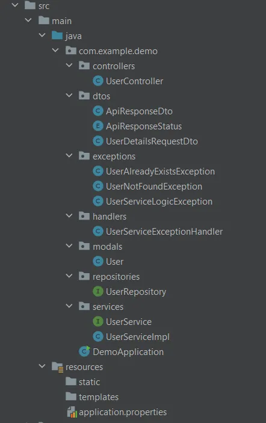
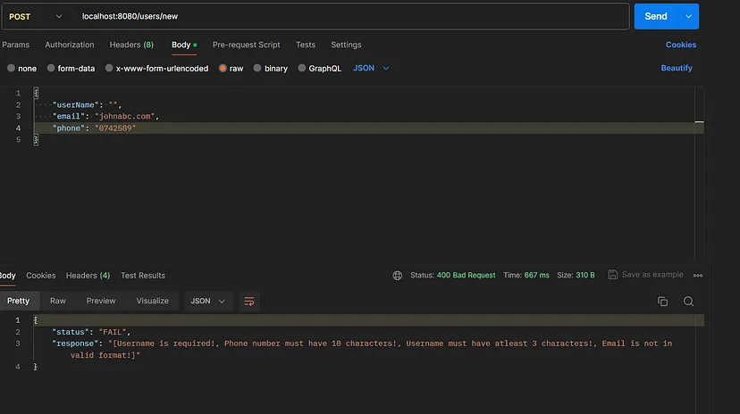
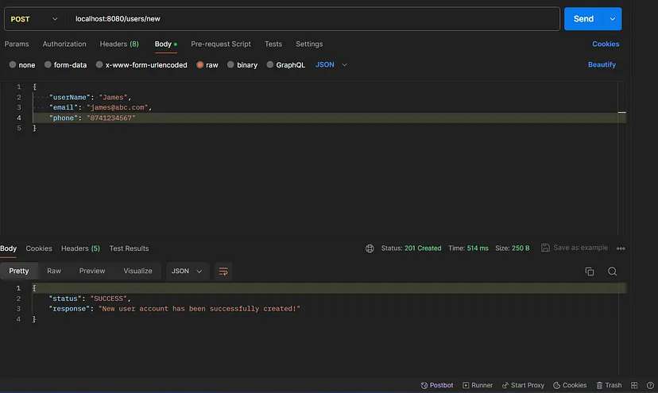
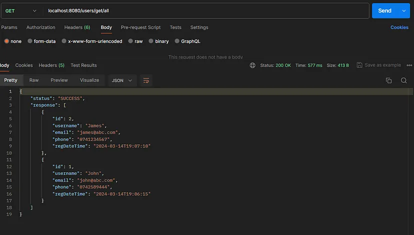
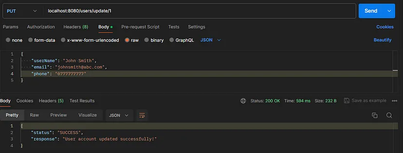

## What is RESTFUL API?
- In the realm of modern web development, RESTful APIs have become a cornerstone for building scalable, efficient, and maintainable web applications. 

- In the world of computers and the internet, applications communicate with each other using a set of rules. 

- RESTful APIs (Application Programming Interfaces) are act as intermediaries between different software applications (client and server), allowing them to communicate and share data with each other over the internet.

- *Representational State Transfer (REST)*: This is a style of building software systems that use standard HTTP methods (like GET, POST, PUT, DELETE) to perform operations on resources (like data stored in a database). It emphasizes simplicity, scalability, and flexibility.

- *API (Application Programming Interface)*: Think of an API as a set of rules and protocols that allow different software applications to talk to each other. It defines how different parts of software systems can interact and exchange data.

- So, when we say a *“RESTful API”*, we’re talking about a set of rules and conventions that govern how applications communicate with each other over the internet using standard HTTP methods.

## Why spring boot?
- Among the myriad of frameworks available for building RESTful APIs, Spring Boot stands out as a robust and developer-friendly option for Java developers.

- Spring Boot makes it simple for developers to create web applications without getting bogged down in complex configuration.

- With Spring Boot, you can quickly build and deploy applications, which is great for trying out ideas or making changes fast.

- It comes with many useful tools and features ready to use, like handling data, security, and more, saving you time and effort.

- Spring Boot can easily connect with other tools and libraries, making it flexible for different needs.
Motive of this article

- In this comprehensive guide, we’ll delve into the process of creating a RESTful CRUD (Create, Read, Update, Delete) API for managing user data using Spring Boot and MySQL. We’ll cover everything from project setup to testing, demonstrating best practices and essential techniques along the way. By the end of this tutorial, you’ll have a solid understanding of how to architect, develop RESTful APIs using Spring Boot.

- Without further ado, let’s embark on this journey of building a RESTful user CRUD API with Spring Boot.

### To build a Spring Boot project, you’ll need a few prerequisites:

- Java Development Kit (JDK): Spring Boot applications are typically written in Java, so you’ll need to have the JDK installed on your system. Spring Boot supports Java 8 and newer versions, so make sure you have a compatible JDK installed.

- Integrated Development Environment (IDE): While you can build Spring Boot applications using a simple text editor and command-line tools, using an IDE can greatly enhance your productivity. Popular choices include IntelliJ IDEA, Eclipse, and Spring Tool Suite (STS).

- Build Tool: Spring Boot projects are typically built using either Maven or Gradle. Maven is more commonly used, but Gradle offers some advantages in terms of flexibility and performance. Choose whichever build tool you’re more comfortable with.

- Understanding of Java: While you don’t need to be an expert, it’s beneficial to have a basic understanding of Java programming.

- Database Knowledge (Optional): Having some knowledge of database concepts and SQL can be beneficial. Spring Boot supports various databases, including MySQL, PostgreSQL, MongoDB, and more.

## Step 1: Setting up project.

- Visit spring initializer and fill in all the details accordingly and at last click on the GENERATE button. Extract the zip file and import it into your IDE.



### 1.1. Add below dependencies in pom.xml file.

```
<dependencies>
      // we'll use this dependency to create RESTful API endpoints, 
      // handle HTTP requests (GET, POST, PUT, DELETE), and return JSON responses.
      <dependency>
       <groupId>org.springframework.boot</groupId>
       <artifactId>spring-boot-starter-web</artifactId>
      </dependency>
      
      // we'll use this dependency to interact with a database, 
      // define JPA entities (data models), perform CRUD operations, 
      // and execute custom database queries.
      <dependency>
       <groupId>org.springframework.boot</groupId>
       <artifactId>spring-boot-starter-data-jpa</artifactId>
      </dependency>

      // we'll use this dependency to establish a connection to 
      // our MySQL database, execute SQL queries, and manage database transactions.
      <dependency>
       <groupId>mysql</groupId>
       <artifactId>mysql-connector-java</artifactId>
       <version>8.0.33</version>
       <scope>runtime</scope>
      </dependency>
      
      // we'll use Lombok annotations (such as @Data, @Getter, @Setter) 
      // in our Java classes to automatically generate common methods, 
      // making your code cleaner and more concise.
      <dependency>
       <groupId>org.projectlombok</groupId>
       <artifactId>lombok</artifactId>
       <optional>true</optional>
      </dependency>
      
      // we'll use this dependency to annotate your Java model classes 
      // with validation constraints (e.g., @NotBlank, @NotNull, @Size) 
      // and automatically validate request data in your RESTful API endpoints.
      <dependency>
       <groupId>org.springframework.boot</groupId>
       <artifactId>spring-boot-starter-validation</artifactId>
      </dependency>

</dependencies>
```


### 1.2. Update application.properties file

```
spring.jpa.hibernate.ddl-auto=update
spring.datasource.url=jdbc:mysql://localhost:3306/usercrud
spring.datasource.username=your localhost username
spring.datasource.password=your localhost password
spring.datasource.driver-class-name=com.mysql.cj.jdbc.Driver
```

## Step 2: Create project structure.

- Create below folder structure inside src folder. We’ll travel through each file one by one.



## Step 3: Create User Model

- Models define the structure and attributes of the data entities that the application manages.

- For example, a User model might include attributes like id, username, email, and password.

- Models often include annotations or custom logic to validate the data before it is persisted to the database. For example, you might use annotations like `@NotBlank`, `@Email`, or `@Size` to enforce constraints on the data.

- Models are typically mapped to database tables using Object-Relational Mapping (ORM) frameworks like Hibernate in Spring Boot applications. They define the structure of the database tables and establish relationships between entities.

```java
// User.java

@Data
@AllArgsConstructor
@NoArgsConstructor
@Entity
@Table(uniqueConstraints = {
        @UniqueConstraint(columnNames = "username"),
        @UniqueConstraint(columnNames = "email")
})
public class User {
    @Id
    @GeneratedValue(strategy = GenerationType.IDENTITY)
    private Long id;

    @NotBlank
    @Size(min=3, max = 20)
    private String username;

    @NotBlank
    @Email
    private String email;

    @NotBlank
    @Size(min=10, max = 10)
    private String phone;

    private LocalDateTime regDateAndTime;

}
```

## Step 4: Create DTO classes

- DTOs (Data Transfer Objects) play a crucial role in Spring Boot CRUD applications by providing a flexible and efficient mechanism for transferring data between layers (Client and Server), optimizing performance, encapsulating business logic, ensuring compatibility, and enhancing security and privacy.

```java
// ApiResponseDto.java

@Data
@AllArgsConstructor
public class ApiResponseDto<T> {
    private String status;
    private T response;

}

// ApiResponseStatus.java

public enum ApiResponseStatus {
    SUCCESS,
    FAIL
}

// UserRegistrationDTO.java

@Data
@AllArgsConstructor
@NoArgsConstructor
public class UserRegistrationDTO {

    @NotBlank(message = "Username is required!")
    @Size(min= 3, message = "Username must have atleast 3 characters!")
    @Size(max= 20, message = "Username can have have atmost 20 characters!")
    private String userName;

    @Email(message = "Email is not in valid format!")
    @NotBlank(message = "Email is required!")
    private String email;

    @NotBlank(message = "Phone number is required!")
    @Size(min = 10, max = 10, message = "Phone number must have 10 characters!")
    @Pattern(regexp="^[0-9]*$", message = "Phone number must contain only digits")
    private String phone;

}
```

## Step 5: Create Exception classes

- Custom exceptions help to improve the clarity and maintainability of the code by providing specific error handling for common scenarios encountered in a CRUD application.
- They allow developers to handle exceptional cases gracefully and communicate errors effectively.

```java
// UserNotFoundException.java

// This exception is thrown when attempting to retrieve a user from the database, but the user does not exist.
public class UserNotFoundException extends Exception{
    public UserNotFoundException(String message) {
        super(message);
    }
}


// UserAlreadyExistsException.java

// This exception is thrown when attempting to create a new user, but a user with the same identifier (e.g., username, email) already exists in the database.
public class UserAlreadyExistsException extends Exception{
    public UserAlreadyExistsException(String message) {
        super(message);
    }
}


// UserServiceLogicException.java

// This exception serves as a generic exception for any unexpected errors or business logic violations that occur within the user service layer.
public class UserServiceLogicException extends Exception{
    public UserServiceLogicException() {
        super("Something went wrong. Please try again later!");
    }
}
```

## Step 6: Create User Repository Interface

- Repository interfaces abstract the details of data access. Instead of directly interacting with data storage mechanisms (such as databases), you define repository interfaces to declare methods for common CRUD (Create, Read, Update, Delete) operations.

- JpaRepository is a part of Spring Data JPA and provides CRUD (Create, Read, Update, Delete) operations for the User entity.

- The first generic parameter User specifies the entity class that this repository manages, implying that User is an entity class.

- The second generic parameter Integer specifies the type of the primary key of the User entity.

```java
// UserRepository.java

@Repository
public interface UserRepository extends JpaRepository<User, Integer> {

    // Developers can define methods in repository interfaces with custom query keywords,
    // and Spring Data JPA automatically translates them into appropriate SQL queries.
    User findByEmail(String email);

    User findByUsername(String userName);

    List<User> findAllByOrderByRegDateTimeDesc();

}
```

- By extending JpaRepository, UserRepository inherits methods for performing various database operations such as saving, deleting, finding, etc., without needing to write these methods explicitly. These methods are provided by Spring Data JPA based on the naming convention of the methods in the repository interface.

## Step 7: Create User Service class

- Service classes in Spring Boot CRUD applications serve as the backbone for implementing business logic, managing transactions, abstracting data access, centralizing business rules, promoting reusability, and handling errors effectively.

- By placing business logic within service classes, you centralize the rules governing your application’s behavior. This makes it easier to maintain and modify the behavior of your application without having to hunt down logic scattered across different parts of the codebase.

```java
@Service
public interface UserService {

    ResponseEntity<ApiResponseDto<?>> registerUser(UserDetailsRequestDto newUserDetails)
            throws UserAlreadyExistsException, UserServiceLogicException;

    ResponseEntity<ApiResponseDto<?>> getAllUsers() 
            throws UserServiceLogicException;

    ResponseEntity<ApiResponseDto<?>> updateUser(UserDetailsRequestDto newUserDetails, int id) 
            throws UserNotFoundException, UserServiceLogicException;

    ResponseEntity<ApiResponseDto<?>> deleteUser(int id) 
            throws UserServiceLogicException, UserNotFoundException;
    
}
```

```java
@Component
@Slf4j
public class UserServiceImpl implements UserService{

    @Autowired
    private UserRepository userRepository;

    @Override
    public ResponseEntity<ApiResponseDto<?>> registerUser(UserDetailsRequestDto newUserDetails)
            throws UserAlreadyExistsException, UserServiceLogicException {

        // logic to register user
    }

    @Override
    public ResponseEntity<ApiResponseDto<?>> getAllUsers() throws UserServiceLogicException {
        // logic to get all users
    }

    @Override
    public ResponseEntity<ApiResponseDto<?>> updateUser(UserDetailsRequestDto newUserDetails, int id)
            throws UserNotFoundException, UserServiceLogicException {
        // logic to update user
    }

    @Override
    public ResponseEntity<ApiResponseDto<?>> deleteUser(int id) throws UserServiceLogicException, UserNotFoundException {
        // logic to delete user
    }
}
```

- Now let’s see how we can implement each of the methods in UserServiceImpl separately.

```java
@Override
public ResponseEntity<ApiResponseDto<?>> registerUser(UserDetailsRequestDto newUserDetails)
        throws UserAlreadyExistsException, UserServiceLogicException {

    try {
        if (userRepository.findByEmail(newUserDetails.getEmail()) != null){
            throw new UserAlreadyExistsException("Registration failed: User already exists with email " newUserDetails.getEmail());
        }
        if (userRepository.findByUsername(newUserDetails.getUserName()) != null){
            throw new UserAlreadyExistsException("Registration failed: User already exists with username "  newUserDetails.getUserName());
        }

        User newUser = new User(
                newUserDetails.getUserName(), newUserDetails.getEmail(), newUserDetails.getPhone(), LocalDateTime.no()
        );

        // save() is an in built method given by JpaRepository
        userRepository.save(newUser);

        return ResponseEntity
                .status(HttpStatus.CREATED)
                .body(new ApiResponseDto<>(ApiResponseStatus.SUCCESS.name(), "New user account has been successfully created!"));

    }catch (UserAlreadyExistsException e) {
        throw new UserAlreadyExistsException(e.getMessage());
    }catch (Exception e) {
        log.error("Failed to create new user account: " + e.getMessage());
        throw new UserServiceLogicException();
    }
}
```

```java
@Override
public ResponseEntity<ApiResponseDto<?>> getAllUsers() throws UserServiceLogicException {
    try {
        List<User> users = userRepository.findAllByOrderByRegDateTimeDesc();

        return ResponseEntity
                .status(HttpStatus.OK)
                .body(new ApiResponseDto<>(ApiResponseStatus.SUCCESS.name(), users)
        );

    }catch (Exception e) {
        log.error("Failed to fetch all users: " + e.getMessage());
        throw new UserServiceLogicException();
    }
}
```

```java
@Override
public ResponseEntity<ApiResponseDto<?>> updateUser(UserDetailsRequestDto newUserDetails, int id)
        throws UserNotFoundException, UserServiceLogicException {
    try {
        User user = userRepository.findById(id).orElseThrow(() -> new UserNotFoundException("User not found with id " + id));

        user.setEmail(newUserDetails.getEmail());
        user.setUsername(newUserDetails.getUserName());
        user.setPhone(newUserDetails.getPhone());

        userRepository.save(user);

        return ResponseEntity
                .status(HttpStatus.OK)
                .body(new ApiResponseDto<>(ApiResponseStatus.SUCCESS.name(), "User account updated successfully!")
        );

    }catch(UserNotFoundException e){
        throw new UserNotFoundException(e.getMessage());
    }catch(Exception e) {
        log.error("Failed to update user account: " + e.getMessage());
        throw new UserServiceLogicException();
    }
    }
```

```java
@Override
public ResponseEntity<ApiResponseDto<?>> deleteUser(int id) throws UserServiceLogicException, UserNotFoundException {
    try {
        User user = userRepository.findById(id).orElseThrow(() -> new UserNotFoundException("User not found with id " + id));

        userRepository.delete(user);

        return ResponseEntity
                .status(HttpStatus.OK)
                .body(new ApiResponseDto<>(ApiResponseStatus.SUCCESS.name(), "User account deleted successfully!")
        );
    } catch (UserNotFoundException e) {
        throw new UserNotFoundException(e.getMessage());
    } catch (Exception e) {
        log.error("Failed to delete user account: " + e.getMessage());
        throw new UserServiceLogicException();
    }
}
```

:::note
- The `@Service` annotation is used to indicate that a class is a service component in the Spring application context.

- The `@Component` annotation is a generic stereotype annotation used to indicate that a class is a Spring component. Components annotated with @Component are candidates for auto-detection when using Spring's component scanning feature.

- The `@Autowired` annotation is used to automatically inject dependencies into Spring-managed beans. When Spring encounters a bean annotated with @Autowired, it looks for other beans in the application context that match the type of the dependency and injects it.

- The `@Slf4j` annotation is not a standard Spring annotation but rather a Lombok annotation used for logging.
:::

## Step 8: Create controller

- A controller class in a Spring Boot application is responsible for handling incoming HTTP requests and returning appropriate HTTP responses.

- It serves as an entry point for processing client requests and often delegates the actual business logic to service classes.

- A controller class is typically annotated with @RestController or @Controller.
Inside the controller class, you define methods that handle specific HTTP requests. These methods are annotated with `@RequestMapping`, `@GetMapping`, `@PostMapping`, `@PutMapping`, `@DeleteMapping`, or other similar annotations to specify the HTTP method and the URL path that the method should respond to.

- Each method in the controller class represents a particular endpoint of the REST API.

- Controller classes often rely on service classes to perform business logic. Dependencies on these service classes are typically injected using the @Autowired annotation or constructor injection.

- Controller methods return the response to the client. This can be done by returning a ResponseEntity object to have more control over the response status code, headers, and body.

```java
@RestController
@RequestMapping("/users")
public class UserController {

    @Autowired
    public UserService userService;

    @PostMapping("/new")
    public ResponseEntity<ApiResponseDto<?>> registerUser(@Valid @RequestBody UserDetailsRequestDto userDetailsRequestDto) throws UserAlreadyExistsException, UserServiceLogicException {
        return userService.registerUser(userDetailsRequestDto);
    }

    @GetMapping("/get/all")
    public ResponseEntity<ApiResponseDto<?>> getAllUsers() throws UserServiceLogicException {
        return userService.getAllUsers();
    }

    @PutMapping("/update/{id}")
    public ResponseEntity<ApiResponseDto<?>> updateUser(@Valid @RequestBody UserDetailsRequestDto userDetailsRequestDto, @PathVariable int id)
            throws UserNotFoundException, UserServiceLogicException {
        return userService.updateUser(userDetailsRequestDto, id);
    }

    @DeleteMapping("/delete/{id}")
    public ResponseEntity<ApiResponseDto<?>> deleteUser(@PathVariable int id)
            throws UserNotFoundException, UserServiceLogicException {
        return userService.deleteUser(id);
    }

}
```

:::note

- The `@PathVariable` annotation is used to extract values from the URI template of the incoming request. E.g., updateUser method.

- The `@RequestParam` annotation is used to extract query parameters from the URL of the incoming request.

- The `@RequestBody` annotation is used to extract the request body of the incoming HTTP request. It binds the body of the request to a method parameter in a controller method, typically for POST, PUT, and PATCH requests. E.g., registerUser method.
:::

## Step 9: Create Exception Handler class

- Exception handlers in Spring Boot applications are used to handle exceptions thrown during the processing of HTTP requests.

- They allow you to centralize error handling logic and provide custom responses to clients when errors occur.

- `@RestControllerAdvice` annotation is used to indicate that the class contains advice that applies to all controllers. This advice will be applied globally to handle exceptions thrown from any controller in the application.

- To create an exception handler, you annotate a method within a controller class with @ExceptionHandler and specify the type(s) of exceptions it can handle.

```java
// UserServiceExceptionHandler.java

@RestControllerAdvice
public class UserServiceExceptionHandler {

    @ExceptionHandler(value = UserNotFoundException.class)
    public ResponseEntity<ApiResponseDto<?>> UserNotFoundExceptionHandler(UserNotFoundException exception) {
        return ResponseEntity.status(HttpStatus.NOT_FOUND).body(new ApiResponseDto<>(ApiResponseStatus.FAIL.name(), exception.getMessage()));
    }

    @ExceptionHandler(value = UserAlreadyExistsException.class)
    public ResponseEntity<ApiResponseDto<?>> UserAlreadyExistsExceptionHandler(UserAlreadyExistsException exception) {
        return ResponseEntity.status(HttpStatus.CONFLICT).body(new ApiResponseDto<>(ApiResponseStatus.FAIL.name(), exception.getMessage()));
    }

    @ExceptionHandler(value = UserServiceLogicException.class)
    public ResponseEntity<ApiResponseDto<?>> UserServiceLogicExceptionHandler(UserServiceLogicException exception) {
        return ResponseEntity.badRequest().body(new ApiResponseDto<>(ApiResponseStatus.FAIL.name(), exception.getMessage()));
    }

    @ExceptionHandler(value = MethodArgumentNotValidException.class)
    public ResponseEntity<ApiResponseDto<?>> MethodArgumentNotValidExceptionHandler(MethodArgumentNotValidException exception) {

        List<String> errorMessage = new ArrayList<>();

        exception.getBindingResult().getFieldErrors().forEach(error -> {
            errorMessage.add(error.getDefaultMessage());
        });
        return ResponseEntity.badRequest().body(new ApiResponseDto<>(ApiResponseStatus.FAIL.name(), errorMessage.toString()));
    }

}
```

## Step 10: Run your application and test with postman/frontend😊.

Register user failed: User details invalid!



Register user successful




Retrieve all users




Update the details of John




Delete user john


Hey guys, that’s it. We have successfully developed rest crud API for a user management system.
