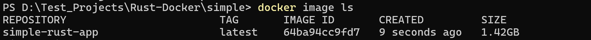
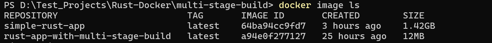

In this blog post, we will learn how to get started with MERN stack development. The MERN stack consists of four technologies: MongoDB, Express.js, React, and Node.js. We will cover the basics of each technology and guide you through building a simple web application using the MERN stack.

<!-- truncate -->

Create a Docker image for your Rust application with minimal image size ⚒️


New to Docker 🧐,

Ever tried building the docker image of your application with just simple/base _Dockerfiles_, giving you large image sizes ( >800Mb ) which ended up eating up all your RAM.😭

Don’t worry 😙, you aren’t alone…

<hr/>

Here, I am going to be talking specifically about building a lightweight image for your Rust Application. Will be releasing for other applications in the (not so distant 😅) future…

> _According to AWS,_
>
> _Docker is a software platform that allows you to build, test, and deploy applications quickly. Docker packages software into standardized units called containers that have everything the software needs to run including libraries, system tools, code, and runtime. Using Docker, you can quickly deploy and scale applications into any environment and know your code will run._
>
> *Chill*😄 _It’s basically solves the problem of “It RUNS of my MACHINE”. It allows you to run your application as a container on any OS having the Docker Daemon ( right now which is practically any OS )_

Let’s talk about methods that can be used to make your image as light as possible:

- Using Multi-Stage builds
- Using light weight images like _alpine_, _slim_ etc. to run your executable

Building an image using these methods vs building with a simple/base Dockerfile has a lot of difference in terms of the image size. ( I’m talking about 1Gb --- 20Mb )

That can make quite a lot of difference when dealing with an actual infrastructure. 😤And the best way to understand the difference is to do it firsthand and compare the sizes. 😉

( Psst🐱 I’ll be using a simple Rust app for creating the image )

> Repo link https://github.com/AMS003010/Rust-Docker

<hr/>

## Create an Image with a Simple Dockerfile

### Prerequisites:

- Rust installed
- _Cargo_ installed ( Package manager for Rust📦 )

### Steps:

```
cargo new simple
```

```
cd simple
nano Dockerfile
```

Paste in the below, to the _Dockerfile_

```
# Use the official Rust image from Docker Hub
FROM rust:latest

# Set the working directory inside the container
WORKDIR /usr/src/myapp

# Copy the project files into the container
COPY . .

# Build the project
RUN cargo build --release

# Set the default command to run the application
CMD ["./target/release/myapp"]
```

Now since we have the docker configuration file ready lets build it ( Make sure to have your Docker Daemon😈 running… )

```
Docker build -t simple-rust-app .
```

After the image has been built, check for in the docker images



You can see that the image “simple-rust-app” that we built has a size of 1.42Gb 🤯.

Let’s now see the optimized way to do it…

<hr/>

## Create an Image with Multi-Stage Builds

Here we are going to be using the same Rust application but with changes only to the _Dockerfile_.

Just notice, how by adding few more lines to your _Dockerfile_ will give you a light and optimized build.

So what are we doing in Multi-Stage Build🧐…

Our main focus here is to have only the final executable which is run on a minimal distro like _alpine_ to give us the most optimized performance. This includes compilers like _rustc_, package managers like _cargo_ and even build artifacts which are not actually required and should not be included in the final image. So all the unnecessary components have to be removed.

For this we build our application and fetch all the required dependencies in a image like rust:1.75.0 and then we transfer the necessary files from the build stage to another base image like _alpine_ and run the executable there.

Also, some security practices tips 💡

- The executable should be run on the base image as a non-privileged user and not as root user.
- The number of packages should be kept minimal as necessary, because fewer packages means fewer vulnerability risks ( also smaller size😤 ).

Now that we have understood Multi-Stage Builds let’s implement. Paste the below into your _Dockerfile_.

```
ARG RUST_VERSION=1.75.0
ARG APP_NAME=singularity

FROM rust:${RUST_VERSION}-alpine AS build
ARG APP_NAME
WORKDIR /app

RUN apk add --no-cache clang lld musl-dev git

RUN --mount=type=bind,source=src,target=src \
    --mount=type=bind,source=Cargo.toml,target=Cargo.toml \
    --mount=type=bind,source=Cargo.lock,target=Cargo.lock \
    --mount=type=cache,target=/app/target/ \
    --mount=type=cache,target=/usr/local/cargo/git/db \
    --mount=type=cache,target=/usr/local/cargo/registry/ \
cargo build --locked --release && \
cp ./target/release/$APP_NAME /bin/server


FROM alpine:3.18 AS final

ARG UID=10001
RUN adduser \
    --disabled-password \
    --gecos "" \
    --home "/nonexistent" \
    --shell "/sbin/nologin" \
    --no-create-home \
    --uid "${UID}" \
    appuser
USER appuser

# Copy the executable from the "build" stage.
COPY --from=build /bin/server /bin/

# What the container should run when it is started.
CMD ["/bin/server"]
```

Also remember to paste your Rust Version in the “ARG RUST_VERSION=rust_version”.

You can find that with

```
cargo --version
```

Now build it with

```
docker build -t rust-app-with-multi-stage-build .
```

Once the build has completed, let’s compare the build sizes 🤔



From 1.42 Gb to 12 Mb, is the power of Multi-Stage Builds 😌

Hope you enjoyed it !!!

Stay tuned and Do make sure to check out my articles [@ams_132](https://medium.com/@ams_132) !!!

<hr/>

So always remember _keeping your Dockerfile minimal will keep your Docker image maximum_.😉

_Sayonara until next time…_  
