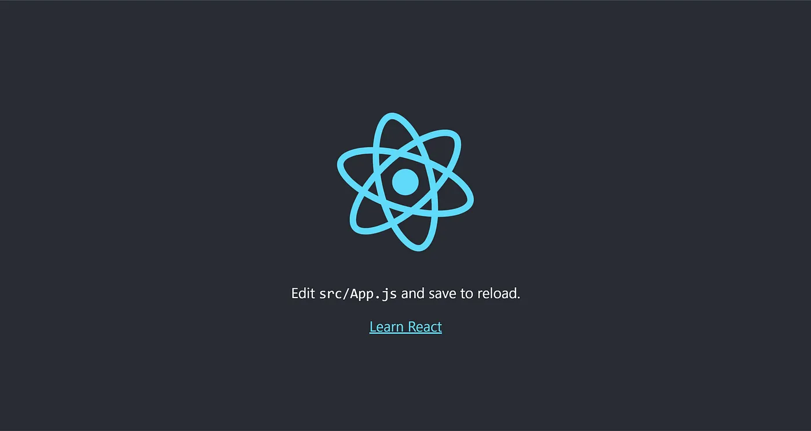
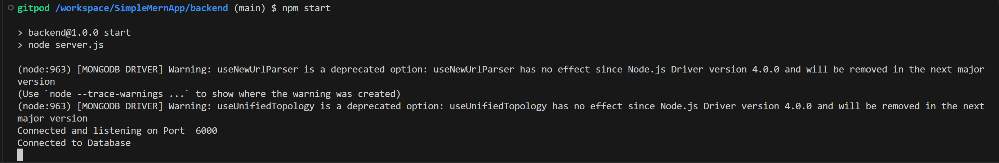
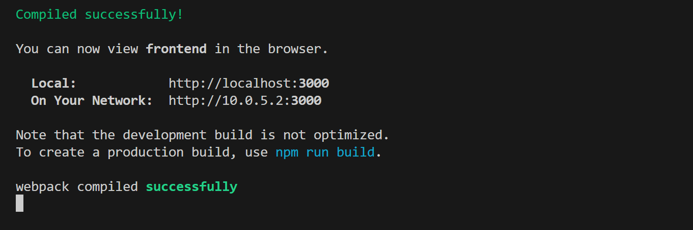
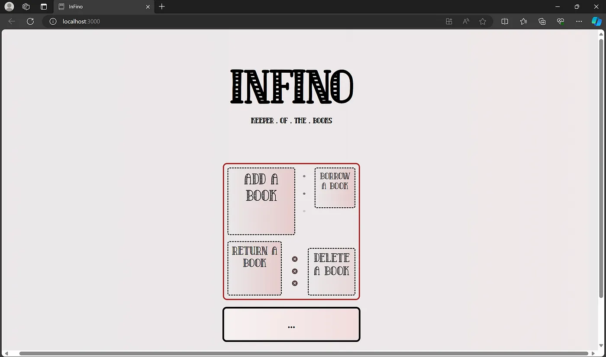

A Deep dive into building your first MERN application from scratch


_CAUTION_ ⚠️ _THIS IS A COMPREHENSIVE STARTER FRIENDLY GUIDE TO MERN_

> Hello Guys,
>
>Here we gonna build a simple library management application using the MERN stack, making sure all the basics regarding the stack is covered from building an API with Express.js to building a full blown application in which > the React app interacts with a backend Database.

🚨🚨🚨 MAKE SURE TO HAVE [NODE](https://nodejs.org/en/download/package-manager/current) INSTALLED.🚨🚨🚨

> So let’s start right away!!

_This is gonna be a beginner friendly, so don’t worry_ 😁

If you just want to skip to the repository, find the Github repo link below

> Github Repo link — https://github.com/AMS003010/SimpleMernApp

Show your support by starring ⭐ the repo

## What we’re covering
 - What a Web Framework is?
 - Configuring a _MongoDB Atlas_ Cluster
 - Building a API with _Express.js_
 - Creating a React App
 - Setting a Proxy from your Backend API server to the Frontend React App
 - Styling and making Requests from the frontend

## What is a Web Framework?
You might have heard of Unintelligible acronyms like MERN, MEVN, MEAN, LAMP, PERN etc. These are examples of some of the most popular web frameworks. A Web Framework is essentially a collection of tools or libraries that helps to build a full blown web application. Using frameworks, helps make the web development process faster, flexible and more transparent.

MERN — MongoDB, Express.js, React.js, Node.js

MEVN — MongoDB, Express.js, Vue.js, Node.js

MEAN — MongoDB, Express.js, Angular.js, Node.js

PERN — PostgreSQL, Express.js, React.js, Node.js

BEHM — Bun, Elysia, HTMX, MongoDB

and many more (seriously there’s no end to that😅)

> __Fun fact:__ HTMX has been making waves in the community due to its ability to be written in a hypertext format (that is what HTML is 😌) and being able to give you access to AJAX, CSS Transitions, WebSockets and Server Sent Events directly in HTML, using attributes.

## Configuring a MongoDB Atlas Cluster
Lets configure a MongoDB Atlas cluster. Here MongoDB will be used as a Database to store the books (with their details). You can either download MongoDB locally on your device (MongoDB Compass is a GUI tool to query and analyze the database) or use MongoDB Atlas to store your data in a serverless environment. I am going to using MongoDB Atlas

Create a account on https://www.mongodb.com/cloud/atlas/register

Click on Create a deployment

_Steps_
 - Choose a __configuration__ of your liking( I chose __M0__ which was Free and suitable for our application )
 - Choose your provider( I chose the default choice )
 - Click __Create Deployment__

This should bring you to a Dashboard, Click on __Connect__

_Steps_
 - Add a username and password
 - For connection methods, choose Drivers and then choose Node (with your node version)
 - Copy the __connection string__, it looks like the one below

```
mongodb+srv://<username>:<password>@cluster0.tpgdder.mongodb.net/?retryWrites=true&w=majority&appName=Cluster0
```
 - Replace the __username__ and __password__ in the string
 - For connection methods, choose __Drivers__ and then choose Node (with your node version)
 - Click on __Network Access__ and add your __IP Address__

Now You are all done Configuring MongoDB !!! 🎉

## Building a API with Express.js

> An API is an acronym for a __Application Programming Interface__. An API is an interface which helps two services to communicate and interact with each other through requests and responses.

Lets get to building an API !!!😁

First make the Project Folder

```
mkdir SimpleMernApp
mkdir backend
cd backend
touch .env
npm init -y
npm install nodemon -g
```

Lets install the dependencies

```
npm install express mongoose dotenv cors express-async-errors
```

Open your package.json file ( This file handles your dependencies ) and add the below code in under the scripts section

```
"start": "node server.js",
"dev": "nodemon server.js"
```

Create a _.env_ file and add your environment variables into it

```
MONGO_URI=mongodb+srv://<username>:<password>@cluster0.tpgdder.mongodb.net/?retryWrites=true&w=majority&appName=Cluster0
PORT=6000
```

Create a file called db.js and paste the below code. This uses the mongoose module to connect to the _MongoDB Atlas_ Cluster with your mongo connection string.

```
//Contents of db.js
const mongoose = require('mongoose');
require('dotenv').config() //module for managing environment variables

const connection = async () => {
    const connectionParams = {
        useNewUrlParser: true,
        useUnifiedTopology: true,
    };
    try {
        await mongoose.connect(process.env.MONGO_URI,connectionParams);
        console.log("Connected to Database");
    } catch (error) {
        console.log("Not Connected to Databse",error);
    }
}
module.exports = connection;
```

Create a model.js file and paste the code below. This file contains the MongoDB database schema, which defines the rules that each field in a document follows. In MongoDB, each record in a database is represented as a document.

```
//Contents of model.js
const mongoose = require('mongoose');

const Schema = mongoose.Schema

const userSchema = new Schema({
    name: {
        type: String,
        required: true,
        unique: true
    },
    author: {
        type: String,
        required: true
    },
    publication: {
        type: String,
        required: true
    },
    series: {
        type: String,
        required: true
    },
    borrowed: {
        type: String,
        default: null
    },
    borrowed_on: {
        type: Number,
        default: null
    }
});

const DataModel = mongoose.model('library_data',userSchema);

module.exports = {DataModel};
```

Create a route.js file and paste the below code. This file defines the Express routes and their respective controller functions. Controller functions are simply functions that define the action to be taken upon making an API request at that route.

```
//Contents of route.js
const express = require('express');
const {DataModel} = require('./model');

const router = express.Router()

router.get("/getbooks",async (req,res) => {
    const data = await DataModel.find();
    res.status(200).send({"data":data});
} )

router.post("/addbook", async (req,res) => {
    const body = await req.body;
    const sendObj = await new DataModel({
        "name": body.name,
        "author": body.author,
        "publication": body.publication,
        "series": body.series
    }).save();
    res.status(200).send({"msg":"Book added"});
});

module.exports = router;
```

Create a file called server.js and paste the below code. This file runs the express server at the assigned “PORT”.

```
//Contents of server.js
require('dotenv').config();
require('express-async-errors');
const express = require('express');
const app = express();
const connection = require('./db');
const cors = require('cors'); //Takes care of cross-orign requests
const Routes = require('./route'); //Routes being imported from route.js 

connection();

app.use(express.json());
app.use((req,res,next) => {
    console.log(req.path,req.method)
    next()
})
app.use(cors());

app.use('/api',Routes);

app.listen(process.env.PORT,() => {
    console.log("Connected and listening on Port ",process.env.PORT);
})
```

> “npm run dev” runs nodemon server.js. This module helps speed up the development process. Trust me 🫡😌

Run the server ( during the developing phase ) with command.

```
npm run dev
```

Run the server ( during the production phase ) with command

```
npm start
```

Running either of these commands, gets an _Express_ server running at port 6000 ready and waiting to receive requests.

Also make sure to test out the API endpoints with an application like [POSTMAN](https://www.postman.com/downloads/), [Apache JMeter](https://jmeter.apache.org/download_jmeter.cgi) etc.

Yahoo!!! You just Created an API🎉

## Creating a React App

Let’s now get into some frontend, which will define how your website will behave and look.

Type the below command to create a react app. Do this in the root folder.

```
npx create-react-app frontend
```

This creates a react app named frontend ( You can name it anything you like )

Once it is complete, type the command

```
npm install react-router-dom
npm start
```

This will run the React App at port 3000. Navigate to _http://localhost:3000/_

Check for a window similar to the below. If you do, then you have successfully installed a React App.🎉



## Setting a Proxy from your Backend API server to the Frontend React App

Type the below code in the package.json file of your frontend

```
"proxy": "http://localhost:6000"
```

By doing this any request made to your development server (the one serving your frontend application) will be forwarded to `http://localhost:4000`. This is often used when you have a separate backend server running on `localhost:4000`, and you want to avoid issues related to cross-origin requests during development.

Now, you can be sure that requests made on the frontend( React ) will be proxied( forwarded ) to the backend ( Express ). 😉

## Styling and making Requests from the frontend

Now let’s get on to styling 🎨 and make the frontend look Gooood….

Here 😼 is where good old CSS and HTML comes in

This below is the frontend folder structure


Only the above files in the src folder is necessary for this project, the rest of the files can be removed like App.test.js, reportWebVitals.js etc.

> Also check the repository, as I had made some changes to the index.js file. Also add the screw.png image to your img folder

To use some custom fonts in my project, I downloaded the respective .ttf file and stored them in the fonts folder and copied the below code into the App.css file

```
@font-face {
  font-family: "Old English";   /*Can be any text*/
  src: local("Old English"),
    url("./fonts/OldeEnglish.ttf") format("truetype");
}

@font-face {
  font-family: "Subway";   /*Can be any text*/
  src: local("Subway"),
    url("./fonts/subway.ttf") format("truetype");
}
w  
@font-face {
  font-family: "Quad Serif";   /*Can be any text*/
  src: local("Quad Serif Line"),
    url("./fonts/QuadSerifLine.ttf") format("truetype");
}

@font-face {
  font-family: "Krakoan";   /*Can be any text*/
  src: local("Krakoan"),
    url("./fonts/Krakoan.ttf") format("truetype");
}
```

The React framework is considered very developer-friendly because of its component-based architecture. Components in React are reusable and encapsulated pieces of code that can represent parts of a user interface, such as a button, form, or even entire sections or pages of a web application. By breaking down the UI into components, React promotes code organization, reusability, and maintainability, making it easier for developers to manage and scale their projects.

> All the components in this project is added to the “components” folder

```
//Contents of addBook.js
import {useState} from 'react';

const AddBook = ({cardState,setCardState}) => {
    const [name,setName] = useState('');
    const [author,setAuthor] = useState('');
    const [pub,setPub] = useState('');
    const [ser,setSer] = useState('');
    const [res,setRes] = useState('');

    const handleClick = async () => {
        const response = await fetch('/api/addbook', {
            method: 'POST',
            headers: { 'Content-Type': 'application/json' },
            body: JSON.stringify({
                "name":name,
                "author":author,
                "publication":pub,
                "series":ser
            })
        });

        if (!response.ok) {
            console.log("Unable to add a book");
            return;
        }

        const data = await response.json();
        console.log(data.msg);
        setRes(data.msg)
        if(data.msg === "Book added") {
            setCardState(0);
        }
    };

    return(
        <div className="cardMainContainer">
            Book name: <input 
                type="text" 
                className="input1"
                onChange={(e) => {setName(e.target.value)}}
                value={name}
            />
            Author: <input 
                type="text" 
                className="input2"
                onChange={(e) => {setAuthor(e.target.value)}}
                value={author}
            />
            Publications: <input 
                type="text" 
                className="input3"
                onChange={(e) => {setPub(e.target.value)}}
                value={pub}
            />
            Series: <input 
                type="text" 
                className="input4"
                onChange={(e) => {setSer(e.target.value)}}
                value={ser}
            />
            <button className="actionButton" onClick={handleClick}>Add!!</button>
            <div>{res ? res : <p></p>}</div>
        </div>
    )
}

export default AddBook;
```

```
//Contents of nothBook.js
const NotBook = () => {
    return(
        <p style={{fontSize:'1.5rem',fontWeight:'900'}}>...</p>
    )
}

export default NotBook;
```

```
//Contents of home.js
import {useState} from 'react';

import AddBook from './addBook';
import NotBook from './nothBook';
import screw from '../img/screw.png'

const Home = () => {
    const [cardState,setCardState] = useState(0);
    const cardList = [<NotBook />,<AddBook cardState={cardState} setCardState={setCardState}/>]
    return(
        <div className='mainContainer'>
            <h1 className="mainHeading">Infino</h1>
            <h1 className="mainsubHead">keeper . of . the . books</h1>
            <div className="mainWrapper">
                <div className="div1" onClick={() => setCardState(1)}>Add a book</div>
                <div className="div2" onClick={() => setCardState(1)}>Borrow a book</div>
                <div className="div3" onClick={() => setCardState(1)}>Return a book</div>
                <div className="div4" onClick={() => setCardState(1)}>Delete a book</div>  
                <div className="div5">
                    <div className="dot1">.</div>
                    <div className="dot2">.</div>
                    <div className="dot3">.</div>
                </div>
                <div className='screwComp'>
                    
                    
                    
                </div>  
            </div>
            <div className='cardWrapper'>{cardList[cardState]}</div>
            <div className='madeWithLove'>made with ❣️ by &nbsp;<span>abhijith</span></div>
        </div>
    )
}

export default Home;
```

```
/*Contents of index.css*/
@import url('https://fonts.googleapis.com/css2?family=Poor+Story&display=swap');

body,html {
  margin: 0px;
  padding: 0px;
  background: linear-gradient(to right,rgb(235, 232, 233),rgb(240, 233, 233));
}

.pages {
  align-items: center;
  text-align: center;
}

.mainContainer {
  display: flex;
  align-items: center;
  justify-content: center;
  flex-direction: column;
}

.mainWrapper {
  font-family: Quad Serif;
  width: 20rem;
  height: 20rem;
  border: 3px solid  brown;
  position: relative;
  margin-top: 5rem;
  border-radius: 10px;
  margin-bottom: 1rem;
}

.mainHeading {
  font-family: Quad Serif;
  font-size: 6rem;
  margin-bottom: 0;
  margin-top: 5rem;
}

.mainsubHead {
  font-family: Quad Serif;
  font-size: 1rem;
}

.div1 {
  position: absolute;
  font-size: 2rem;
  padding: 0.4rem;
  width: 9rem;
  height: 9rem;
  border: 2px dashed black;
  left: 0.5rem;
  top: 0.5rem;
  border-radius: 5px;
  transform: scale(1);
  transition: transform ease 0.5s;
  background: linear-gradient(to right,rgb(235, 232, 233),rgb(230, 204, 204));
}

.div1:hover {
  transform: scale(1.2);
  cursor: pointer;
}

.div2 {
  position: absolute;
  font-size: 1.2rem;
  padding: 0.4rem;
  width: 5rem;
  height: 5rem;
  border: 2px dashed black;
  right: 0.5rem;
  top: 0.5rem;
  border-radius: 5px;
  transform: scale(1);
  transition: transform ease 0.5s;
  background: linear-gradient(to right,rgb(235, 232, 233),rgb(230, 204, 204));
}

.div2:hover {
  transform: scale(1.4);
  cursor: pointer;
}

.div3 {
  position: absolute;
  font-size: 1.5rem;
  padding: 0.4rem;
  width: 7rem;
  height: 7rem;
  border: 2px dashed black;
  left: 0.5rem;
  bottom: 0.5rem;
  border-radius: 5px;
  transform: scale(1);
  transition: transform ease 0.5s;
  background: linear-gradient(to right,rgb(235, 232, 233),rgb(230, 204, 204));
}

.div3:hover {
  transform: scale(1.4);
  cursor: pointer;
}

.div4 {
  position: absolute;
  padding: 0.4rem;
  font-size: 1.6rem;
  width: 6rem;
  height: 6rem;
  border: 2px dashed black;
  right: 0.5rem;
  bottom: 0.5rem;
  border-radius: 5px;
  transform: scale(1);
  transition: transform ease 0.5s;
  background: linear-gradient(to right,rgb(235, 232, 233),rgb(232, 216, 216));
}

.div4:hover {
  transform: scale(1.4);
  cursor: pointer;
}

.div5 {
  position: absolute;
  width: 1rem;
  height: 3rem;
  font-size: 2.3rem;
  left: 56%;
}

@keyframes flashColor1 {
  0% {
    color: rgb(238, 215, 215);
  }
  50% {
    color: rgb(90, 68, 68); /* Change to the color you want during the flash */
  }
  100% {
    color: rgb(155, 144, 144);
  }
}

@keyframes flashColor2 {
  0% {
    color: rgb(155, 144, 144);
  }
  50% {
    color: rgb(238, 215, 215); /* Change to the color you want during the flash */
  }
  100% {
    color: rgb(90, 68, 68);
  }
}

@keyframes flashColor3 {
  0% {
    color: rgb(90, 68, 68);
  }
  50% {
    color: rgb(155, 144, 144); /* Change to the color you want during the flash */
  }
  100% {
    color: rgb(238, 215, 215);
  }
}

.div5 .dot1 {
  color: rgb(123, 104, 104);
  font-family: 'Courier New', Courier, monospace;
  animation: flashColor1 1s infinite alternate;
}

.div5 .dot2 {
  color: rgb(78, 58, 58);
  font-family: 'Courier New', Courier, monospace;
  animation: flashColor2 1s infinite alternate;
}

.div5 .dot3 {
  color: rgb(148, 129, 129);
  font-family: 'Courier New', Courier, monospace;
  animation: flashColor3 1s infinite alternate;
}

.cardWrapper {
  position: relative;
  border: 4px solid black;
  border-radius: 10px;
  width: 20rem;
  height: max-content;
  background: linear-gradient(to right,rgb(247, 242, 242),rgb(242, 221, 221));
  margin-bottom: 5rem;
}

.cardMainContainer {
  display: flex;
  flex-direction: column;
  text-align: left;
  padding: 0.8rem;
}

.cardMainContainer .input1,.input2,.input3,.input4 {
  width: 10rem;
  height: 1.5rem;
  border-radius: 5px;
  margin-top: 0.5rem;
  border-style: dashed;
  margin-bottom: 0.2rem;
}

.actionButton {
  border: 2px dashed #767676;
  border-radius: 5px;
  width: max-content;
  padding-left: 1rem;
  padding-right: 1rem;
  padding-top: 0.3rem;
  padding-bottom: 0.3rem;
  margin-top: 1rem;
}

.actionButton:hover {
  border-style: solid;
  border-color: black;
  cursor: pointer;
}

.madeWithLove {
  font-family: Poor Story;
  text-align: right;
  width: 100%;
  font-size: 1.5rem;
  padding: 1rem;
  padding-right: 1.5rem;
}

.madeWithLove span {
  font-family: Krakoan;
  letter-spacing: 0.2rem;
  margin-right: 1rem;
}

.screwComp {
  display: flex;
  flex-direction: column;
  position: absolute;
  right: 9rem;
  bottom: 1rem;
}

.screwComp img {
  width: 1rem;
  height: 1rem;
  margin-bottom: 0.8rem;
}
```

Now lets talk about the most important file in React, which is the App.js. It is in this file where we control which component gets rendered for which route.

```
//Contents of App.js
import { BrowserRouter, Routes, Route} from 'react-router-dom';
import "./App.css";

import Home from './components/home';

function App() {
  return (
    <div className="App">
      <BrowserRouter>
        <div className='pages'>
          <Routes>
            <Route 
            path='/'
            element={<Home />}
            />
          </Routes>
        </div>
      </BrowserRouter>
    </div>
  );
}

export default App;
```

Congrats you just completed your MERN Project 🎊🥳

## Lets have it working

Lets run it. Make sure you are in your root directory. Also make sure you have the .env file in your backend folder with the your environment variables. Now run these commands.

```
cd backend/
npm install
npm start
```

The output is



Now open another terminal in the root directory. Run the below command

```
cd frontend/
npm install
npm start
```

The output is



Open _http://localhost:3000_ to view your react application

It will look like the below (The UI isn’t the best, I know 😅)



Only the addbook route has been written😅, so only the “Add A Book” feature works. Consider adding the following features
 - Borrow a Book
 - Return a Book
 - Delete a Book

Good luck !! 😁👍


Stay tuned and Do make sure to check out my articles [@ams_132](https://medium.com/@ams_132) !!!

_Sayonara… Until next time_