In the era of cloud-native development, microservices have emerged as a popular architectural style for building scalable, resilient, and maintainable applications. This guide provides an introduction to microservices, explores their benefits, and offers a step-by-step tutorial on developing a microservice application using Spring Boot and MongoDB.

<!-- truncate -->

## 1. Understanding the importance Microservices

- Microservices are an architectural style that structures an application as a collection of small, loosely coupled services. Each service is self-contained, focused on a specific business functionality, and can be developed, deployed, and scaled independently. This modular approach to software design offers several benefits, including increased agility, scalability, and resilience.
- Microservices architecture is a design pattern that breaks down complex applications into smaller, more manageable services. Each service is responsible for a specific functionality and can communicate with other services through well-defined APIs. This modular approach enables faster development cycles, easier maintenance, and better scalability.

### 1.1. Monolithic vs Microservices

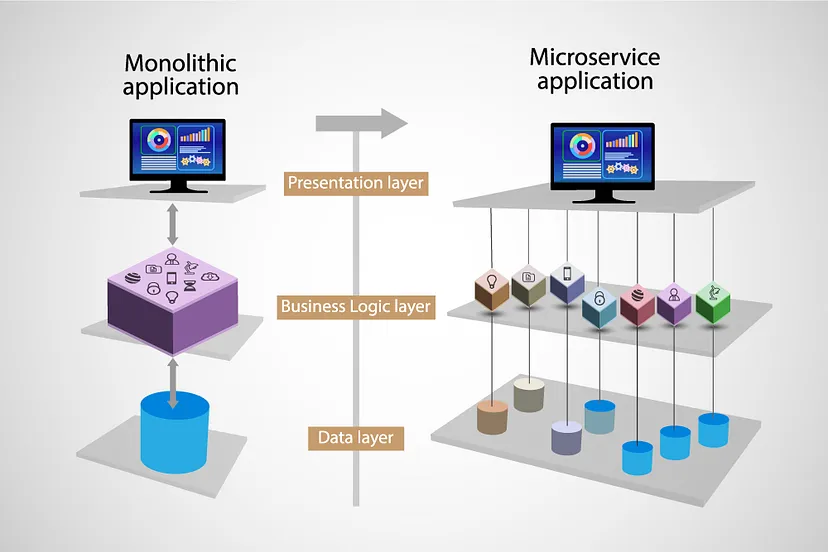

**Monolithic Architecture:**

- Imagine all your items (toys, books, clothes, etc.) are stored in one big box. Finding something specific can be challenging because everything is jumbled together. If you need to update or change something, you have to dig through the entire box, which can be time-consuming and error-prone.
- Same going to happen in software development. Monolithic architectures are like one big chunk of code where all components of an application are tightly integrated. Making changes or updates to one part of the code can have unintended consequences on other parts, leading to complex and risky development and maintenance processes.

**Microservices Architecture:**

- Now, imagine your items are stored in separate, labeled containers (toys in one box, books in another, clothes in a third, etc.). Finding something specific is much easier because everything is organized and accessible. If you need to update or change something, you only need to focus on the relevant container, making the process faster and more efficient.
- Similarly, microservices architecture breaks down an application into small, independent services, each responsible for specific functionalities. This modular approach allows for faster development cycles, easier maintenance, and better scalability. Each service can be developed, deployed, and scaled independently, promoting agility and resilience in software development.

Let’s deep dive into the differences of these 2 patterns.

#### 1.1.1. Size and Structure

- **Monolithic:** One large, interconnected structure where all components of an application are tightly integrated.
- **Microservices:** Composed of small, independent services, each responsible for specific functionalities of an application.

#### 1.1.2. Development and Deployment

- **Monolithic:** Typically developed and deployed as a single unit.
- **Microservices:** Each service can be developed and deployed independently, allowing for faster iteration and updates.

#### 1.1.3. Modification

- **Monolithic:** Making changes often requires modifying the entire codebase. This can be time-consuming and risky, as a change in one part of the code may inadvertently affect other parts.
- **Microservices:** Each service is focused on a specific functionality, making it easier to modify and update. Changes can be made to individual services without impacting the entire application. This modular approach allows for faster development cycles and easier maintenance.

#### 1.1.4. Scaling

- **Monolithic:** Scaling a monolithic application usually involves replicating the entire application, including components that may not require additional resources. This can lead to inefficient resource utilization.
- **Microservices:** Enables granular scaling, where only the services experiencing high demand need to be scaled. This results in more efficient resource utilization and better performance scalability.

#### 1.1.5. Technology Stack

- **Monolithic:** Usually built using a single technology stack (e.g., one programming language, framework).
- **Microservices:** Services can be built using different technologies best suited for their specific functionalities.

#### 1.1.6. Fault Isolation and Resilience

- **Monolithic:** A failure in one part of the application can bring down the entire system.
- **Microservices:** Faults are isolated to individual services, so a failure in one service does not necessarily impact the entire application, enhancing resilience.

#### 1.1.7. Data Management

- **Monolithic:** Typically uses a single database shared by all components, which can lead to data coupling and scalability challenges.
- **Microservices:** Each service can have its own database, allowing for better data isolation and scalability.

#### 1.1.8. Testing

- **Monolithic:** Testing can be complex and time-consuming, as changes may impact multiple functionalities.
- **Microservices:** Testing can be more focused and granular, with each service tested independently, facilitating easier debugging and maintenance.

#### 1.1.9. Team Organization

- **Monolithic:** Development teams often work on the same codebase, leading to potential conflicts and dependencies.
- **Microservices:** Teams can be organized around individual services, allowing for greater autonomy and faster development cycles.

#### 1.1.10. Communication and Integration

- **Monolithic:** Communication between different components typically occurs through function or method calls within the same codebase.
- **Microservices:** Communication between services usually happens over network protocols like HTTP or message queues, promoting loose coupling and interoperability.

## 2. Developing a Microservice application

- Great! Now that we have a clear understanding of microservices, let’s embark on developing a simple microservice project.

- Crafting an expense tracker? In this example, users can add expenses, with each expense associated with a category. To keep this example simple, I’ll omit user management. Thus, we’ll focus on two microservices: the expense-service and category-service.

- Creating a microservice application involves multiple steps. Let’s navigate through them methodically, one step at a time.

### 2.1. Developing service registry

- A service registry, like Eureka Server, plays a pivotal role in managing the dynamic nature of microservice architectures.
- The Service Registry serves as a centralized repository for storing information about all the available services in the microservices architecture. This includes details such as IP addresses, port numbers, and other metadata required for communication.
- When a microservice instance (like expense or category) starts up, it registers itself with the Service Registry.
- As services start, stop, or scale up/down dynamically in response to changing demand, they update their registration information in the Service Registry accordingly.
- When one service needs to communicate with another (e.g., expense needs to call category), it consults the Service Registry to obtain the necessary connection details. By querying the Service Registry, services can discover the locations and endpoints of the target services dynamically, without needing to maintain hardcoded configurations.
- In scenarios where multiple instances of a service (such as expense) are running across different servers, the Service Registry can facilitate load balancing by distributing incoming requests among these instances.
- By maintaining awareness of all available instances, the Service Registry helps optimize resource utilization and improve system performance.

- So, Let’s create a service registry for our application.

#### 2.1.1. Create a spring boot project as below.

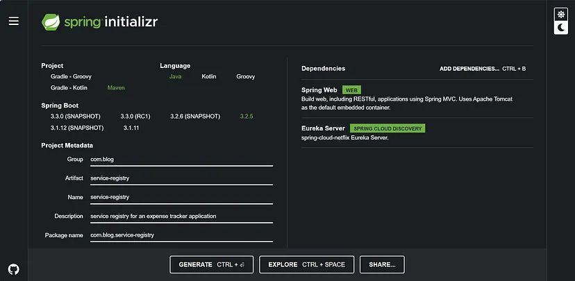

#### 2.1.2. Make Changes in Your application.properties File.

```
# application.properties

# This name is used for identifying the application in the environment
spring.application.name=service-registry

# By default, Eureka Server uses port 8761 for communication with client applications.
# If you want you can change
server.port=8761

# Disables the Eureka client's capability to fetch the registry
# of other services from the Eureka server, as it is not acting as a Eureka client.
eureka.client.fetch-registry=false

# Disables the Eureka client's registration with the Eureka server.
# Since this application is the Eureka server itself,
# it does not need to register with any other Eureka server.
eureka.client.register-with-eureka=false
```

#### 2.1.2. Update ServiceRegistryApplication.java file

```java title="ServiceRegistryApplication.java"
@SpringBootApplication
@EnableEurekaServer
public class ServiceRegistryApplication {

 public static void main(String[] args) {
  SpringApplication.run(ServiceRegistryApplication.class, args);
 }

}
```

`@EnableEurekaServerannotation` is used to enable the Eureka Server functionality in the Spring Boot application. It configures the application to act as a Eureka Server, allowing it to register and manage services within the microservices architecture.

#### 2.1.3. Run the application

To see the Spring Eureka dashboard visit `https://localhost:8761` url in your browser.
You can see the dashboard as below.

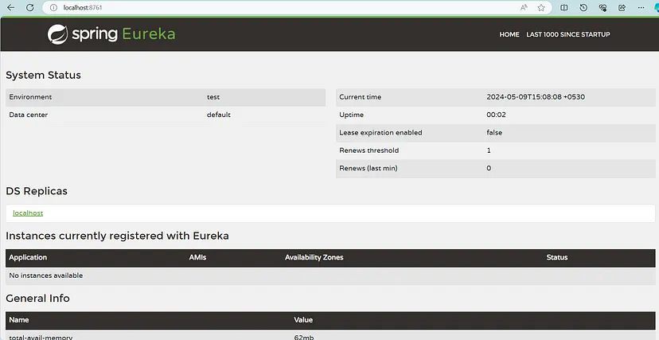

You can see that under ‘Instances currently registered with Eureka’, it displays a message “No instances available”. Because none of the microservices in our architecture have registered themselves with the Eureka Server.

### 2.2. Create our first microservice: CATEGORY-SERVICE

#### 2.2.1. Create a spring boot project as below.


#### 2.2.2. Add @EnableDiscoveryClient in CategoryServiceApplication class

```java title="CategoryServiceApplication.java"
@SpringBootApplication
@EnableDiscoveryClient
public class CategoryServiceApplication {

 public static void main(String[] args) {
  SpringApplication.run(CategoryServiceApplication.class, args);
 }

}
```

<code>@EnableDiscoveryClient</code> annotation is used to enable service discovery functionality in the Spring Boot application. It signifies that this microservice will register itself with a service registry (like Eureka, Consul, etc.) upon startup and will be discoverable by other microservices within the same architecture.

#### 2.2.3. Configure application.yml file

```yml title="application.yml"
spring:
  #    This name is used for identifying the application in the environment
  application:
    name: category-service

  #    MongoDB database configuration.
  #    Make sure you have created the database, before running the application
  data:
    mongodb:
      host: 127.0.0.1
      port: 27017
      database: category_service

#    The port on which the Spring Boot application will listen for incoming HTTP requests
server:
  port: 9000

#    The URL of the Eureka Server where the application will register itself for service discovery.
eureka:
  client:
    serviceUrl:
      defaultZone: http://localhost:8761/eureka/
```

#### 2.2.4. Create category entity

    ```java title="Category.java"
    @Data
    @Document(collection = "categories")
    @Builder
    public class Category {
        @Id
        private String id;
        private String categoryName;
    }
    ```

#### 2.2.5. Create dtos for send Api responses and accept category details

    ```java title="CategoryDto.java"
    @Data
    @Builder
    public class ApiResponseDto<T> {
        private boolean isSuccess;
        private String message;
        private T response;
    }

    @Data
    @AllArgsConstructor
    @NoArgsConstructor
    public class CategoryRequestDto {
        private String name;
    }
    ```

#### 2.2.6. Create category repository

    ```java title="CategoryRepository.java"
    @Repository
    public interface CategoryRepository extends MongoRepository<Category,String> {
       boolean existsByCategoryName(String categoryName);

    }
    ```

#### 2.2.7. Create category service

    ```java title="CategoryService.java"
    @Service
    public interface CategoryService {

        ResponseEntity<ApiResponseDto<?>> getAllCategories();

        ResponseEntity<ApiResponseDto<?>> getCategoryById(String categoryId);

        ResponseEntity<ApiResponseDto<?>> createCategory(CategoryRequestDto categoryRequestDto);
    }
    ```

    ```java title="CategoryServiceImpl.java"
    @Component
    public class CategoryServiceImpl implements CategoryService {

        @Autowired
        CategoryRepository categoryRepository;

        @Override
        public ResponseEntity<ApiResponseDto<?>> getAllCategories(){
            List<Category> categories = categoryRepository.findAll();
            try {
                return ResponseEntity.ok(
                        ApiResponseDto.builder()
                                .isSuccess(true)
                                .response(categories)
                                .message(categories.size() + " results found!")
                                .build()
                );
            }catch (Exception e) {
    //            Try to create a custom exception and handle them using exception handlers
                return ResponseEntity.status(HttpStatus.INTERNAL_SERVER_ERROR).body(
                        ApiResponseDto.builder()
                                .isSuccess(false)
                                .response("Unable to process right now. Try again later!")
                                .message("No results found!")
                                .build()
                );
            }
        }

        @Override
        public ResponseEntity<ApiResponseDto<?>> getCategoryById(String categoryId) {

            try {
                Category category = categoryRepository.findById(categoryId).orElse(null);
                return ResponseEntity.ok(
                        ApiResponseDto.builder()
                                .isSuccess(true)
                                .response(category)
                                .build()
                );
            }catch (Exception e) {
    //            Try to create a custom exception and handle them using exception handlers
                return ResponseEntity.status(HttpStatus.INTERNAL_SERVER_ERROR).body(
                        ApiResponseDto.builder()
                                .isSuccess(false)
                                .response("Unable to process right now. Try again later!")
                                .message("No results found!")
                                .build()
                );
            }
        }

        @Override
        public ResponseEntity<ApiResponseDto<?>> createCategory(CategoryRequestDto categoryRequestDto) {
            try {
                if (categoryRepository.existsByCategoryName(categoryRequestDto.getName())) {
                    // Try to create a custom exception and handle them using exception handlers
                    return ResponseEntity.status(HttpStatus.BAD_REQUEST).body(
                            ApiResponseDto.builder()
                                    .isSuccess(false)
                                    .response("Category name already exists: " + categoryRequestDto.getName())
                                    .message("Unable to create Category.")
                                    .build()
                    );
                }

                Category category = Category.builder()
                        .categoryName(categoryRequestDto.getName())
                        .build();

                categoryRepository.insert(category);
                return ResponseEntity.status(HttpStatus.CREATED).body(
                        ApiResponseDto.builder()
                            .isSuccess(true)
                            .message("Category saved successfully!")
                            .build()
                );

            }catch (Exception e) {
    //            Try to create a custom exception and handle them using exception handlers
                return ResponseEntity.status(HttpStatus.INTERNAL_SERVER_ERROR).body(
                        ApiResponseDto.builder()
                                .isSuccess(false)
                                .response("Unable to process right now. Try again later!")
                                .message("Unable to create Category.")
                                .build()
                );
            }
        }


    }
    ```

#### 2.3.8. Create category controller

    ```java title="CategoryController.java"
    @RestController
    @RequestMapping("/category")
    public class CategoryController {

        @Autowired
        private CategoryService categoryService;

        @PostMapping("/new")
        public ResponseEntity<ApiResponseDto<?>> createCategory(@RequestBody CategoryRequestDto categoryRequestDto){
            return categoryService.createCategory(categoryRequestDto);
        }

        @GetMapping("/all")
        public ResponseEntity<ApiResponseDto<?>> getAllCategories() {
            return categoryService.getAllCategories();
        }

        @GetMapping("/{id}")
        public ResponseEntity<ApiResponseDto<?>> getCategoryById(@PathVariable String id) {
            return categoryService.getCategoryById(id);
        }

    }
    ```

#### 2.3.9. Run category-service application

- After running the service refresh eureka server in your browser. Now you can see that CATEGORY-SERVICE is displaying under available instances.

  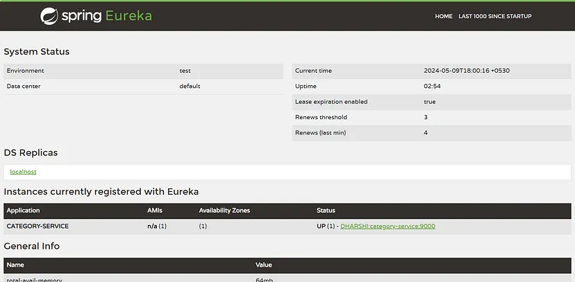

Then check the endpoints using postman to ensure that everything is working cool.

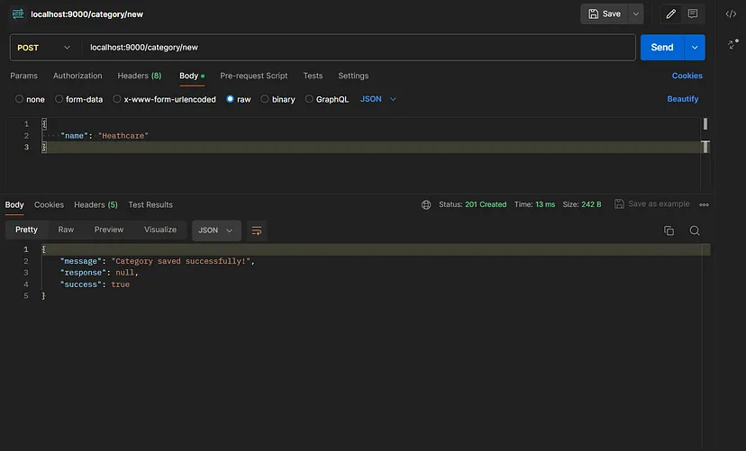

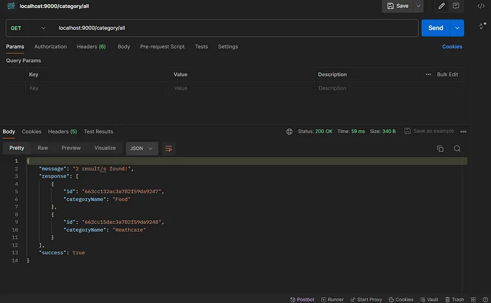

### 2.3. Create our second microservice: EXPENSE-SERVICE

#### 2.3.1. Create a spring boot project as below.

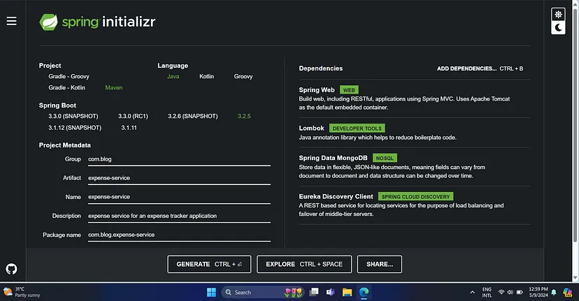

#### 2.3.2. Add @EnableDiscoveryClient in CategoryServiceApplication class

    ```java title="ExpenseServiceApplication.java"
    @SpringBootApplication
    @EnableDiscoveryClient
    public class ExpenseServiceApplication {

     public static void main(String[] args) {
      SpringApplication.run(ExpenseServiceApplication.class, args);
     }

    }
    ```

#### 2.3.3. Configure application.yml file

    ```yml title="application.yml"
    spring:
    #    This name is used for identifying the application in the environment
        application:
            name: expense-service

    #    MongoDB database configuration.
    #    Make sure you have created the database, before running the application
        data:
            mongodb:
                host: 127.0.0.1
                port: 27017
                database: expense_service

    #    The port on which the Spring Boot application will listen for incoming HTTP requests
    server:
        port: 9000

    #    The URL of the Eureka Server where the application will register itself for service discovery.
    eureka:
        client:
            serviceUrl:
                defaultZone: http://localhost:8761/eureka/
    ```

#### 2.3.4. Create expense entity

    ```java title="Expense.java"
    @Document(collection = "expenses")
    @Data
    @Builder
    public class Expense {
        @Id
        private String id;
        private String description;
        private double amount;
        private LocalDate date;
        private String categoryId;

    }
    ```

#### 2.3.5. Create dtos for send Api responses and accept expense details

    ```java title="ExpenseDto.java"
    @Data
    @Builder
    public class ApiResponseDto<T> {
        private boolean isSuccess;
        private String message;
        private T response;
    }

    @Data
    @AllArgsConstructor
    public class ExpenseRequestDto {
        private String description;
        private double amount;
        private LocalDate date;
        private String categoryId;
    }
    ```

#### 2.3.6. Create expense repository

    ```java title="ExpenseRepository.java"
    @Repository
    public interface ExpenseRepository extends MongoRepository<Expense, String> {
    }
    ```

#### 2.3.7. Create expense service

    ```java title="ExpenseService.java"
    @Service
    public interface ExpenseService {
        ResponseEntity<ApiResponseDto<?>> addExpense(ExpenseRequestDto requestDto);
        ResponseEntity<ApiResponseDto<?>> getAllExpenses();
    }

    @Component
    public class ExpenseServiceImpl implements ExpenseService{

        @Autowired
        private ExpenseRepository expenseRepository;

        @Override
        public ResponseEntity<ApiResponseDto<?>> addExpense(ExpenseRequestDto requestDto) {
          // will implement later
        }

        @Override
        public ResponseEntity<ApiResponseDto<?>> getAllExpenses() {
            List<Expense> expenses = expenseRepository.findAll();
            try {
                return ResponseEntity.ok(
                        ApiResponseDto.builder()
                                .isSuccess(true)
                                .response(expenses)
                                .message(expenses.size() + " results found!")
                                .build()
                );
            }catch (Exception e) {
                // Try to create a custom exception and handle them using exception handlers
                return ResponseEntity.status(HttpStatus.INTERNAL_SERVER_ERROR).body(
                        ApiResponseDto.builder()
                                .isSuccess(false)
                                .response("Unable to process right now. Try again later!")
                                .message("No results found!")
                                .build()
                );
            }
        }
    }
    ```

#### 2.3.8. Create expense controller

    ```java title="ExpenseController.java"
    @RestController
    @RequestMapping("/expense")
    public class ExpenseController {

        @Autowired
        private ExpenseService expenseService;

        @PostMapping("/new")
        public ResponseEntity<ApiResponseDto<?>> addExpense(@RequestBody ExpenseRequestDto requestDto){
            return expenseService.addExpense(requestDto);
        }

        @GetMapping("/all")
        public ResponseEntity<ApiResponseDto<?>> getAllExpenses(){
            return expenseService.getAllExpenses();
        }

    }
    ```

#### 2.3.9. Run expense-service application

- After running the service, once again refresh eureka server in your browser. Now you can see that EXPENSE-SERVICE is displaying under available instances.

  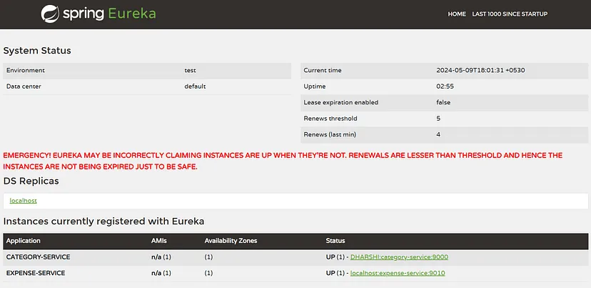

- Let’s check endpoints for confirmation.

  

- Done. We have created 2 microservices successfully. Let’s move to next step.

- Imagine the scenario, creating an expense, before saving expenses in the database, it’s crucial to validate that the category ID provided is valid, meaning it exists in the category table. However, the Expense Service lacks direct access to category information, as categories are managed by the Category Service. This necessitates communication between the two services.

### 2.4. Communication between microservices

- Before persisting the expense data, the Expense Service needs to validate the category ID present in the CategoryRequestDto.
- To verify the category ID’s validity, the Expense Service communicates with the Category Service. It sends a request containing the category ID to the Category Service.
- Based on the response from the Category Service, the Expense Service proceeds accordingly.
- OpenFeign is a declarative HTTP client library for Java that simplifies the process of making HTTP requests to other microservices.
- OpenFeign integrates seamlessly with Spring Cloud, providing additional features for service discovery and load balancing.
- Let’s see how expense service going to interact with category service using OpenFeign

#### 2.4.1. Add OpenFeign dependency in pom.xml

- Add below dependency in expence-service pom.xml.

  ```xml title="pom.xml"
    <dependency>
     <groupId>org.springframework.cloud</groupId>
     <artifactId>spring-cloud-starter-openfeign</artifactId>
    </dependency>
  ```

#### 2.4.2. Create FeignClient for category service

    ```java title="CategoryFeignService.java"
    @FeignClient("CATEGORY-SERVICE")
    public interface CategoryFeignService {

        @GetMapping("/category/{id}")
        ResponseEntity<ApiResponseDto<CategoryDto>> getCategoryById(@PathVariable String id);

    }
    ```

- **`@FeignClient`:** This annotation marks the interface as a Feign client. It specifies the name of the target microservice ("CATEGORY-SERVICE"). Feign will use this name to locate the service within the service registry.
- **`CategoryFeignInterface`:** The interface definition for the Feign client. It declares methods that will be used to make HTTP requests to the Category Service.
- Use the same method name, parameters you have used in the category controller in the category-service. Make sure the defined method’s implementation is available in the category-service. I have implemented the `getCategoryById` method the category-service. Recall it again.

#### 2.4.3. Update ExpenseServiceApplication.java

    ```java title="ExpenseServiceApplication.java"
    @SpringBootApplication
    @EnableDiscoveryClient
    @EnableFeignClients
    public class ExpenseServiceApplication {

     public static void main(String[] args) {
      SpringApplication.run(ExpenseServiceApplication.class, args);
     }

    }
    ```

- `@EnableFeignClients` annotation enables the Feign client in the Spring Boot application. It scans the classpath for interfaces annotated with `@FeignClient` and generates proxy implementations for them. These proxies are used to make HTTP requests to other microservices or external APIs.

#### 2.4.4. Implement addExpense method in expense service

    ```java title="ExpenseServiceImpl.java"
    @Component
    public class ExpenseServiceImpl implements ExpenseService{

        @Autowired
        private ExpenseRepository expenseRepository;

        @Autowired
        private CategoryFeignService categoryFeignService;

        @Override
        public ResponseEntity<ApiResponseDto<?>> addExpense(ExpenseRequestDto requestDto) {
            try {

                // fetching category from category service
                CategoryDto category = categoryFeignService.getCategoryById(requestDto.getCategoryId()).getBody().getResponse();

                if (category == null) {
                    // Try to create a custom exception and handle them using exception handlers
                    return ResponseEntity.status(HttpStatus.BAD_REQUEST).body(
                            ApiResponseDto.builder()
                                    .isSuccess(false)
                                    .response("Category not exists with id: " + requestDto.getCategoryId())
                                    .message("Unable to create Category.")
                                    .build()
                    );
                }

                Expense expense = Expense.builder()
                                .description(requestDto.getDescription())
                                .amount(requestDto.getAmount())
                                .date(requestDto.getDate())
                                .categoryId(requestDto.getCategoryId())
                                .build();

                expenseRepository.insert(expense);
                return ResponseEntity.status(HttpStatus.CREATED).body(
                        ApiResponseDto.builder()
                                .isSuccess(true)
                                .message("Expense saved successfully!")
                                .build()
                );

            }catch (Exception e) {
    //            Try to create a custom exception and handle them using exception handlers
                return ResponseEntity.status(HttpStatus.INTERNAL_SERVER_ERROR).body(
                        ApiResponseDto.builder()
                                .isSuccess(false)
                                .response("Unable to process right now. Try again later!")
                                .message("Unable to save expense.")
                                .build()
                );
            }
        }

    // getAllExpenses method here.

    }
    ```

#### 2.4.5. Run the application

- There will be no changes in the eureka dashboard. It will be display same as before.
- Let’s check the add expense endpoint from frontend.

  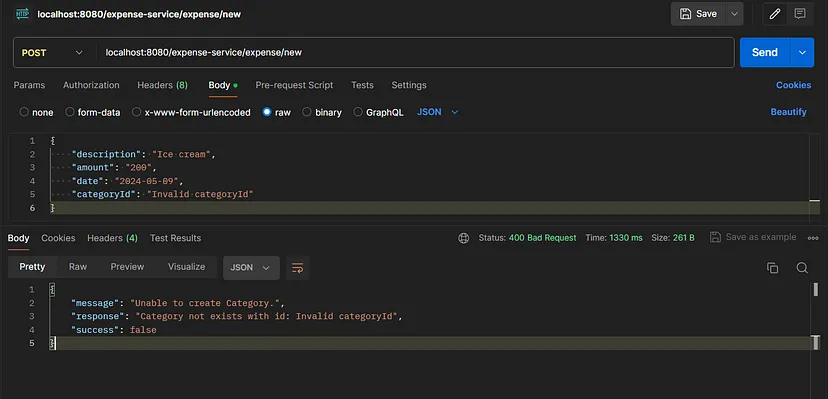

  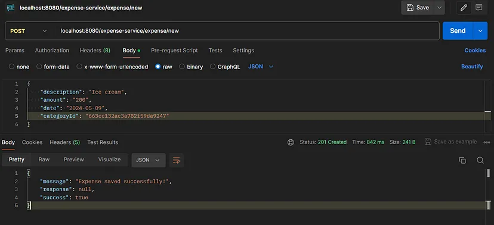

- In wrapping up our discussion on microservices, there’s one critical aspect left to address: the challenge of accessing microservices individually via their own port numbers. This approach becomes impractical as the number of microservices, or instances thereof increases. That’s precisely where an API gateway steps in.

### 2.5. Developing API gateway

- Imagine having numerous microservices or multiple instances of a single microservice scattered across your architecture. Directly accessing each one via its unique port number would result in complexity and maintenance headaches. An API gateway acts as a centralized entry point for clients, providing a unified interface to access the various microservices.
- An API gateway acts as a centralized entry point for clients, providing a unified interface to access the various microservices.
- Think of the API gateway as the traffic cop of your microservices architecture. It routes incoming requests to the appropriate microservice, or instance based on predefined rules or configurations.
- Single Entry Point: Clients interact with the API gateway, unaware of the underlying microservices’ locations or configurations. This decouples clients from the complexities of service discovery and routing.
- Load Balancing: The API gateway can distribute incoming requests across multiple instances of a microservice, ensuring optimal resource utilization and high availability.
- Security: Centralized authentication, authorization, and security policies can be enforced at the API gateway, safeguarding the entire system from unauthorized access and attacks.
- Monitoring and Analytics: By serving as a centralized point of contact, the API gateway facilitates comprehensive monitoring, logging, and analytics of incoming and outgoing traffic, providing valuable insights into system performance and usage patterns.

Now let’s see how we can develop an Api-gateway for our application.

#### 2.5.1. Create spring project

- Create a spring boot project as below.

  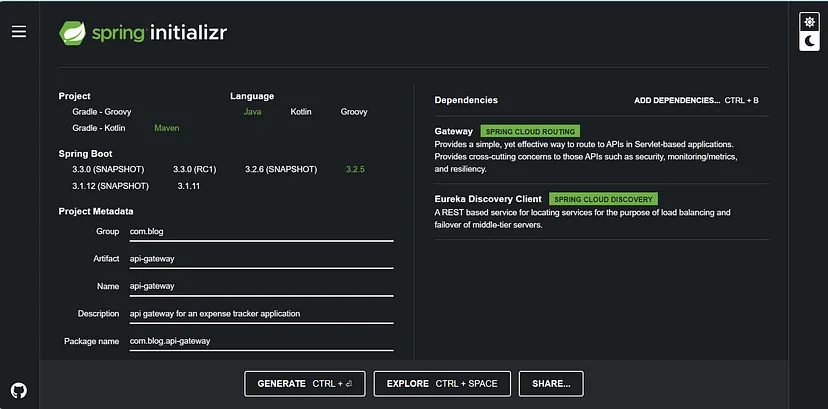

#### 2.5.2. Add @EnableDiscoveryClient annotation ApiGatewayApplication.java

    ```java title="ApiGatewayApplication.java"
    @SpringBootApplication
    @EnableDiscoveryClient
    public class ApiGatewayApplication {

     public static void main(String[] args) {
      SpringApplication.run(ApiGatewayApplication.class, args);
     }

    }
    ```

#### 2.5.3. Configure application.yml file

    ```yml title="application.yml"
    #  The port number (8080) on which the API gateway will listen for incoming requests.
    server:
      port: 8080

    #  The name of the Spring Boot application.
    spring:
      application:
        name: api-gateway
      cloud:
        gateway:
          mvc:
    #   Enables discovery-based routing. When enabled, Spring Cloud Gateway will automatically discover
    #   routes for registered services using service discovery
            discovery:
              locator:
                enabled: true
    #   Defining the routing rules for accessing microservices
            routes:
              - id: category-service
                uri: lb://CATEGORY-SERVICE
                predicates:
                  - Path=/category-service/**
                filters:
                  - StripPrefix=1

              - id: expense-service
                uri: lb://EXPENSE-SERVICE
                predicates:
                  - Path=/expense-service/**
                filters:
                  - StripPrefix=1

    #   The URL of the Eureka Server where the API gateway will register itself and discover other services.
    eureka:
      client:
        serviceUrl:
          defaultZone: http://localhost:8761/eureka/
    ```

- <code>id: category-service</code> — This is an identifier for the route. It’s used internally within the API gateway configuration to refer to this specific route. It doesn’t have any significance outside of the configuration context.
- <code>uri</code>: Specifies the URI (Uniform Resource Identifier) of the target microservice.
- <code>lb://</code>: This prefix indicates that load balancing should be applied to the target URI. The lb stands for "load balancer".
- <code>CATEGORY-SERVICE</code>: This is the logical name of the microservice registered with the service registry (Eureka). Use the same name which displayed in the eureka server.
- Predicates are conditions that must be met for a request to match this route and be forwarded to the target microservice.
- <code>- Path=/category-service/</code>: This predicate specifies that requests must have a path starting with "/category-service/" followed by any additional path segments. The "\*\*" wildcard matches any number of additional path segments. You can use any prefix as you wish.
- Filters are applied to requests before they are forwarded to the target microservice. They can modify request headers, paths, or payloads, among other things.
- <code>- StripPrefix=1</code>: This filter removes one path segment, effectively stripping "/category-service" from the request path. This is necessary because the routing predicate matches requests starting with "/category-service/", but the target microservice expects requests without this prefix.

#### 2.5.4. Test the application

- For instance, let’s say you want to retrieve all expenses. You would typically use the URI localhost:8080/expense-service/expense/all.
- It matches the incoming request against the defined routes based on the configured predicates. In this case, it identifies that the request path starts with “/expense-service/”, indicating that it should be directed to the expense service.
- Before forwarding the request to the expense service, the API gateway rewrites the URI to match the expected format of the microservice. Since the expense service expects requests without the “/expense-service” prefix, the API gateway removes this prefix from the URI.
- Once the URI is properly formatted, the API gateway forwards the request to the identified microservice. In this example, it sends the request to the expense service, ensuring that it reaches the correct endpoint (“/expense/all”).

  Let’s check this in post man.

  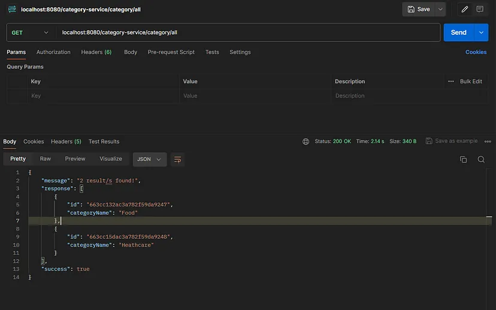

  

That’s it! We have successfully developed a microservices architecture with a service registry, communication between microservices, and an API gateway. This modular approach to software design offers several benefits, including increased agility, scalability, and resilience. By breaking down complex applications into smaller, more manageable services, we can achieve faster development cycles, easier maintenance, and better scalability. Microservices architecture is a powerful design pattern that can help organizations adapt to changing business requirements and deliver innovative solutions to customers.

## Conclusion

Microservices architecture is a design pattern that structures an application as a collection of small, loosely coupled services. Each service is self-contained, focused on a specific business functionality, and can be developed, deployed, and scaled independently. This modular approach to software design offers several benefits, including increased agility, scalability, and resilience.
