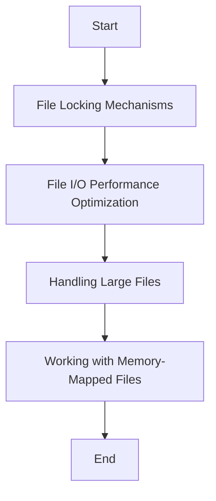

---
id: lesson-1
title: "Advanced File Handling in C++"
sidebar_label: Advanced File Handling 
sidebar_position: 1
description: "Learn Advanced File Handling in C++"
tags: [courses,Advance-level,Introduction]
---   
 

Advanced file handling techniques allow for better control, performance optimization, and handling of large files. Let's explore these techniques:

### Flowchart



#### 1. File Locking Mechanisms

File locking prevents simultaneous access to a file, which can cause data corruption. It ensures that only one process can write to a file at a time.

##### Example: File Locking with `fcntl`

```cpp
#include <iostream>
#include <fcntl.h>
#include <unistd.h>

int main() {
    int fd = open("example.txt", O_RDWR | O_CREAT, 0666);
    if (fd == -1) {
        std::cerr << "Failed to open file" << std::endl;
        return 1;
    }

    struct flock lock;
    lock.l_type = F_WRLCK;
    lock.l_whence = SEEK_SET;
    lock.l_start = 0;
    lock.l_len = 0; // Lock the whole file

    if (fcntl(fd, F_SETLK, &lock) == -1) {
        std::cerr << "Failed to lock file" << std::endl;
        close(fd);
        return 1;
    }

    std::cout << "File locked. Press Enter to unlock..." << std::endl;
    std::cin.get();

    lock.l_type = F_UNLCK;
    if (fcntl(fd, F_SETLK, &lock) == -1) {
        std::cerr << "Failed to unlock file" << std::endl;
    }

    close(fd);
    return 0;
}
```

#### 2. File I/O Performance Optimization

Optimizing file I/O can significantly improve performance, especially when dealing with large files or high-frequency I/O operations.

:::tip
- **Buffering**: Use buffered I/O for efficient data handling.
- **Asynchronous I/O**: Perform non-blocking I/O operations to avoid waiting for I/O completion.
- **Memory Mapping**: Use memory-mapped files for direct memory access to file contents.
:::

#### 3. Handling Large Files

Handling large files efficiently is crucial for applications that deal with massive datasets.

##### Example: Reading Large Files in Chunks

```cpp
#include <iostream>
#include <fstream>

int main() {
    std::ifstream file("largefile.txt", std::ios::in | std::ios::binary);
    if (!file) {
        std::cerr << "Failed to open file" << std::endl;
        return 1;
    }

    const size_t bufferSize = 1024 * 1024; // 1 MB buffer
    char buffer[bufferSize];

    while (file.read(buffer, bufferSize) || file.gcount() > 0) {
        // Process buffer contents
        std::cout.write(buffer, file.gcount());
    }

    file.close();
    return 0;
}
```
