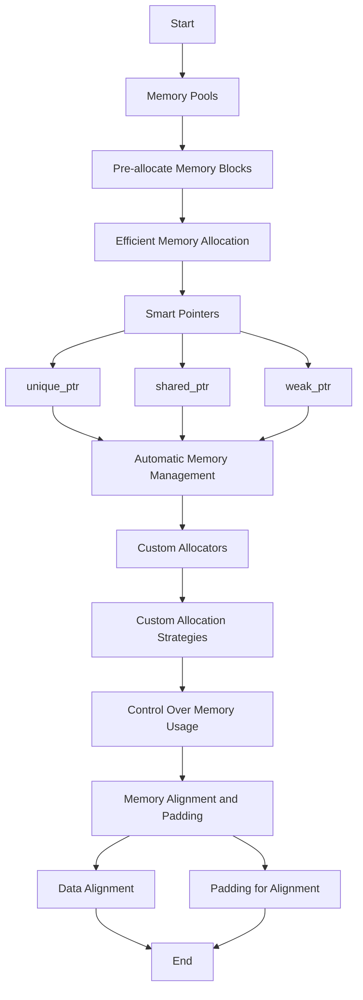

---
id: lesson-1
title: "Advanced Memory Management in C++"
sidebar_label: Advanced Memory Management
sidebar_position: 1
description: "Learn Advanced Memory Management in C++"
tags: [courses,Advance-level,Introduction]
---     

Advanced memory management techniques in C++ can significantly improve the efficiency and safety of memory usage in your applications. Key topics include memory pools, smart pointers, custom allocators, and memory alignment.

### Flowchart



#### 1. Memory Pools

**Memory Pools**: A memory pool is a collection of pre-allocated memory blocks that are used to manage memory more efficiently. They are useful when you need to allocate and deallocate memory frequently.

##### Example: Memory Pool

```cpp
#include <iostream>
#include <vector>

class MemoryPool {
    std::vector<void*> pool;
    size_t blockSize;
    size_t poolSize;

public:
    MemoryPool(size_t blockSize, size_t poolSize)
        : blockSize(blockSize), poolSize(poolSize) {
        pool.reserve(poolSize);
        for (size_t i = 0; i < poolSize; ++i) {
            pool.push_back(::operator new(blockSize));
        }
    }

    ~MemoryPool() {
        for (void* block : pool) {
            ::operator delete(block);
        }
    }

    void* allocate() {
        if (pool.empty()) {
            throw std::bad_alloc();
        }
        void* block = pool.back();
        pool.pop_back();
        return block;
    }

    void deallocate(void* block) {
        pool.push_back(block);
    }
};

int main() {
    MemoryPool mp(128, 10); // Block size of 128 bytes, 10 blocks

    void* ptr1 = mp.allocate();
    void* ptr2 = mp.allocate();

    mp.deallocate(ptr1);
    mp.deallocate(ptr2);

    std::cout << "Memory pool operations completed." << std::endl;
    return 0;
}
```

**Output:**
```
Memory pool operations completed.
```

#### 2. Smart Pointers

**Smart Pointers**: Smart pointers manage the lifetime of dynamically allocated objects and automatically deallocate memory when it is no longer needed. The three main types are `unique_ptr`, `shared_ptr`, and `weak_ptr`.

##### Example: Smart Pointers

```cpp
#include <iostream>
#include <memory>
#include <vector>

class MyClass {
public:
    MyClass() { std::cout << "MyClass constructed." << std::endl; }
    ~MyClass() { std::cout << "MyClass destructed." << std::endl; }
    void hello() { std::cout << "Hello, world!" << std::endl; }
};

int main() {
    // unique_ptr example
    std::unique_ptr<MyClass> uptr1(new MyClass());
    uptr1->hello();

    // shared_ptr example
    std::shared_ptr<MyClass> sptr1 = std::make_shared<MyClass>();
    std::shared_ptr<MyClass> sptr2 = sptr1;
    sptr1->hello();

    // weak_ptr example
    std::weak_ptr<MyClass> wptr = sptr1;
    if (auto sptr3 = wptr.lock()) {
        sptr3->hello();
    }

    return 0;
}
```

**Output:**
```
MyClass constructed.
Hello, world!
MyClass constructed.
Hello, world!
MyClass constructed.
Hello, world!
MyClass destructed.
MyClass destructed.
MyClass destructed.
```
