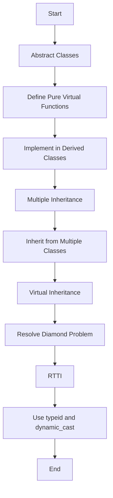

---
id: lesson-1
title: "Advanced OOP Concepts in C++"
sidebar_label: Inheritance
sidebar_position: 1
description: "Learn Advanced OOP Concepts in C++"
tags: [courses,Advance-level,Introduction]
---   

Advanced Object-Oriented Programming (OOP) concepts in C++ enhance the flexibility and functionality of your code. These include abstract classes, interfaces, multiple inheritance, virtual inheritance, and run-time type information (RTTI).

### Diagram



#### 1. Abstract Classes and Interfaces

**Abstract Classes**: An abstract class is a class that cannot be instantiated and is used to define a common interface for derived classes. It can contain pure virtual functions, which must be implemented by derived classes.

**Interfaces**: In C++, an interface is typically represented by an abstract class that only contains pure virtual functions.

##### Example: Abstract Class and Interface

```cpp
#include <iostream>
using namespace std;

// Abstract class with pure virtual function
class Shape {
public:
    virtual void draw() const = 0; // Pure virtual function
};

// Derived class implementing the pure virtual function
class Circle : public Shape {
public:
    void draw() const override {
        cout << "Drawing a Circle" << endl;
    }
};

int main() {
    Circle c;
    c.draw(); // Output: Drawing a Circle
    return 0;
}
```

**Output:**
```
Drawing a Circle
```

#### 2. Multiple Inheritance

**Multiple Inheritance**: This is a feature where a class can inherit from more than one base class. While powerful, it can lead to complexity and ambiguity if not handled carefully.

##### Example: Multiple Inheritance

```cpp
#include <iostream>
using namespace std;

class A {
public:
    void showA() {
        cout << "Class A" << endl;
    }
};

class B {
public:
    void showB() {
        cout << "Class B" << endl;
    }
};

class C : public A, public B {
public:
    void showC() {
        cout << "Class C" << endl;
    }
};

int main() {
    C obj;
    obj.showA(); // Output: Class A
    obj.showB(); // Output: Class B
    obj.showC(); // Output: Class C
    return 0;
}
```

**Output:**
```
Class A
Class B
Class C
```

#### 3. Virtual Inheritance

**Virtual Inheritance**: Virtual inheritance is used to solve the diamond problem in multiple inheritance scenarios. It ensures that only one instance of the base class is inherited.

##### Example: Virtual Inheritance

```cpp
#include <iostream>
using namespace std;

class A {
public:
    void showA() {
        cout << "Class A" << endl;
    }
};

class B : virtual public A {
public:
    void showB() {
        cout << "Class B" << endl;
    }
};

class C : virtual public A {
public:
    void showC() {
        cout << "Class C" << endl;
    }
};

class D : public B, public C {
public:
    void showD() {
        cout << "Class D" << endl;
    }
};

int main() {
    D obj;
    obj.showA(); // Output: Class A
    obj.showB(); // Output: Class B
    obj.showC(); // Output: Class C
    obj.showD(); // Output: Class D
    return 0;
}
```

**Output:**
```
Class A
Class B
Class C
Class D
```