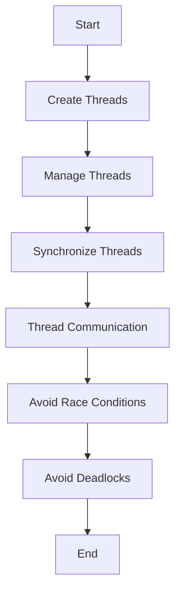

---
id: lesson-2
title: "Multithreading and Concurrency in C++"
sidebar_label: Multithreading and Concurrency
sidebar_position: 2
description: "Learn Multithreading and Concurrency in C++"
tags: [courses,Advance-level,Introduction]
---   
 

Multithreading allows a program to perform multiple operations concurrently, which can lead to improved performance and responsiveness. In C++, multithreading is primarily handled through the `<thread>` library, and synchronization between threads is managed using various synchronization primitives.

#### 1. Introduction to Multithreading

**Multithreading** involves dividing a program into multiple threads, each performing its own task. Threads share the same process space but operate independently, which can lead to more efficient CPU usage.

### Flowchart 




#### 2. Creating and Managing Threads

Threads in C++ can be created using the `<thread>` library. Each thread executes a function or callable object.

##### Example: Creating and Managing Threads

```cpp
#include <iostream>
#include <thread>

void printHello() {
    std::cout << "Hello from thread!" << std::endl;
}

int main() {
    std::thread t1(printHello); // Create and start a thread
    t1.join(); // Wait for the thread to finish

    std::cout << "Hello from main!" << std::endl;
    return 0;
}
```

**Output:**
```
Hello from thread!
Hello from main!
```

#### 3. Synchronization Techniques

**Synchronization** is crucial for managing access to shared resources and preventing data races. Common synchronization techniques include mutexes and semaphores.

##### Example: Using Mutexes

```cpp
#include <iostream>
#include <thread>
#include <mutex>

std::mutex mtx; // Mutex for synchronization
int counter = 0;

void increment() {
    std::lock_guard<std::mutex> lock(mtx); // Lock mutex
    ++counter;
    std::cout << "Counter: " << counter << std::endl;
}

int main() {
    std::thread t1(increment);
    std::thread t2(increment);

    t1.join();
    t2.join();

    return 0;
}
```

**Output:**
```
Counter: 1
Counter: 2
```

#### 4. Thread Communication

**Thread Communication** allows threads to coordinate their actions. This can be achieved using condition variables.

##### Example: Using Condition Variables

```cpp
#include <iostream>
#include <thread>
#include <mutex>
#include <condition_variable>

std::mutex mtx;
std::condition_variable cv;
bool ready = false;

void waitForReady() {
    std::unique_lock<std::mutex> lock(mtx);
    cv.wait(lock, []{ return ready; });
    std::cout << "Thread proceeding!" << std::endl;
}

void signalReady() {
    {
        std::lock_guard<std::mutex> lock(mtx);
        ready = true;
    }
    cv.notify_one();
}

int main() {
    std::thread t1(waitForReady);
    std::thread t2(signalReady);

    t1.join();
    t2.join();

    return 0;
}
```

**Output:**
```
Thread proceeding!
```