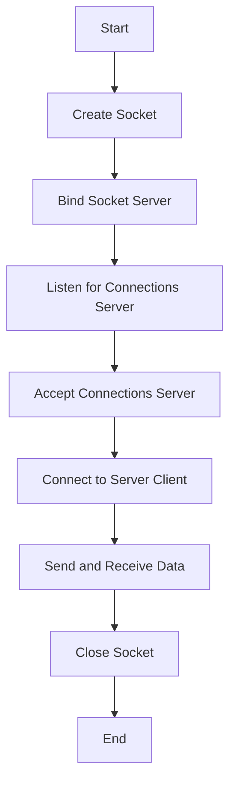

---
id: lesson-2
title: "Basic TCP/IP Communication"
sidebar_label: TCP/IP Communication
sidebar_position: 2
description: "Learn Basic TCP/IP Communication"
tags: [courses,Advance-level,Introduction]
---   

 

TCP/IP is the fundamental communication protocol suite for the internet.

:::important
1. **Create a Socket**.
2. **Bind the Socket** (server only).
3. **Listen for Connections** (server only).
4. **Accept Connections** (server only).
5. **Connect to Server** (client only).
6. **Send and Receive Data**.
7. **Close the Socket**.
:::

### Flowchart


### Simple Network Applications

Let's implement a simple TCP client-server application.

##### Example 

```cpp
#include <iostream>
#include <thread>
#include <cstring>
#include <unistd.h>
#include <arpa/inet.h>

void handleClient(int clientSocket) {
    char buffer[1024];
    std::string message = "Hello from server!";
    send(clientSocket, message.c_str(), message.size(), 0);

    int bytesRead = read(clientSocket, buffer, 1024);
    if (bytesRead > 0) {
        std::cout << "Received from client: " << buffer << std::endl;
    }
    close(clientSocket);
}

int main() {
    int serverSocket = socket(AF_INET, SOCK_STREAM, 0);
    if (serverSocket == -1) {
        std::cerr << "Failed to create socket" << std::endl;
        return -1;
    }

    sockaddr_in serverAddr;
    serverAddr.sin_family = AF_INET;
    serverAddr.sin_port = htons(8080);
    serverAddr.sin_addr.s_addr = INADDR_ANY;

    if (bind(serverSocket, (struct sockaddr*)&serverAddr, sizeof(serverAddr)) == -1) {
        std::cerr << "Bind failed" << std::endl;
        return -1;
    }

    if (listen(serverSocket, 5) == -1) {
        std::cerr << "Listen failed" << std::endl;
        return -1;
    }

    std::cout << "Server is listening on port 8080" << std::endl;

    while (true) {
        int clientSocket = accept(serverSocket, nullptr, nullptr);
        if (clientSocket == -1) {
            std::cerr << "Accept failed" << std::endl;
            continue;
        }
        std::thread(handleClient, clientSocket).detach();
    }

    close(serverSocket);
    return 0;
}
```

##### Example

```cpp
#include <iostream>
#include <cstring>
#include <arpa/inet.h>

int main() {
    int clientSocket = socket(AF_INET, SOCK_STREAM, 0);
    if (clientSocket == -1) {
        std::cerr << "Failed to create socket" << std::endl;
        return -1;
    }

    sockaddr_in serverAddr;
    serverAddr.sin_family = AF_INET;
    serverAddr.sin_port = htons(8080);
    inet_pton(AF_INET, "127.0.0.1", &serverAddr.sin_addr);

    if (connect(clientSocket, (struct sockaddr*)&serverAddr, sizeof(serverAddr)) == -1) {
        std::cerr << "Connect failed" << std::endl;
        return -1;
    }

    char buffer[1024];
    int bytesRead = read(clientSocket, buffer, 1024);
    if (bytesRead > 0) {
        std::cout << "Received from server: " << buffer << std::endl;
    }

    std::string message = "Hello from client!";
    send(clientSocket, message.c_str(), message.size(), 0);

    close(clientSocket);
    return 0;
}
```

**Output:**
```
Server is listening on port 8080
Received from client: Hello from client!
```

**Client Output:**
```
Received from server: Hello from server!
```


:::tip
- **Socket Management**: Always close sockets to avoid resource leaks.
- **Error Handling**: Implement robust error handling for network operations.
- **Concurrency**: Use multithreading to handle multiple clients in server applications.
- **Data Encoding**: Ensure proper encoding and decoding of data sent over the network.
:::