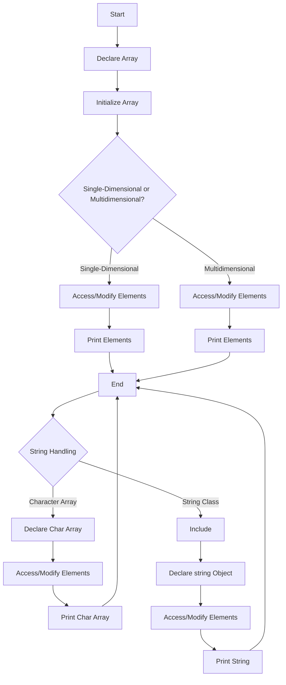

---
id: lesson-1
title: "Introduction to Arrays"
sidebar_label:  Arrays
sidebar_position: 1
description:  "Learn Array techniques"
tags: [courses,beginner-level,C++,Introduction]
---  
  

Arrays are collections of elements of the same type stored in contiguous memory locations.

### Flowchart for Arrays and Strings


#### Single-Dimensional Arrays

A single-dimensional array is a list of elements of the same type.

#### Example
```cpp
#include <iostream>
using namespace std;

int main() {
    int arr[5] = {1, 2, 3, 4, 5};

    for(int i = 0; i < 5; i++) {
        cout << "Element at index " << i << ": " << arr[i] << endl;
    }

    return 0;
}
```

**Output:**
```
Element at index 0: 1
Element at index 1: 2
Element at index 2: 3
Element at index 3: 4
Element at index 4: 5
```

#### Multidimensional Arrays

Multidimensional arrays are arrays of arrays.

#### Example
```cpp
#include <iostream>
using namespace std;

int main() {
    int matrix[2][3] = {{1, 2, 3}, {4, 5, 6}};

    for(int i = 0; i < 2; i++) {
        for(int j = 0; j < 3; j++) {
            cout << "Element at [" << i << "][" << j << "]: " << matrix[i][j] << endl;
        }
    }

    return 0;
}
```

**Output:**
```
Element at [0][0]: 1
Element at [0][1]: 2
Element at [0][2]: 3
Element at [1][0]: 4
Element at [1][1]: 5
Element at [1][2]: 6
```