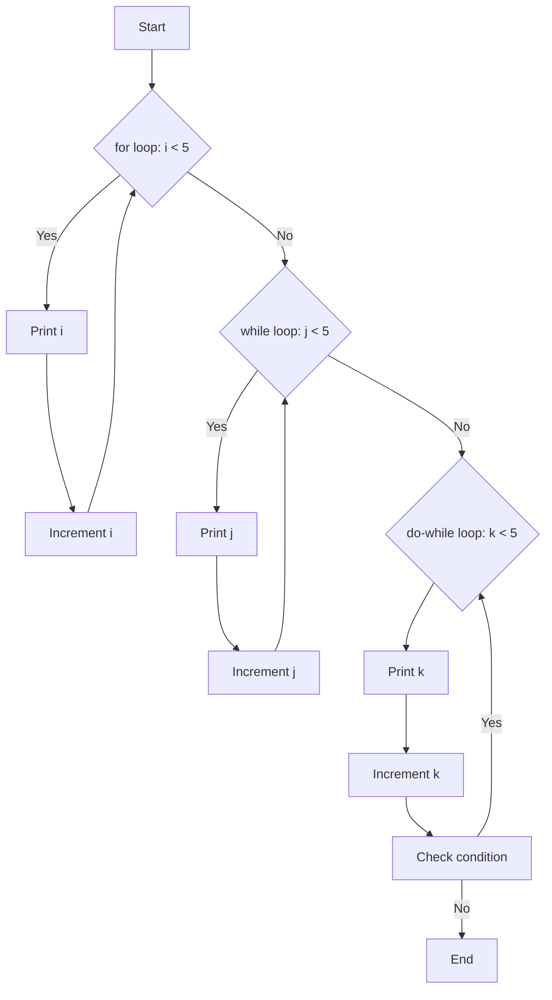

---
id: lesson-2
title: "Loops"
sidebar_label:  Loops
sidebar_position: 2
description:  "Loops in C++"
tags: [courses,beginner-level,C++,Introduction]
---  
 

1. **for Loop**
   - Executes a block of code a specific number of times.

2. **while Loop**
   - Repeatedly executes a block of code while a condition is true.

3. **do-while Loop**
   - Similar to the while loop, but it executes the block of code once before checking the condition.

#### Example
```cpp
#include <iostream>
using namespace std;

int main() {
    // for loop
    for (int i = 0; i < 5; ++i) {
        cout << "for loop: " << i << endl;
    }

    // while loop
    int j = 0;
    while (j < 5) {
        cout << "while loop: " << j << endl;
        ++j;
    }

    // do-while loop
    int k = 0;
    do {
        cout << "do-while loop: " << k << endl;
        ++k;
    } while (k < 5);

    return 0;
}
```

**Output:**
```
for loop: 0
for loop: 1
for loop: 2
for loop: 3
for loop: 4
while loop: 0
while loop: 1
while loop: 2
while loop: 3
while loop: 4
do-while loop: 0
do-while loop: 1
do-while loop: 2
do-while loop: 3
do-while loop: 4
```

#### Flowchart 


#### Break and Continue Statements

- **break** : Exits the loop or switch-case statement.
- **continue** : Skips the current iteration and proceeds to the next iteration of the loop.

#### Example
```cpp
#include <iostream>
using namespace std;

int main() {
    for (int i = 0; i < 10; ++i) {
        if (i == 5) {
            break; // exit the loop when i is 5
        }
        cout << "i: " << i << endl;
    }

    for (int j = 0; j < 10; ++j) {
        if (j == 5) {
            continue; // skip the iteration when j is 5
        }
        cout << "j: " << j << endl;
    }

    return 0;
}
```

**Output:**
```
i: 0
i: 1
i: 2
i: 3
i: 4
j: 0
j: 1
j: 2
j: 3
j: 4
j: 6
j: 7
j: 8
j: 9
```

:::tip
- **Consistent Formatting:** Keep your code clean and well-formatted to improve readability and maintainability.
- **Use Comments:** Comment your code to explain complex logic, making it easier for others (and yourself) to understand later.
- **Avoid Deep Nesting:** Too many nested statements can make code difficult to read. Consider breaking them into separate functions.
- **Edge Cases:** Always test your code with various inputs, including edge cases, to ensure robustness.
- **Debugging:** Use debugging tools and print statements to trace and fix issues in your code efficiently.
:::