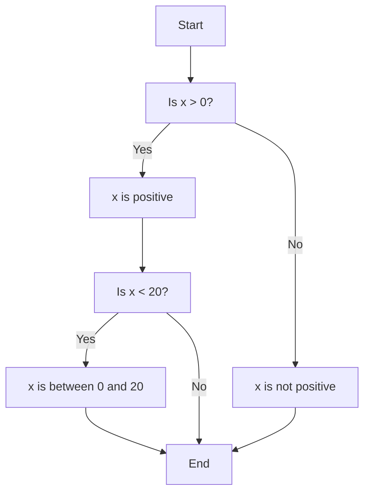
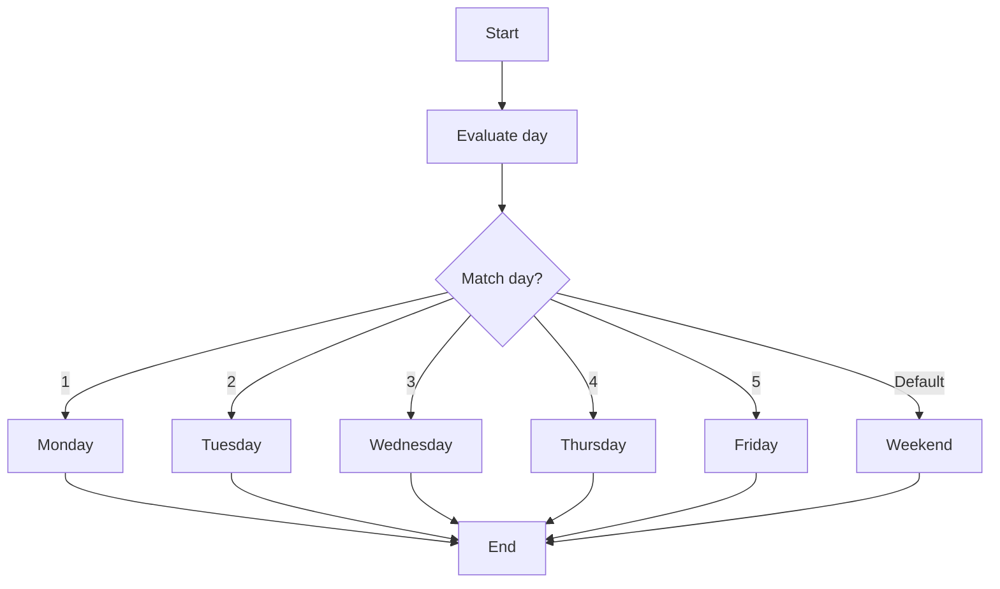

---
id: lesson-1
title: "Conditional Statements"
sidebar_label:  Conditional Statements
sidebar_position: 1
description:  "Conditional Statements in C++"
tags: [courses,beginner-level,C++,Introduction]
---  
  

1. **if Statement**
   - Evaluates a condition. If true, executes the associated block of code.

2. **if-else Statement**
   - Evaluates a condition. If true, executes the associated block of code. Otherwise, executes an alternative block of code.

3. **Nested if Statement**
   - An if or if-else statement inside another if or if-else statement.

#### Example
```cpp
#include <iostream>
using namespace std;

int main() {
    int x = 10;
    
    if (x > 0) {
        cout << "x is positive" << endl;
    } else {
        cout << "x is not positive" << endl;
    }

    if (x > 0) {
        if (x < 20) {
            cout << "x is between 0 and 20" << endl;
        }
    }
    
    return 0;
}
```

**Output:**
```
x is positive
x is between 0 and 20
```

#### Flowchart  


#### Switch-Case Statement

Evaluates a variable against a list of values (cases). Executes the matching case block and continues with the following cases until a break statement is encountered.

#### Example
```cpp
#include <iostream>
using namespace std;

int main() {
    int day = 4;

    switch (day) {
        case 1:
            cout << "Monday" << endl;
            break;
        case 2:
            cout << "Tuesday" << endl;
            break;
        case 3:
            cout << "Wednesday" << endl;
            break;
        case 4:
            cout << "Thursday" << endl;
            break;
        case 5:
            cout << "Friday" << endl;
            break;
        default:
            cout << "Weekend" << endl;
    }

    return 0;
}
```

**Output:**
```
Thursday
```

#### Flowchart  

