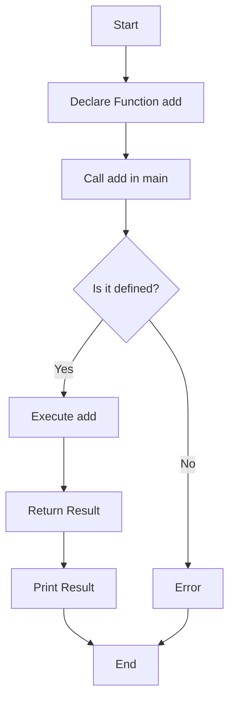

---
id: lesson-1
title: "Functions"
sidebar_label:  Functions
sidebar_position: 1
description:  "Learn Functions in C++"
tags: [courses,beginner-level,C++,Introduction]
---  
 

#### Defining and Declaring Functions

- **Function Declaration:** Provides the function's name, return type, and parameters.
- **Function Definition:** Contains the actual body of the function.


### Flowchart


#### Example
```cpp
#include <iostream>
using namespace std;

// Function declaration
int add(int, int);

int main() {
    int a = 5, b = 3;
    cout << "Sum: " << add(a, b) << endl;
    return 0;
}

// Function definition
int add(int x, int y) {
    return x + y;
}
```

**Output:**
```
Sum: 8
```

#### Function Arguments and Return Values

Functions can take arguments and return values. The return type is specified before the function name.

#### Example
```cpp
#include <iostream>
using namespace std;

int multiply(int a, int b) {
    return a * b;
}

int main() {
    int x = 4, y = 7;
    int result = multiply(x, y);
    cout << "Product: " << result << endl;
    return 0;
}
```

**Output:**
```
Product: 28
```

#### Overloading Functions

Function overloading allows multiple functions with the same name but different parameters.

#### Example
```cpp
#include <iostream>
using namespace std;

int add(int a, int b) {
    return a + b;
}

double add(double a, double b) {
    return a + b;
}

int main() {
    cout << "Int sum: " << add(2, 3) << endl;
    cout << "Double sum: " << add(2.5, 3.5) << endl;
    return 0;
}
```

**Output:**
```
Int sum: 5
Double sum: 6
```