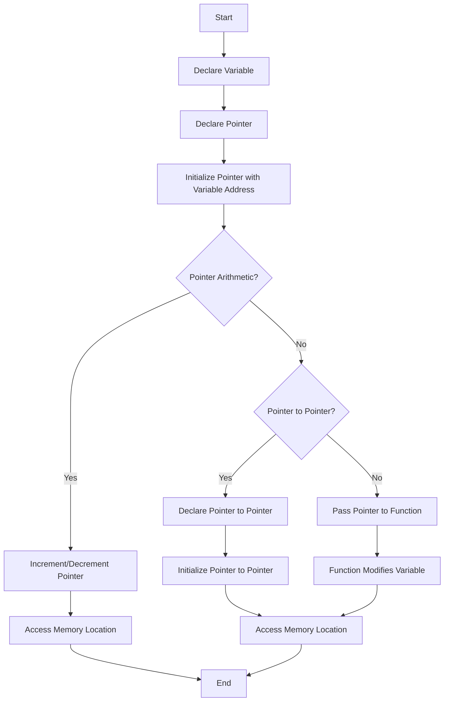

---
id: lesson-1
title: "Pointers"
sidebar_label:  Introduction
sidebar_position: 1
description:  "Learn pointers"
tags: [courses,beginner-level,C++,Introduction]
---  
 

### Introduction to Pointers
Pointers are variables that store the memory address of another variable.

### Flowchart 



### Example
 
```cpp
#include <iostream>
using namespace std;

int main() {
    int var = 10;
    int *ptr = &var; // Pointer to var

    cout << "Value of var: " << var << endl;
    cout << "Address of var: " << &var << endl;
    cout << "Value of ptr: " << ptr << endl;
    cout << "Value pointed by ptr: " << *ptr << endl;

    return 0;
}
```

**Output:**
```
Value of var: 10
Address of var: 0x7ffd6fdfd8ac
Value of ptr: 0x7ffd6fdfd8ac
Value pointed by ptr: 10
```

#### Pointer Arithmetic
Pointer arithmetic allows you to navigate through arrays and memory efficiently.

#### Example
```cpp
#include <iostream>
using namespace std;

int main() {
    int arr[3] = {10, 20, 30};
    int *ptr = arr; // Pointer to the first element of the array

    for(int i = 0; i < 3; i++) {
        cout << "Value at arr[" << i << "]: " << *(ptr + i) << endl;
    }

    return 0;
}
```

**Output:**
```
Value at arr[0]: 10
Value at arr[1]: 20
Value at arr[2]: 30
```

#### Pointers and Arrays
Arrays and pointers are closely related. The name of the array acts as a pointer to its first element.


#### Example
```cpp
#include <iostream>
using namespace std;

void printArray(int *ptr, int size) {
    for(int i = 0; i < size; i++) {
        cout << "Element " << i << ": " << *(ptr + i) << endl;
    }
}

int main() {
    int arr[3] = {10, 20, 30};
    printArray(arr, 3);

    return 0;
}
```

**Output:**
```
Element 0: 10
Element 1: 20
Element 2: 30
```

#### Pointers and Functions
Pointers can be passed to functions to allow the function to modify the argument passed.


#### Example
```cpp
#include <iostream>
using namespace std;

void increment(int *ptr) {
    (*ptr)++;
}

int main() {
    int var = 10;
    increment(&var);

    cout << "Value of var after increment: " << var << endl;

    return 0;
}
```

**Output:**
```
Value of var after increment: 11
```
