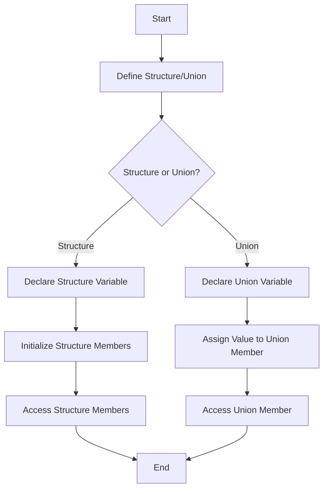

---
id: lesson-1
title: "Structures"
sidebar_label:  Structures
sidebar_position: 1
description:  "Structures in c++"
tags: [courses,beginner-level,C++,Introduction]
---  

#### Defining and Using Structures

**Structures** in C/C++ are user-defined data types that allow grouping variables of different types together.

### Flowchart 


```cpp
#include <iostream>
using namespace std;

// Define a structure
struct Person {
    string name;
    int age;
    float height;
};

int main() {
    // Declare a structure variable
    Person person1;

    // Initialize structure members
    person1.name = "John Doe";
    person1.age = 30;
    person1.height = 5.9;

    // Access and print structure members
    cout << "Name: " << person1.name << endl;
    cout << "Age: " << person1.age << endl;
    cout << "Height: " << person1.height << endl;

    return 0;
}
```

**Output:**
```
Name: John Doe
Age: 30
Height: 5.9
```

#### Array of Structures

An array of structures is useful for storing multiple records.

```cpp
#include <iostream>
using namespace std;

// Define a structure
struct Person {
    string name;
    int age;
    float height;
};

int main() {
    // Declare an array of structures
    Person people[3] = {
        {"Alice", 28, 5.6},
        {"Bob", 34, 5.8},
        {"Charlie", 22, 5.7}
    };

    // Access and print array of structures
    for (int i = 0; i < 3; i++) {
        cout << "Name: " << people[i].name << endl;
        cout << "Age: " << people[i].age << endl;
        cout << "Height: " << people[i].height << endl;
    }

    return 0;
}
```

**Output:**
```
Name: Alice
Age: 28
Height: 5.6
Name: Bob
Age: 34
Height: 5.8
Name: Charlie
Age: 22
Height: 5.7
```

#### Nested Structures

Nested structures allow for more complex data representation.

```cpp
#include <iostream>
using namespace std;

// Define a structure
struct Address {
    string city;
    string state;
    int zipCode;
};

struct Person {
    string name;
    int age;
    Address address; // Nested structure
};

int main() {
    // Declare a structure variable
    Person person = {"John Doe", 30, {"New York", "NY", 10001}};

    // Access and print nested structure members
    cout << "Name: " << person.name << endl;
    cout << "Age: " << person.age << endl;
    cout << "City: " << person.address.city << endl;
    cout << "State: " << person.address.state << endl;
    cout << "Zip Code: " << person.address.zipCode << endl;

    return 0;
}
```

**Output:**
```
Name: John Doe
Age: 30
City: New York
State: NY
Zip Code: 10001
```
