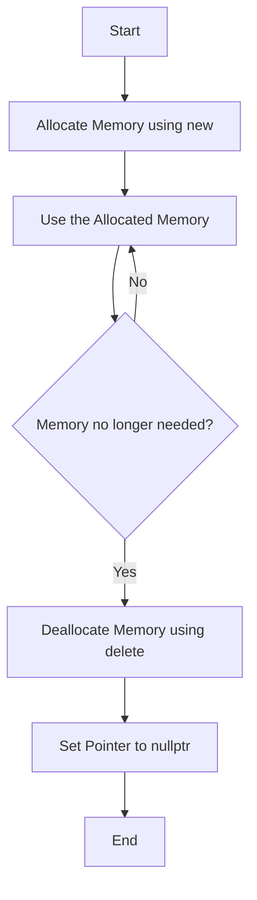

---
id: lesson-1
title: "Dynamic Memory Allocation"
sidebar_label: Dynamic Memory Allocation
sidebar_position: 1
description: "Learn Dynamic Memory Allocation"
tags: [courses,intermediate-level,React Native,Introduction]
--- 
    

Dynamic memory allocation in C++ allows you to allocate memory at runtime using the `new` and `delete` operators. This is essential for creating objects whose size or quantity may not be known until the program is running.

### Introduction to Dynamic Memory Allocation

Dynamic memory allocation enables more flexible and efficient use of memory. Unlike static memory allocation, which is determined at compile-time, dynamic memory allocation occurs at runtime, making it possible to allocate and deallocate memory as needed.

### Flowchart 



:::note
**new and delete Operators**

- **`new` operator**: Allocates memory dynamically on the heap and returns a pointer to the allocated memory.
- **`delete` operator**: Deallocates memory that was previously allocated with `new`.
:::

##### Example: Allocating and Deallocating a Single Variable
```cpp
#include <iostream>
using namespace std;

int main() {
    int *p = new int; // Dynamically allocate memory for an integer
    *p = 10; // Assign a value to the allocated memory

    cout << "Value: " << *p << endl; // Output: Value: 10

    delete p; // Deallocate the memory
    p = nullptr; // Avoid dangling pointer

    return 0;
}
```

**Output:**
```
Value: 10
```

##### Example: Allocating and Deallocating an Array
```cpp
#include <iostream>
using namespace std;

int main() {
    int size;
    cout << "Enter the size of the array: ";
    cin >> size;

    int *arr = new int[size]; // Dynamically allocate memory for an array

    for (int i = 0; i < size; ++i) {
        arr[i] = i + 1; // Initialize array
    }

    cout << "Array elements: ";
    for (int i = 0; i < size; ++i) {
        cout << arr[i] << " ";
    }
    cout << endl;

    delete[] arr; // Deallocate the memory for the array
    arr = nullptr; // Avoid dangling pointer

    return 0;
}
```

**Output:**
```
Enter the size of the array: 5
Array elements: 1 2 3 4 5
```