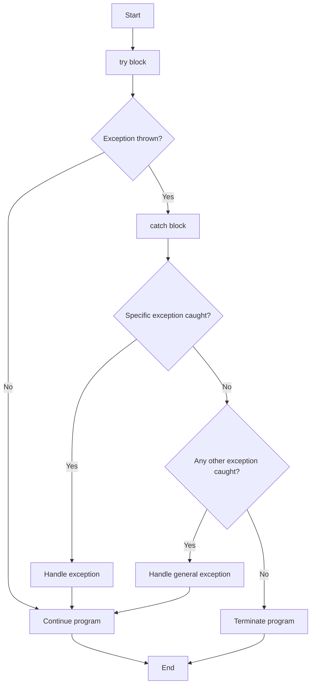

---
id: lesson-1
title: "Exception Handling in C++"
sidebar_label: Intro
sidebar_position: 1
description: "Learn Exception Handling in C++"
tags: [courses,intermediate-level,React Native,Introduction]
---  
 

Exception handling in C++ provides a way to handle runtime errors, ensuring that the program can manage unexpected situations gracefully.

#### Introduction to Exception Handling

Exception handling involves using the `try`, `catch`, and `throw` keywords to handle errors and exceptional conditions in a controlled manner.

### Flowchart  




#### Basic Syntax

The basic structure for exception handling in C++ is:

```cpp
try {
    // Code that may throw an exception
} catch (exceptionType1 e1) {
    // Code to handle exception of type exceptionType1
} catch (exceptionType2 e2) {
    // Code to handle exception of type exceptionType2
    // ...
} catch (...) {
    // Code to handle any exception type
}
```

#### Example: Basic Exception Handling

```cpp
#include <iostream>
using namespace std;

int main() {
    try {
        int a = 10;
        int b = 0;
        if (b == 0) {
            throw "Division by zero!";
        }
        cout << a / b << endl;
    } catch (const char* msg) {
        cerr << "Error: " << msg << endl;
    }
    return 0;
}
```

**Output:**
```
Error: Division by zero!
```
