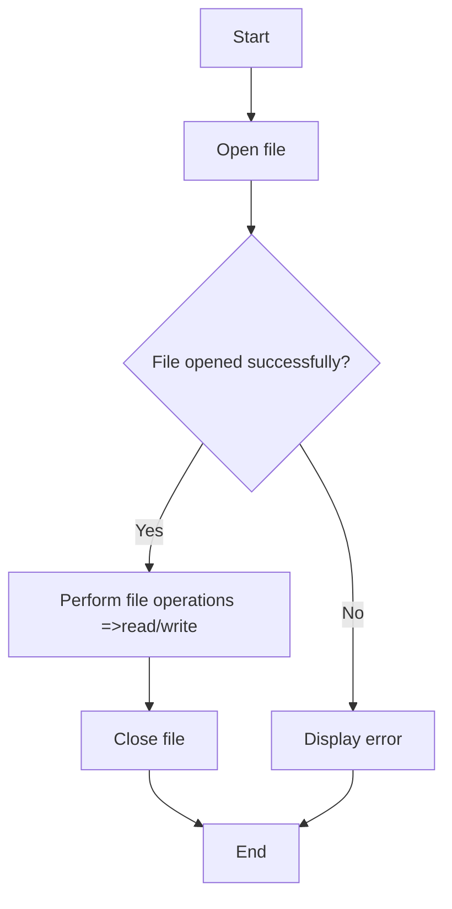

---
id: lesson-1
title: "File Handling"
sidebar_label: File Handling
sidebar_position: 1
description: "Learn File Handling"
tags: [courses,intermediate-level,React Native,Introduction]
--- 
     

File handling in C++ is essential for performing operations such as reading from and writing to files. This allows programs to persist data between executions and manage large amounts of information.

### Introduction to File Handling

File handling in C++ involves using the file stream classes provided in the `<fstream>` header: `ifstream` for reading files, `ofstream` for writing files, and `fstream` for both reading and writing.


### Flowchart 



#### File Operations (Opening, Closing, Reading, Writing)

- **Opening a file**: To open a file, you need to create an object of `ifstream` or `ofstream` and use the `open` method, or you can open a file directly using the constructor.
- **Closing a file**: Always close a file after performing operations using the `close` method to ensure all data is written and resources are freed.
- **Reading from a file**: Use `ifstream` and various input operations (e.g., `>>`, `getline`).
- **Writing to a file**: Use `ofstream` and output operations (e.g., `<<`).

##### Example: Basic File Operations
```cpp
#include <iostream>
#include <fstream>
using namespace std;

int main() {
    // Writing to a file
    ofstream outFile("example.txt");
    if (outFile.is_open()) {
        outFile << "Hello, World!" << endl;
        outFile << "Writing to a file in C++." << endl;
        outFile.close(); // Close the file
    } else {
        cout << "Unable to open file for writing" << endl;
    }

    // Reading from a file
    ifstream inFile("example.txt");
    if (inFile.is_open()) {
        string line;
        while (getline(inFile, line)) {
            cout << line << endl; // Output each line
        }
        inFile.close(); // Close the file
    } else {
        cout << "Unable to open file for reading" << endl;
    }

    return 0;
}
```

**Output:**
```
Hello, World!
Writing to a file in C++.
```

#### File Pointers and File Modes

- **File Pointers**: `ifstream`, `ofstream`, and `fstream` objects have internal pointers that determine where to read or write in the file. You can manipulate these pointers using methods like `seekg`, `seekp`, `tellg`, and `tellp`.
- **File Modes**: Specify the mode in which a file is opened (e.g., `ios::in`, `ios::out`, `ios::app`, `ios::binary`). Multiple modes can be combined using the bitwise OR operator (`|`).

##### Example: Using File Modes
```cpp
#include <iostream>
#include <fstream>
using namespace std;

int main() {
    ofstream outFile("example.txt", ios::app); // Open in append mode
    if (outFile.is_open()) {
        outFile << "Appending a new line." << endl;
        outFile.close();
    }

    ifstream inFile("example.txt", ios::in); // Open in read mode
    if (inFile.is_open()) {
        string line;
        while (getline(inFile, line)) {
            cout << line << endl;
        }
        inFile.close();
    }

    return 0;
}
```

**Output:**
```
Hello, World!
Writing to a file in C++.
Appending a new line.
```
