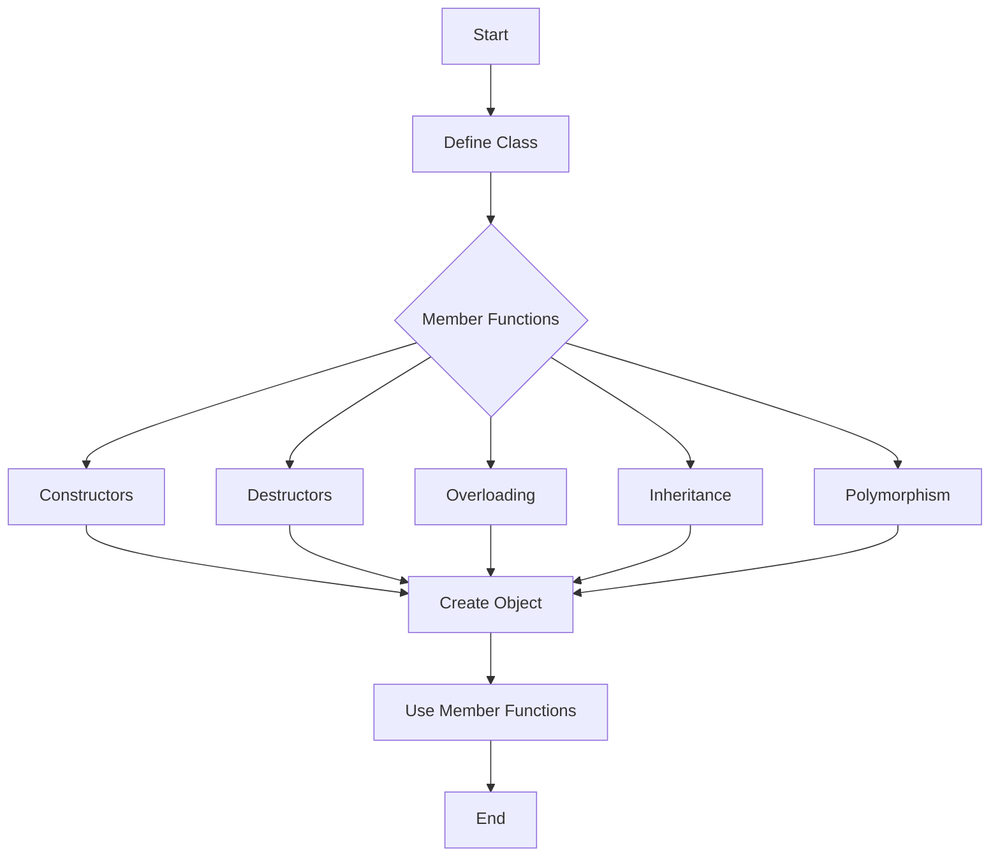

---
id: lesson-1
title: "Object-Oriented Programming(OOP)"
sidebar_label: Introduction & Concept
sidebar_position: 1
description: "Learn Object-Oriented Programming"
tags: [courses,intermediate-level,React Native,Introduction]
--- 
   
 

#### Introduction to OOP
Object-Oriented Programming (OOP) is a programming paradigm that uses "objects" to design applications and programs. It is based on several key concepts, including:

- **Encapsulation**: Bundling data and methods that operate on the data within one unit, such as a class.
- **Inheritance**: Mechanism to create a new class using the properties and methods of an existing class.
- **Polymorphism**: Ability to process objects differently based on their data type or class.
- **Abstraction**: Hiding the complex implementation details and showing only the necessary features of an object.

### Flowchart


#### Classes and Objects

A **class** is a blueprint for creating objects, providing initial values for state (member variables) and implementations of behavior (member functions or methods).

An **object** is an instance of a class.

```cpp
#include <iostream>
using namespace std;

class Car {
public:
    // Member variables
    string brand;
    string model;
    int year;

    // Member functions
    void displayInfo() {
        cout << "Brand: " << brand << endl;
        cout << "Model: " << model << endl;
        cout << "Year: " << year << endl;
    }
};

int main() {
    // Creating an object of Car class
    Car car1;
    car1.brand = "Toyota";
    car1.model = "Corolla";
    car1.year = 2020;

    // Accessing member function
    car1.displayInfo();

    return 0;
}
```

**Output:**
```
Brand: Toyota
Model: Corolla
Year: 2020
```

#### Constructors and Destructors

A **constructor** is a special member function that is called when an object is instantiated. A **destructor** is called when an object is destroyed.

```cpp
#include <iostream>
using namespace std;

class Car {
public:
    string brand;
    string model;
    int year;

    // Constructor
    Car(string b, string m, int y) {
        brand = b;
        model = m;
        year = y;
    }

    // Destructor
    ~Car() {
        cout << "Car object destroyed" << endl;
    }

    void displayInfo() {
        cout << "Brand: " << brand << endl;
        cout << "Model: " << model << endl;
        cout << "Year: " << year << endl;
    }
};

int main() {
    // Creating an object of Car class
    Car car1("Toyota", "Corolla", 2020);
    car1.displayInfo();

    return 0;
}
```

**Output:**
```
Brand: Toyota
Model: Corolla
Year: 2020
Car object destroyed
```

#### Member Functions

Member functions are functions defined inside a class and used to perform operations on the member variables of the class.

```cpp
class Car {
public:
    string brand;
    string model;
    int year;

    // Member function to set car details
    void setDetails(string b, string m, int y) {
        brand = b;
        model = m;
        year = y;
    }

    // Member function to display car details
    void displayInfo() {
        cout << "Brand: " << brand << endl;
        cout << "Model: " << model << endl;
        cout << "Year: " << year << endl;
    }
};
```

#### Inheritance

Inheritance allows a class (derived class) to inherit attributes and methods from another class (base class).

```cpp
class Vehicle {
public:
    string brand;
    void honk() {
        cout << "Beep beep!" << endl;
    }
};

class Car : public Vehicle {
public:
    string model;
    int year;
};

int main() {
    Car car1;
    car1.brand = "Toyota";
    car1.model = "Corolla";
    car1.year = 2020;
    car1.honk();
    return 0;
}
```

**Output:**
```
Beep beep!
```

#### Polymorphism

Polymorphism allows methods to do different things based on the object it is acting upon.

**Function Overloading**: Multiple functions can have the same name with different parameters.

```cpp
class Print {
public:
    void display(int i) {
        cout << "Integer: " << i << endl;
    }

    void display(double d) {
        cout << "Double: " << d << endl;
    }

    void display(string s) {
        cout << "String: " << s << endl;
    }
};
```

**Operator Overloading**: Giving additional meaning to C++ operators.

```cpp
class Complex {
private:
    float real;
    float imag;

public:
    Complex() : real(0), imag(0) {}
    Complex(float r, float i) : real(r), imag(i) {}

    Complex operator + (const Complex& obj) {
        Complex temp;
        temp.real = real + obj.real;
        temp.imag = imag + obj.imag;
        return temp;
    }

    void display() {
        cout << "Real: " << real << " Imaginary: " << imag << endl;
    }
};

int main() {
    Complex c1(3.5, 2.5), c2(1.5, 1.5);
    Complex c3 = c1 + c2; // Using overloaded operator
    c3.display();
    return 0;
}
```

**Output:**
```
Real: 5 Imaginary: 4
```

**Virtual Functions**: Functions that are defined in the base class and overridden in the derived class.

```cpp
class Base {
public:
    virtual void display() {
        cout << "Base class display function" << endl;
    }
};

class Derived : public Base {
public:
    void display() override {
        cout << "Derived class display function" << endl;
    }
};

int main() {
    Base* basePtr;
    Derived d;
    basePtr = &d;
    basePtr->display(); // Calls Derived class display function
    return 0;
}
```

**Output:**
```
Derived class display function
```

:::tip
- **Encapsulation**: Use encapsulation to protect the integrity of your data by hiding internal implementation details and exposing only necessary functionalities.
- **Inheritance**: Inheritance helps in reusing existing code and extending functionalities. Use it to create a hierarchy of classes.
- **Polymorphism**: Polymorphism provides flexibility by allowing methods to operate differently based on the objects they act upon.
- **Constructors and Destructors**: Always initialize objects properly using constructors and clean up resources using destructors to avoid memory leaks.
- **Practice**: Regularly practice writing and refactoring OOP code to better understand and utilize these concepts effectively.
:::