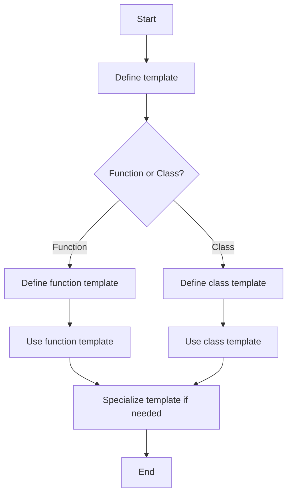

---
id: lesson-1
title: "Templates in C++"
sidebar_label: Templates
sidebar_position: 1
description: "Learn Templates in C++"
tags: [courses,intermediate-level,React Native,Introduction]
--- 
     

Templates allow writing generic and reusable code that works with any data type. This is a powerful feature in C++ for creating flexible and type-safe functions and classes.

#### Introduction to Templates

Templates are used to create functions or classes that work with any data type. They are defined with the `template` keyword.

#### Flowchart


#### Function Templates

Function templates enable creating a single function that can operate on different data types.

##### Example: Function Template
```cpp
#include <iostream>
using namespace std;

template <typename T>
T add(T a, T b) {
    return a + b;
}

int main() {
    cout << "Addition of integers: " << add<int>(3, 4) << endl;
    cout << "Addition of doubles: " << add<double>(3.5, 4.5) << endl;
    return 0;
}
```

**Output:**
```
Addition of integers: 7
Addition of doubles: 8
```

#### Class Templates

Class templates allow defining a blueprint for classes that can operate on any data type.

##### Example: Class Template
```cpp
#include <iostream>
using namespace std;

template <typename T>
class Box {
private:
    T value;
public:
    Box(T v) : value(v) {}
    T getValue() {
        return value;
    }
};

int main() {
    Box<int> intBox(123);
    Box<string> strBox("Hello");

    cout << "Integer value: " << intBox.getValue() << endl;
    cout << "String value: " << strBox.getValue() << endl;
    return 0;
}
```

**Output:**
```
Integer value: 123
String value: Hello
```