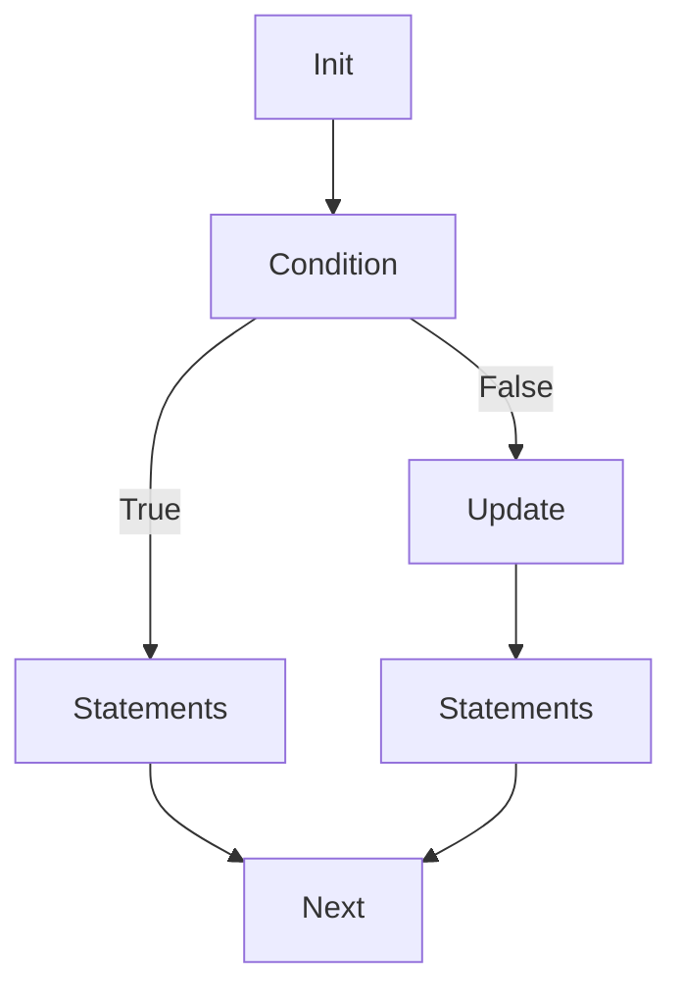
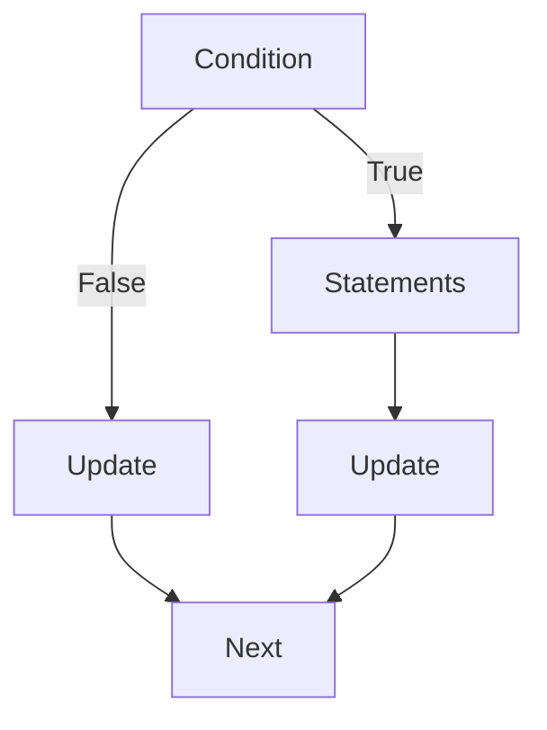
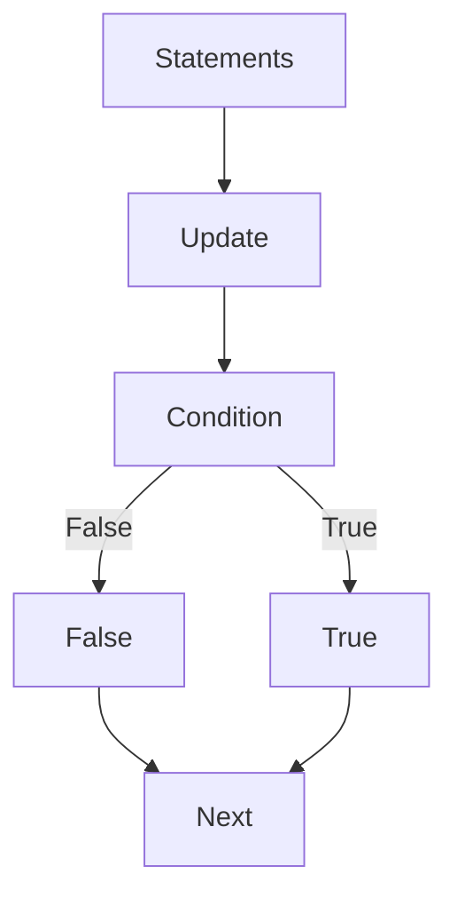
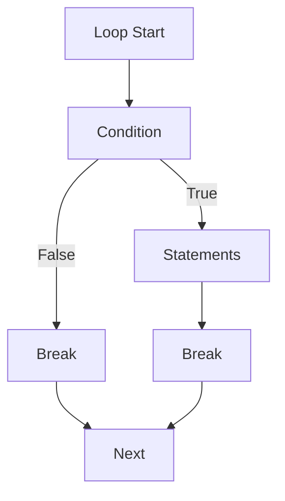
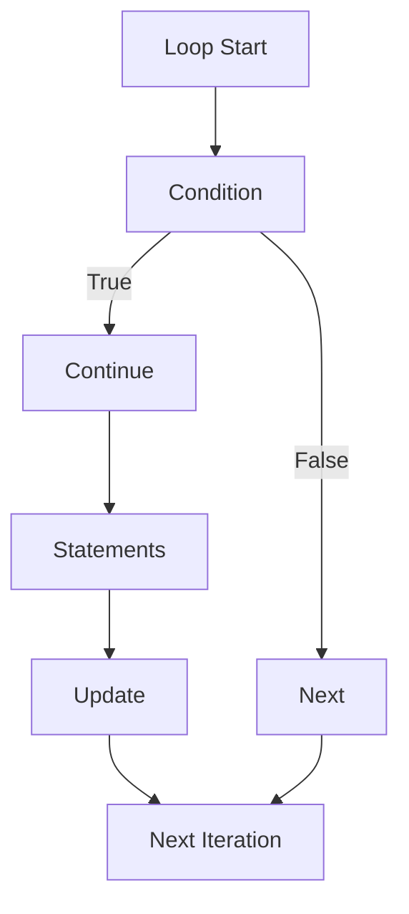

Loops are used to execute a block of code repeatedly.

##### 1. for Loop

**Flowchart:**


**Example:**

```c
#include <stdio.h>

int main() {
    for (int i = 1; i <= 5; i++) {
        printf("i = %d\n", i);
    }
    return 0;
}
```

**Output:**
```
i = 1
i = 2
i = 3
i = 4
i = 5
```

##### 2. while Loop

**Flowchart:** 


 
**Example:**

```c
#include <stdio.h>

int main() {
    int i = 1;
    while (i <= 5) {
        printf("i = %d\n", i);
        i++;
    }
    return 0;
}
```

**Output:**
```
i = 1
i = 2
i = 3
i = 4
i = 5
```

##### 3. do-while Loop

**Flowchart:**




**Example:**

```c
#include <stdio.h>

int main() {
    int i = 1;
    do {
        printf("i = %d\n", i);
        i++;
    } while (i <= 5);
    return 0;
}
```

**Output:**
```
i = 1
i = 2
i = 3
i = 4
i = 5
```

#### Break and Continue Statements

##### Example: break Statement

**Flowchart:**




**Example:**

```c
#include <stdio.h>

int main() {
    for (int i = 1; i <= 5; i++) {
        if (i == 3) {
            break;
        }
        printf("i = %d\n", i);
    }
    return 0;
}
```

**Output:**
```
i = 1
i = 2
```

##### Example: continue Statement

**Flowchart:**


 

**Example:**

```c
#include <stdio.h>

int main() {
    for (int i = 1; i <= 5; i++) {
        if (i == 3) {
            continue;
        }
        printf("i = %d\n", i);
    }
    return 0;
}
```

**Output:**
```
i = 1
i = 2
i = 4
i = 5
```
