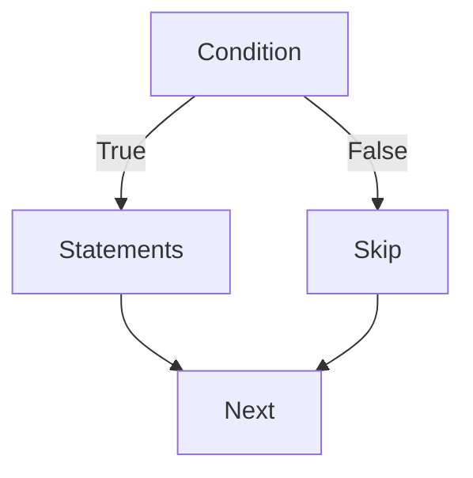
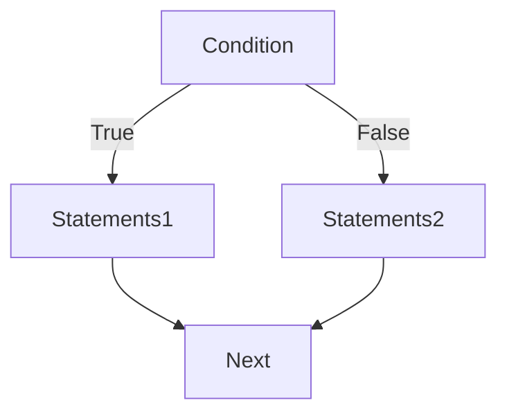
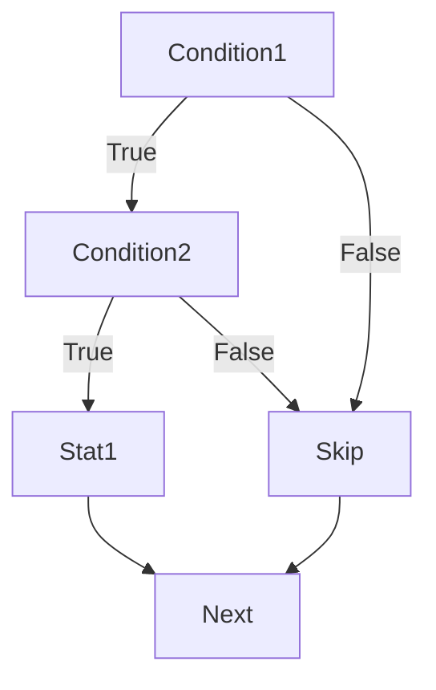
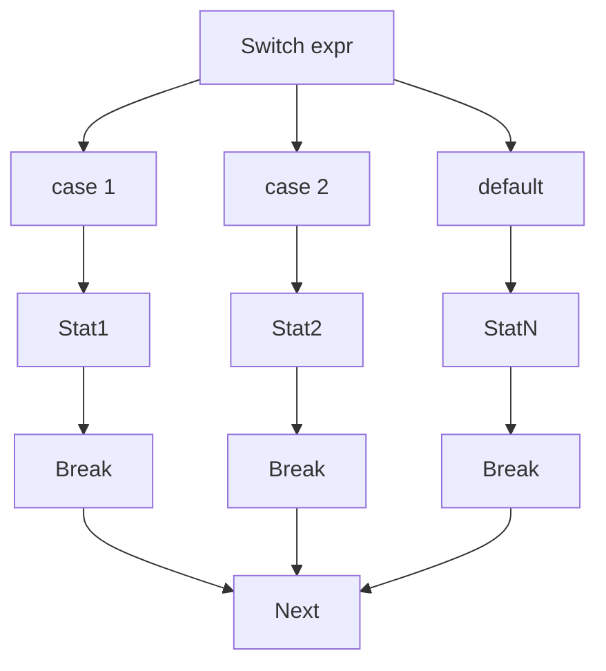

  

Control flow statements are used to determine the flow of execution of a program. The primary control flow constructs in C include conditional statements, switch-case statements, loops, and break and continue statements.

#### Conditional Statements

Conditional statements are used to execute different blocks of code based on certain conditions.

##### 1. if Statement

**Flowchart:**




**Example:**

```c
#include <stdio.h>

int main() {
    int a = 10, b = 20;
    if (a < b) {
        printf("a is less than b\n");
    }
    return 0;
}
```

**Output:**
```
a is less than b
```

##### 2. if-else Statement

**Flowchart:**



 

**Example:**

```c
#include <stdio.h>

int main() {
    int a = 10, b = 20;
    if (a > b) {
        printf("a is greater than b\n");
    } else {
        printf("a is not greater than b\n");
    }
    return 0;
}
```

**Output:**
```
a is not greater than b
```

##### 3. Nested if Statement

**Flowchart:**




**Example:**

```c
#include <stdio.h>

int main() {
    int a = 10, b = 20;
    if (a < b) {
        if (a < 15) {
            printf("a is less than 15\n");
        }
    }
    return 0;
}
```

**Output:**
```
a is less than 15
```

#### Switch-case Statement

Switch-case statements allow multi-way branching based on the value of an expression.

**Flowchart:**



**Example:**

```c
#include <stdio.h>

int main() {
    int day = 3;

    switch (day) {
        case 1:
            printf("Monday\n");
            break;
        case 2:
            printf("Tuesday\n");
            break;
        case 3:
            printf("Wednesday\n");
            break;
        case 4:
            printf("Thursday\n");
            break;
        case 5:
            printf("Friday\n");
            break;
        case 6:
            printf("Saturday\n");
            break;
        case 7:
            printf("Sunday\n");
            break;
        default:
            printf("Invalid day\n");
    }

    return 0;
}
```

**Output:**
```
Wednesday
```