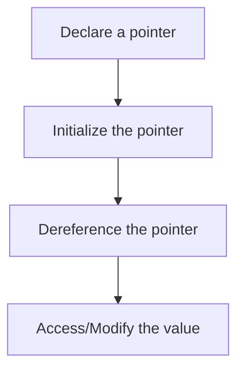

---
id: lesson-1
title: "Pointers in C"
sidebar_label: Pointers
sidebar_position: 1
description: "Learn Pointers in C"
tags: [courses,beginner-level,C,Introduction]
---  

 

Pointers are a powerful feature in C that allow you to directly manipulate memory addresses. Understanding pointers is crucial for effective memory management and efficient programming in C.

#### Introduction to Pointers

A pointer is a variable that stores the memory address of another variable. Pointers enable various operations, such as dynamic memory allocation, array manipulation, and efficient function calls.

### Flowchart for Pointers

1. **Declare a pointer**: Declare a variable to store the address of another variable.
2. **Initialize the pointer**: Assign the address of the variable to the pointer.
3. **Dereference the pointer**: Access or modify the value stored at the pointer's address.





**Declaration and Initialization of Pointers:**

```c
#include <stdio.h>

int main() {
    int var = 10;
    int *ptr; // Pointer declaration

    ptr = &var; // Pointer initialization

    printf("Value of var: %d\n", var);
    printf("Address of var: %p\n", &var);
    printf("Value of ptr: %p\n", ptr);
    printf("Value pointed to by ptr: %d\n", *ptr);

    return 0;
}
```

**Output:**

```
Value of var: 10
Address of var: 0x7ffc12345678
Value of ptr: 0x7ffc12345678
Value pointed to by ptr: 10
```

#### Pointer Arithmetic

Pointer arithmetic involves operations on pointers. You can perform addition and subtraction on pointers to navigate through memory.

**Example: Pointer Arithmetic**

```c
#include <stdio.h>

int main() {
    int arr[5] = {10, 20, 30, 40, 50};
    int *ptr = arr; // Pointer to the first element of the array

    for (int i = 0; i < 5; i++) {
        printf("Value at arr[%d]: %d\n", i, *(ptr + i)); // Pointer arithmetic
    }

    return 0;
}
```

**Output:**

```
Value at arr[0]: 10
Value at arr[1]: 20
Value at arr[2]: 30
Value at arr[3]: 40
Value at arr[4]: 50
```

#### Pointers and Arrays

Pointers and arrays are closely related in C. The name of an array acts as a pointer to the first element of the array.

**Example: Pointers and Arrays**

```c
#include <stdio.h>

int main() {
    int arr[3] = {10, 20, 30};
    int *ptr = arr;

    // Accessing array elements using pointer
    for (int i = 0; i < 3; i++) {
        printf("arr[%d] = %d\n", i, *(ptr + i));
    }

    return 0;
}
```

**Output:**

```
arr[0] = 10
arr[1] = 20
arr[2] = 30
```

#### Pointers and Functions

Pointers can be used to pass arguments to functions by reference, allowing the function to modify the original variables.

**Example: Pointers and Functions**

```c
#include <stdio.h>

// Function declaration
void swap(int *a, int *b);

int main() {
    int x = 5, y = 10;

    printf("Before swap: x = %d, y = %d\n", x, y);
    swap(&x, &y);
    printf("After swap: x = %d, y = %d\n", x, y);

    return 0;
}

// Function definition
void swap(int *a, int *b) {
    int temp;
    temp = *a;
    *a = *b;
    *b = temp;
}
```

**Output:**

```
Before swap: x = 5, y = 10
After swap: x = 10, y = 5
```

#### Example 1: Pointer Declaration and Initialization

```c
#include <stdio.h>

int main() {
    int var = 10;
    int *ptr; // Pointer declaration

    ptr = &var; // Pointer initialization

    printf("Value of var: %d\n", var);
    printf("Address of var: %p\n", &var);
    printf("Value of ptr: %p\n", ptr);
    printf("Value pointed to by ptr: %d\n", *ptr);

    return 0;
}
```

**Explanation**: This program demonstrates the declaration, initialization, and dereferencing of a pointer. The pointer `ptr` is initialized with the address of `var`, and the value stored at that address is accessed using `*ptr`.

**Output:**

```
Value of var: 10
Address of var: 0x7ffc12345678
Value of ptr: 0x7ffc12345678
Value pointed to by ptr: 10
```

#### Example 2: Pointer Arithmetic

```c
#include <stdio.h>

int main() {
    int arr[5] = {10, 20, 30, 40, 50};
    int *ptr = arr; // Pointer to the first element of the array

    for (int i = 0; i < 5; i++) {
        printf("Value at arr[%d]: %d\n", i, *(ptr + i)); // Pointer arithmetic
    }

    return 0;
}
```

**Explanation**: This program shows how to use pointer arithmetic to iterate through an array. The pointer `ptr` is used to access the elements of the array `arr` by incrementing the pointer.

**Output:**

```
Value at arr[0]: 10
Value at arr[1]: 20
Value at arr[2]: 30
Value at arr[3]: 40
Value at arr[4]: 50
```

#### Example 3: Pointers and Functions

```c
#include <stdio.h>

// Function declaration
void swap(int *a, int *b);

int main() {
    int x = 5, y = 10;

    printf("Before swap: x = %d, y = %d\n", x, y);
    swap(&x, &y);
    printf("After swap: x = %d, y = %d\n", x, y);

    return 0;
}

// Function definition
void swap(int *a, int *b) {
    int temp;
    temp = *a;
    *a = *b;
    *b = temp;
}
```

**Explanation**: This program demonstrates passing arguments to functions by reference using pointers. The `swap` function swaps the values of `x` and `y` by modifying the values directly through their pointers.

**Output:**

```
Before swap: x = 5, y = 10
After swap: x = 10, y = 5
```
