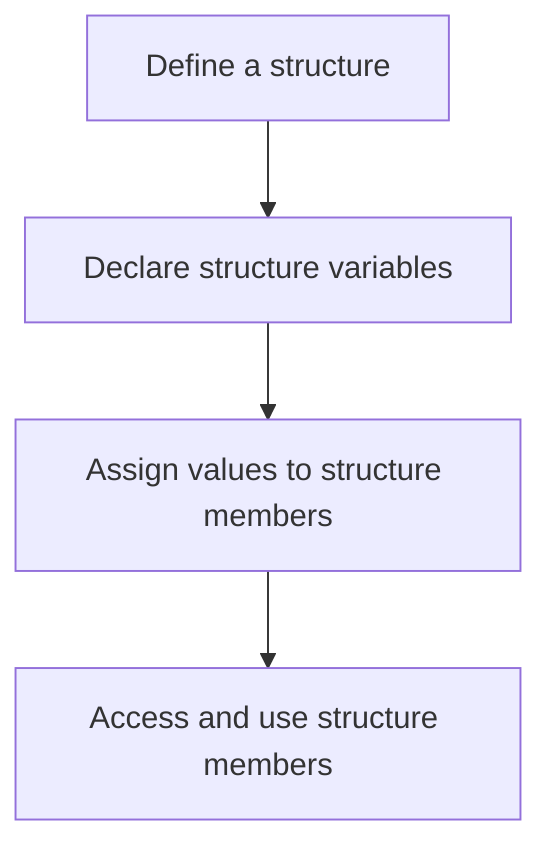

Structures and unions are user-defined data types that allow the grouping of variables of different types. They provide a way to model complex data structures in a single unit.

### Defining and Using Structures

A structure is a collection of variables, possibly of different types, grouped together under a single name.

### Flowchart for Using Structures

:::note

1. **Define a structure**: Define the structure with the required members.
2. **Declare structure variables**: Declare variables of the structure type.
3. **Assign values to structure members**: Use the dot operator to assign values.
4. **Access and use structure members**: Access values using the dot operator.
   :::



**Defining a Structure:**

```c title="filename.c"
#include <stdio.h>

// Define a structure
struct Person {
    char name[50];
    int age;
    float salary;
};

int main() {
    // Declare a structure variable
    struct Person person1;

    // Assign values to the members of the structure
    strcpy(person1.name, "Alice");
    person1.age = 30;
    person1.salary = 55000.50;

    // Access and print the values
    printf("Name: %s\n", person1.name);
    printf("Age: %d\n", person1.age);
    printf("Salary: %.2f\n", person1.salary);

    return 0;
}
```

**Output:**

```
Name: Alice
Age: 30
Salary: 55000.50
```

#### Array of Structures

An array of structures allows storing multiple records of the same structure type.

**Example: Array of Structures**

```c
#include <stdio.h>

// Define a structure
struct Person {
    char name[50];
    int age;
    float salary;
};

int main() {
    // Declare an array of structures
    struct Person people[3];

    // Assign values to the array elements
    strcpy(people[0].name, "Alice");
    people[0].age = 30;
    people[0].salary = 55000.50;

    strcpy(people[1].name, "Bob");
    people[1].age = 25;
    people[1].salary = 45000.75;

    strcpy(people[2].name, "Charlie");
    people[2].age = 28;
    people[2].salary = 50000.60;

    // Access and print the values
    for (int i = 0; i < 3; i++) {
        printf("Name: %s, Age: %d, Salary: %.2f\n", people[i].name, people[i].age, people[i].salary);
    }

    return 0;
}
```

**Output:**

```
Name: Alice, Age: 30, Salary: 55000.50
Name: Bob, Age: 25, Salary: 45000.75
Name: Charlie, Age: 28, Salary: 50000.60
```

#### Nested Structures

Nested structures are structures within structures, allowing you to create more complex data models.

**Example: Nested Structures**

```c
#include <stdio.h>

// Define a nested structure
struct Date {
    int day;
    int month;
    int year;
};

struct Person {
    char name[50];
    struct Date birthdate; // Nested structure
    float salary;
};

int main() {
    // Declare a structure variable
    struct Person person1;

    // Assign values to the members of the structure
    strcpy(person1.name, "Alice");
    person1.birthdate.day = 15;
    person1.birthdate.month = 5;
    person1.birthdate.year = 1990;
    person1.salary = 55000.50;

    // Access and print the values
    printf("Name: %s\n", person1.name);
    printf("Birthdate: %02d-%02d-%04d\n", person1.birthdate.day, person1.birthdate.month, person1.birthdate.year);
    printf("Salary: %.2f\n", person1.salary);

    return 0;
}
```

**Output:**

```
Name: Alice
Birthdate: 15-05-1990
Salary: 55000.50
```

#### Example : Using Structures

```c
#include <stdio.h>

// Define a structure
struct Person {
    char name[50];
    int age;
    float salary;
};

int main() {
    // Declare a structure variable
    struct Person person1;

    // Assign values to the members of the structure
    strcpy(person1.name, "Alice");
    person1.age = 30;
    person1.salary = 55000.50;

    // Access and print the values
    printf("Name: %s\n", person1.name);
    printf("Age: %d\n", person1.age);
    printf("Salary: %.2f\n", person1.salary);

    return 0;
}
```

**Output:**

```
Name: Alice
Age: 30
Salary: 55000.50
```
