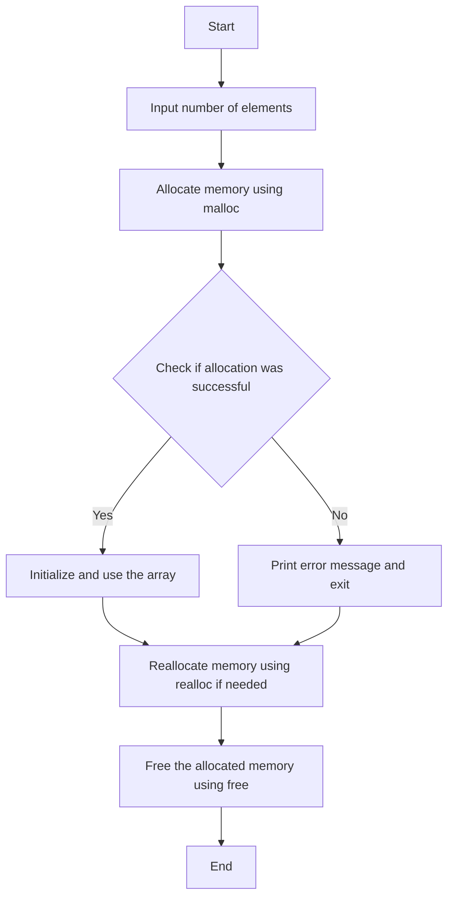

  

Dynamic arrays allow you to allocate memory at runtime, making it possible to handle arrays whose size can change during program execution.

1. **Creating Dynamic Arrays**:

   ```c
   int *arr;
   int n;

   printf("Enter number of elements: ");
   scanf("%d", &n);

   arr = (int *)malloc(n * sizeof(int)); // Allocate memory dynamically
   if (arr == NULL) {
       printf("Memory allocation failed\n");
       return 1;
   }

   for (int i = 0; i < n; i++) {
       arr[i] = i + 1; // Initialize array
   }

   for (int i = 0; i < n; i++) {
       printf("%d ", arr[i]); // Access array elements
   }

   free(arr); // Deallocate memory
   ```

2. **Resizing Dynamic Arrays**:

   ```c
   int *arr;
   int n, new_n;

   printf("Enter number of elements: ");
   scanf("%d", &n);

   arr = (int *)malloc(n * sizeof(int));
   if (arr == NULL) {
       printf("Memory allocation failed\n");
       return 1;
   }

   for (int i = 0; i < n; i++) {
       arr[i] = i + 1;
   }

   printf("\nEnter new size: ");
   scanf("%d", &new_n);

   arr = (int *)realloc(arr, new_n * sizeof(int)); // Resize array
   if (arr == NULL) {
       printf("Memory reallocation failed\n");
       return 1;
   }

   for (int i = 0; i < new_n; i++) {
       printf("%d ", arr[i]);
   }

   free(arr);
   ```
 

#### Flowchart: Dynamic Arrays

:::note
1. **Start**
2. **Input number of elements (n)**
3. **Allocate memory using `malloc`**
4. **Check if allocation was successful**
   - If successful, proceed to the next step
   - If not, print an error message and **exit**
5. **Initialize and use the array**
6. **Reallocate memory using `realloc` if needed**
7. **Free the allocated memory**
8. **End**
:::



