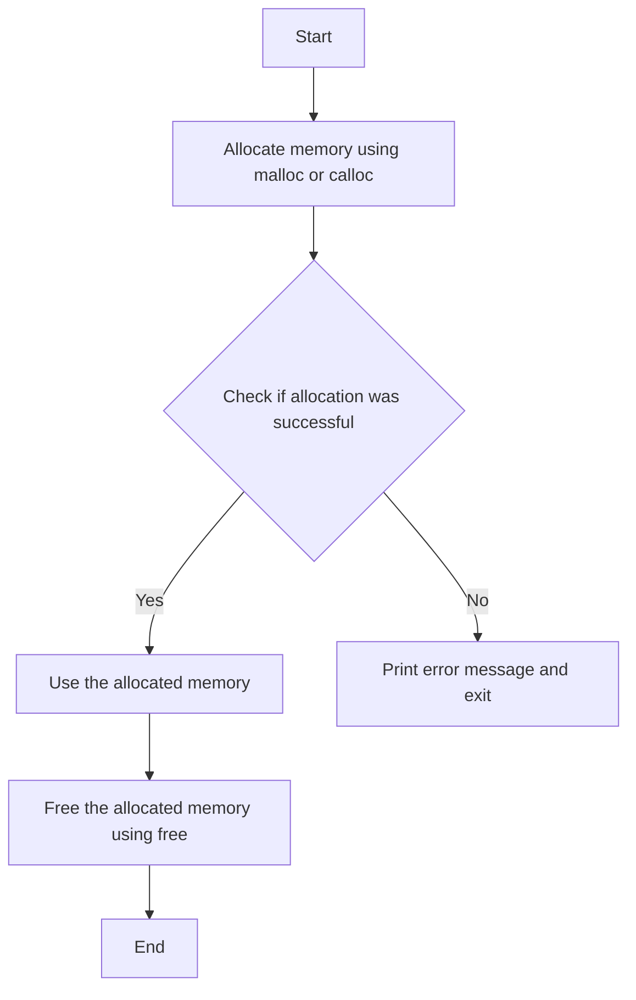

 

Dynamic memory allocation allows programs to allocate memory at runtime, which is useful for creating flexible and efficient programs. The C Standard Library provides several functions for dynamic memory management.

#### Introduction to Dynamic Memory Allocation

Dynamic memory allocation is the process of allocating memory storage during the execution of a program. This is done using pointers to manage memory blocks of varying sizes.

#### Flowchart: Dynamic Memory Allocation
:::note
1. **Start**
2. **Allocate memory** using `malloc` or `calloc`
3. **Check if allocation was successful**
   - If successful, proceed to the next step
   - If not, print an error message and **exit**
4. **Use the allocated memory** (assign values, process data)
5. **Free the allocated memory** using `free`
6. **End**
:::
  


 


#### `malloc`, `calloc`, `realloc`, and `free`

1. **`malloc` (Memory Allocation)**:
   - Allocates a specified number of bytes of memory.
   - Returns a pointer to the allocated memory.
   - Memory is not initialized.

   ```c
   int *ptr;
   ptr = (int *)malloc(sizeof(int) * n); // Allocate memory for n integers
   if (ptr == NULL) {
       printf("Memory allocation failed\n");
   }
   ```

2. **`calloc` (Contiguous Allocation)**:
   - Allocates memory for an array of elements, initializes all bytes to zero.
   - Returns a pointer to the allocated memory.

   ```c
   int *ptr;
   ptr = (int *)calloc(n, sizeof(int)); // Allocate memory for n integers and initialize to 0
   if (ptr == NULL) {
       printf("Memory allocation failed\n");
   }
   ```

3. **`realloc` (Reallocation)**:
   - Resizes a previously allocated memory block.
   - Returns a pointer to the newly allocated memory.

   ```c
   int *ptr;
   ptr = (int *)realloc(ptr, sizeof(int) * new_size); // Resize the memory block
   if (ptr == NULL) {
       printf("Memory reallocation failed\n");
   }
   ```

4. **`free` (Deallocation)**:
   - Frees previously allocated memory.

   ```c
   free(ptr); // Deallocate the memory
   ```
