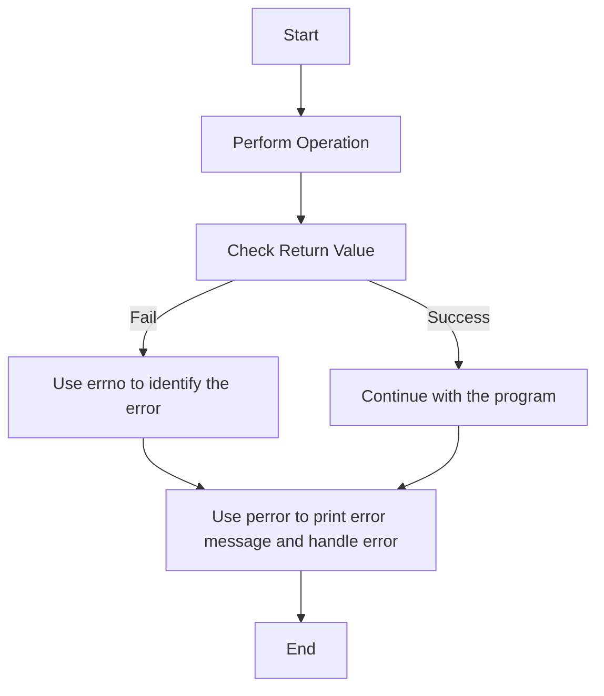

---
id: lesson-1
title: "Error Handling in C"
sidebar_label:  Introduction
sidebar_position: 1
description: "Learn Error Handling in C"
tags: [courses,intermediate-level,File Handling,Introduction]
--- 
 

Error handling is an essential aspect of programming that helps manage and respond to issues that arise during the execution of a program. In C, errors can be categorized into several types, and there are specific techniques and tools for handling them.

#### Types of Errors

1. **Syntax Errors**
   - **Definition**: Errors that occur due to incorrect use of the C language syntax. These are typically caught by the compiler.
   - **Examples**:
     ```c
     int main() {
         int x = 5
         return 0;
     }
     ```
     *Missing semicolon after `int x = 5`.*

2. **Runtime Errors**
   - **Definition**: Errors that occur during the execution of the program. These errors are not detected during compilation.
   - **Examples**:
     ```c
     int main() {
         int *p = NULL;
         *p = 10; // Dereferencing a null pointer
         return 0;
     }
     ```
     *Dereferencing a null pointer.*

3. **Logical Errors**
   - **Definition**: Errors that occur when the program runs but produces incorrect results due to flawed logic.
   - **Examples**:
     ```c
     int main() {
         int a = 5, b = 10;
         int sum = a - b; // Incorrect operation
         printf("Sum: %d\n", sum);
         return 0;
     }
     ```
     *Incorrect calculation of sum.*


#### Flowchart for Error Handling
:::note
1. **Start**
2. **Perform Operation (e.g., file operation)**
3. **Check Return Value**
   - If the operation fails:
     - Use `errno` to identify the error.
     - Use `perror` to print the error message.
     - Handle the error (e.g., clean up resources, exit program).
   - If the operation succeeds, proceed with the next step.
4. **End**
:::





#### Error Handling Techniques

1. **Using `errno` and `perror`**

   - **`errno`**: A global variable set by system calls and some library functions in the event of an error to indicate what went wrong. It is defined in `<errno.h>`.
   
   - **`perror`**: A function that prints a descriptive error message to `stderr` based on the current value of `errno`.

   - **Example**:
     ```c
     #include <stdio.h>
     #include <errno.h>
     #include <string.h>

     int main() {
         FILE *file = fopen("nonexistentfile.txt", "r");
         if (file == NULL) {
             perror("Error opening file");
             printf("Error code: %d\n", errno);
         } else {
             fclose(file);
         }
         return 0;
     }
     ```

   **Output**:
   ```
   Error opening file: No such file or directory
   Error code: 2
   ```
