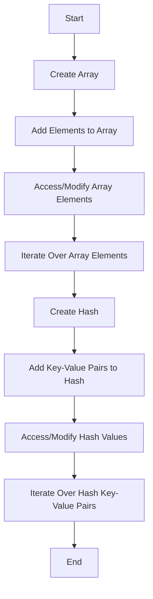

---
id: lesson-2
title: "Introduction to Hashes"
sidebar_label: Hashes
sidebar_position: 2
description: "Introduction to Hashes"
tags: [courses,beginner-level,Ruby,Introduction]
--- 
 
Hashes are collections of key-value pairs. They are similar to arrays, but the indexing is done via arbitrary keys.

```ruby
# Creating a hash
person = { name: "Alice", age: 30, city: "New York" }

# Accessing values
puts person[:name] # Output: Alice

# Modifying values
person[:age] = 31
puts person.inspect # Output: {:name=>"Alice", :age=>31, :city=>"New York"}
```

#### Hash Methods and Operations
Ruby provides numerous methods to work with hashes.

```ruby
# Adding key-value pairs
person[:email] = "alice@example.com"
puts person.inspect # Output: {:name=>"Alice", :age=>31, :city=>"New York", :email=>"alice@example.com"}

# Removing key-value pairs
person.delete(:city)
puts person.inspect # Output: {:name=>"Alice", :age=>31, :email=>"alice@example.com"}

# Iterating over key-value pairs
person.each do |key, value|
  puts "#{key}: #{value}"
end

# Checking for a key
puts person.key?(:name) # Output: true
puts person.key?(:city) # Output: false
```

### Example  

```ruby
# Array example
fruits = ["apple", "banana", "cherry"]
fruits << "date"
fruits.each { |fruit| puts fruit }
# Output:
# apple
# banana
# cherry
# date

# Hash example
car = { make: "Toyota", model: "Camry", year: 2020 }
car[:color] = "red"
car.each { |key, value| puts "#{key}: #{value}" }
# Output:
# make: Toyota
# model: Camry
# year: 2020
# color: red
```

### Flowchart



:::tip
1. **Versatility of Arrays:**
   - Ruby arrays can hold objects of any type and provide numerous methods for manipulation, making them very versatile.

2. **Power of Hashes:**
   - Hashes are useful for storing key-value pairs and are highly efficient for lookups, making them ideal for scenarios where association between a key and a value is needed.

3. **Enumerable Methods:**
   - Both arrays and hashes include the Enumerable module, providing powerful methods like `each`, `map`, `select`, and more, allowing for elegant and efficient data manipulation.
:::