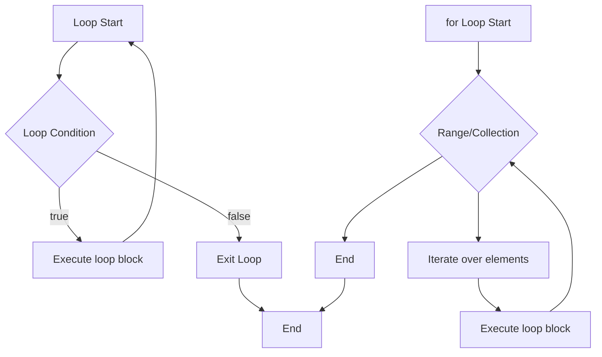

---
id: lesson-2
title: "Loops"
sidebar_label: Loops
sidebar_position: 2
description: "Learn Loops"
tags: [courses,beginner-level,Ruby,Introduction]
--- 
 

### Flowchart




**while Loop:**
- Repeats code as long as the condition is true.

```ruby
i = 1

while i <= 5
  puts i
  i += 1
end
```

**until Loop:**
- Repeats code as long as the condition is false.

```ruby
i = 1

until i > 5
  puts i
  i += 1
end
```

**for Loop:**
- Iterates over a range or collection.

```ruby
for i in 1..5
  puts i
end
```

**each Iterator:**
- Iterates over elements of a collection.

```ruby
(1..5).each do |i|
  puts i
end
```

###  Iterators and Blocks

**Block:**
- A block is a chunk of code enclosed in `do...end` or curly braces `{...}` that you can pass to methods.

```ruby
3.times do
  puts "Hello!"
end

3.times { puts "Hello!" }
```

### Break, Next, and Redo Statements

**break:**
- Exits the loop early.

```ruby
i = 0

while i < 10
  puts i
  break if i == 5
  i += 1
end
```

**next:**
- Skips to the next iteration.

```ruby
for i in 1..10
  next if i % 2 == 0
  puts i
end
```

**redo:**
- Repeats the current iteration.

```ruby
i = 0

while i < 10
  puts i
  i += 1
  redo if i == 5
end
```

### Example 

```ruby
# control_structures.rb

# Conditional statements
age = 21
if age >= 18
  puts "You are an adult."
else
  puts "You are a minor."
end

hungry = true
unless hungry
  puts "You are not hungry."
else
  puts "You are hungry."
end

day = "Monday"
case day
when "Monday", "Tuesday", "Wednesday", "Thursday", "Friday"
  puts "It's a weekday."
when "Saturday", "Sunday"
  puts "It's a weekend."
else
  puts "Invalid day."
end

# Loops
i = 1
while i <= 3
  puts "While Loop: #{i}"
  i += 1
end

i = 1
until i > 3
  puts "Until Loop: #{i}"
  i += 1
end

for i in 1..3
  puts "For Loop: #{i}"
end

(1..3).each do |i|
  puts "Each Iterator: #{i}"
end

# Break, next, and redo statements
for i in 1..10
  break if i == 4
  next if i % 2 == 0
  puts "Break/Next: #{i}"
end
```

**Output:**

```bash
You are an adult.
You are hungry.
It's a weekday.
While Loop: 1
While Loop: 2
While Loop: 3
Until Loop: 1
Until Loop: 2
Until Loop: 3
For Loop: 1
For Loop: 2
For Loop: 3
Each Iterator: 1
Each Iterator: 2
Each Iterator: 3
Break/Next: 1
Break/Next: 3
```

:::tip

1. **Readable Conditions:**
   - Always write conditions that are easy to read and understand. Avoid complex and nested conditions when possible to enhance readability and maintainability.

2. **Iterators over Loops:**
   - Prefer using iterators like `each` over traditional loops (`for`, `while`) as they are more idiomatic and concise in Ruby.

3. **Early Exit:**
   - Use `break`, `next`, and `redo` wisely to control the flow within loops. These can help in managing complex loop conditions and improving readability.
:::

