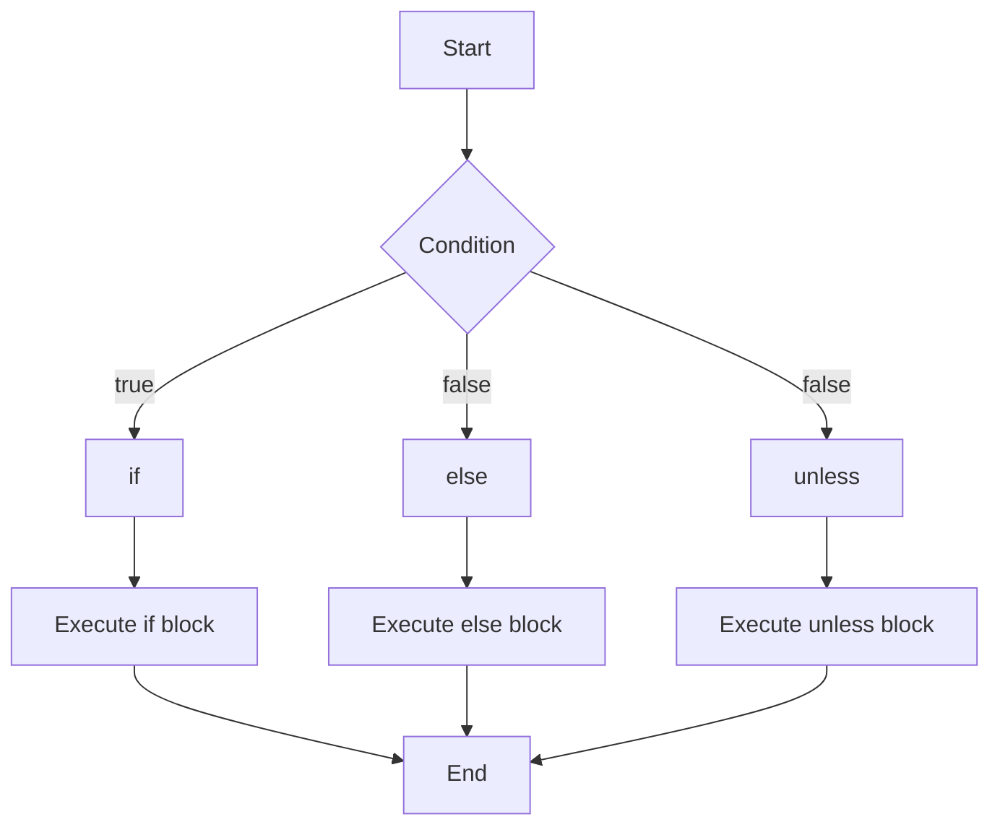

---
id: lesson-1
title: "Conditional Statements"
sidebar_label: Conditional Statements
sidebar_position: 1
description: "Learn Conditional Statements"
tags: [courses,beginner-level,Ruby,Introduction]
--- 
   

#### Flowchart



**if Statement:**
- Used to execute code based on a condition.

```ruby
age = 18

if age >= 18
  puts "You are an adult."
else
  puts "You are a minor."
end
```

**unless Statement:**
- Executes code if the condition is false.

```ruby
hungry = false

unless hungry
  puts "You are not hungry."
else
  puts "You are hungry."
end
```

**case-when Statement:**
- Executes code based on multiple conditions.

```ruby
day = "Saturday"

case day
when "Monday", "Tuesday", "Wednesday", "Thursday", "Friday"
  puts "It's a weekday."
when "Saturday", "Sunday"
  puts "It's a weekend."
else
  puts "Invalid day."
end
```
 
:::tip
 **Readable Switch Statements:**
   - Use `case` statements for multiple condition checks instead of multiple `if-elsif-else` blocks to make your code cleaner.
   ```ruby
   case day
   when "Monday" then puts "Start of the week!"
   when "Friday" then puts "End of the work week!"
   else puts "Midweek"
   end
   ``` 
:::