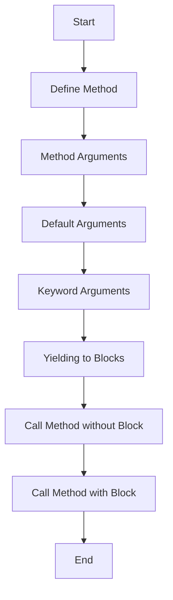

---
id: lesson-1
title: "Defining and Calling Methods"
sidebar_label: Defining Methods
sidebar_position: 1
description: "Learn Defining and Calling Methods"
tags: [courses,beginner-level,Ruby,Introduction]
---  


In Ruby, methods are defined using the `def` keyword. Here's how to define and call a method:

```ruby
def greet(name)
  puts "Hello, #{name}!"
end

greet("Alice") # Output: Hello, Alice!
```

### Flowchart


