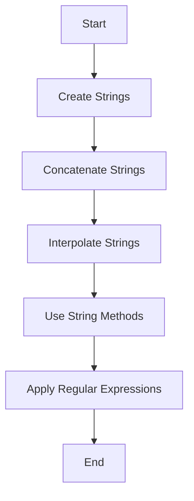

---
id: lesson-1
title: "String Creation and Manipulation"
sidebar_label: String Concept
sidebar_position: 1
description: "Learn String Concepts"
tags: [courses,beginner-level,Ruby,Introduction]
---  

Strings in Ruby can be created using single quotes, double quotes, or the `String` class.

```ruby
# Creating strings
single_quote_string = 'Hello, world!'
double_quote_string = "Hello, world!"
string_class_string = String.new("Hello, world!")

# Accessing characters
puts single_quote_string[0] # Output: H

# Modifying strings
single_quote_string[0] = 'J'
puts single_quote_string # Output: Jello, world!
```

#### String Interpolation and Concatenation
String interpolation allows embedding expressions inside string literals. Concatenation joins strings together.

```ruby
name = "Alice"
greeting = "Hello, #{name}!"
puts greeting # Output: Hello, Alice!

# Concatenation
full_greeting = "Hello, " + name + "!"
puts full_greeting # Output: Hello, Alice!

# Using the shovel operator (<<)
greeting << " How are you?"
puts greeting # Output: Hello, Alice! How are you?
```

#### String Methods
Ruby provides many methods for string manipulation.

```ruby
# Length
puts greeting.length # Output: 20

# Split
words = greeting.split(" ")
puts words.inspect # Output: ["Hello,", "Alice!", "How", "are", "you?"]

# Replace (gsub)
new_greeting = greeting.gsub("Alice", "Bob")
puts new_greeting # Output: Hello, Bob! How are you?

# Upcase and Downcase
puts greeting.upcase # Output: HELLO, ALICE! HOW ARE YOU?
puts greeting.downcase # Output: hello, alice! how are you?
```

#### Regular Expressions
Regular expressions are used for pattern matching and text manipulation.

```ruby
text = "The price is $100."
# Check for pattern
puts text =~ /\$[0-9]+/ # Output: 13

# Extracting the pattern
price = text[/\$[0-9]+/]
puts price # Output: $100

# Replacing text using regex
new_text = text.gsub(/\$[0-9]+/, "$200")
puts new_text # Output: The price is $200.
```

### Example with Output
Here's an example demonstrating the concepts:

```ruby
name = "Alice"
greeting = "Hello, #{name}!"
full_greeting = greeting + " How are you today?"
puts full_greeting

# String methods
puts "Length: #{full_greeting.length}"
puts "Words: #{full_greeting.split(" ").inspect}"
puts "Uppercase: #{full_greeting.upcase}"

# Regular expressions
if full_greeting =~ /Alice/
  puts "The string contains 'Alice'."
else
  puts "The string does not contain 'Alice'."
end

```
## Output:
```bash
 Hello, Alice! How are you today?
 Length: 27
 Words: ["Hello", "Alice!", "How", "are", "you", "today?"]
 Uppercase: HELLO, ALICE! HOW ARE YOU TODAY?
 The string contains 'Alice'.
```
:::important
1. **String Interpolation**: Allows embedding variables and expressions within strings using `#{}`.
2. **String Methods**: Ruby provides extensive methods like `length`, `split`, `gsub`, etc., for effective string manipulation.
3. **Regular Expressions**: Powerful for pattern matching and text processing, enabling sophisticated string operations.
:::

### Flowchart




:::tip
- Use single quotes for strings that don't need interpolation or special character processing for slight performance benefits.
- Familiarize yourself with Ruby's extensive string methods to handle common tasks efficiently.
- Regular expressions are a powerful tool but can be complex; practice to understand their syntax and capabilities.
:::