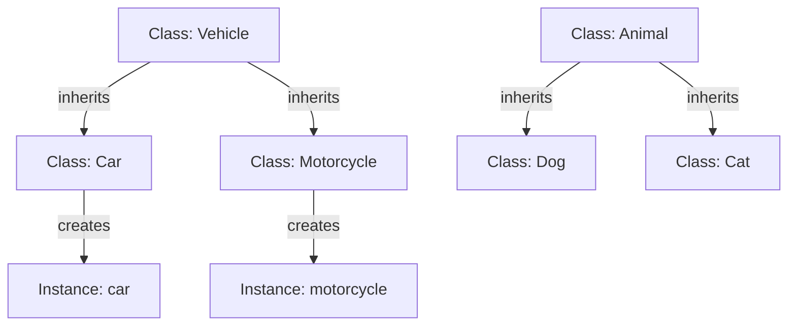

---
id: lesson-1
title: "Advanced Object-Oriented Programming (OOP) in Ruby"
sidebar_label: OOPS Overall View
sidebar_position: 1
description: "Learn Advanced Object-Oriented Programming (OOP) in Ruby"
tags: [courses,intermediate-level,Ruby,Introduction]
---  

#### Introduction to OOP Concepts
Object-Oriented Programming (OOP) is a programming paradigm that uses objects and classes to structure code. Ruby, being an object-oriented language, makes heavy use of these concepts.

:::note
- **Classes and Objects**: Classes are blueprints for objects. Objects are instances of classes.
- **Instance Variables and Methods**: Instance variables are variables that belong to an instance of a class. Instance methods are functions defined in a class that operate on instance variables.
- **Class Variables and Methods**: Class variables are variables that belong to the class itself. Class methods are functions defined on the class, not instances.
:::

#### Classes and Objects

```ruby
class Person
  # Class variable
  @@population = 0

  # Constructor
  def initialize(name, age)
    @name = name    # Instance variable
    @age = age      # Instance variable
    @@population += 1
  end

  # Instance method
  def introduce
    "Hello, my name is #{@name} and I am #{@age} years old."
  end

  # Class method
  def self.population
    @@population
  end
end

# Creating objects
alice = Person.new("Alice", 30)
bob = Person.new("Bob", 25)

puts alice.introduce # Output: Hello, my name is Alice and I am 30 years old.
puts bob.introduce   # Output: Hello, my name is Bob and I am 25 years old.
puts Person.population # Output: 2
```

#### Inheritance
Inheritance allows a class to inherit features from another class.

```ruby
class Animal
  def speak
    "Some sound"
  end
end

class Dog < Animal
  def speak
    "Woof!"
  end
end

dog = Dog.new
puts dog.speak # Output: Woof!
```

#### Method Overriding and `super`
Method overriding allows a subclass to provide a specific implementation of a method that is already defined in its superclass.

```ruby
class Animal
  def speak
    "Some sound"
  end
end

class Cat < Animal
  def speak
    super + " Meow!"  # Calling the superclass method
  end
end

cat = Cat.new
puts cat.speak # Output: Some sound Meow!
```

#### Polymorphism
Polymorphism allows methods to behave differently based on the object calling them.

```ruby
class Animal
  def speak
    "Some sound"
  end
end

class Dog < Animal
  def speak
    "Woof!"
  end
end

class Cat < Animal
  def speak
    "Meow!"
  end
end

animals = [Dog.new, Cat.new, Animal.new]
animals.each { |animal| puts animal.speak }
# Output:
# Woof!
# Meow!
# Some sound
```

#### Encapsulation and Access Control
Encapsulation restricts direct access to some of an object's components, which is a means of preventing unintended interference and misuse.

```ruby
class Person
  def initialize(name, age)
    @name = name
    @age = age
  end

  # Getter method
  def name
    @name
  end

  # Setter method
  def name=(new_name)
    @name = new_name
  end

  # Private method
  private
  def age
    @age
  end
end

person = Person.new("Alice", 30)
puts person.name # Output: Alice
person.name = "Bob"
puts person.name # Output: Bob
# puts person.age  # This will raise an error: private method `age' called
```

### Example with Output
Here's a full example demonstrating the concepts:

```ruby
class Vehicle
  @@count = 0

  def initialize(make, model)
    @make = make
    @model = model
    @@count += 1
  end

  def description
    "This is a #{@make} #{@model}."
  end

  def self.count
    @@count
  end
end

class Car < Vehicle
  def description
    super + " It's a car."
  end
end

class Motorcycle < Vehicle
  def description
    super + " It's a motorcycle."
  end
end

car = Car.new("Toyota", "Camry")
motorcycle = Motorcycle.new("Harley-Davidson", "Iron 883")

puts car.description         # Output: This is a Toyota Camry. It's a car.
puts motorcycle.description  # Output: This is a Harley-Davidson Iron 883. It's a motorcycle.
puts Vehicle.count           # Output: 2
```

:::important
1. **Encapsulation**: Restricts access to certain parts of an object to prevent unintended interference.
2. **Inheritance**: Allows a class to inherit attributes and methods from another class, promoting code reuse.
3. **Polymorphism**: Enables a single method to operate differently based on the calling object, enhancing flexibility.
:::

### Flowchart 




:::tip
- Use `super` to call methods from the superclass when overriding.
- Encapsulate sensitive data by using private or protected access controls.
- Leverage polymorphism to write more generic and reusable code.
:::