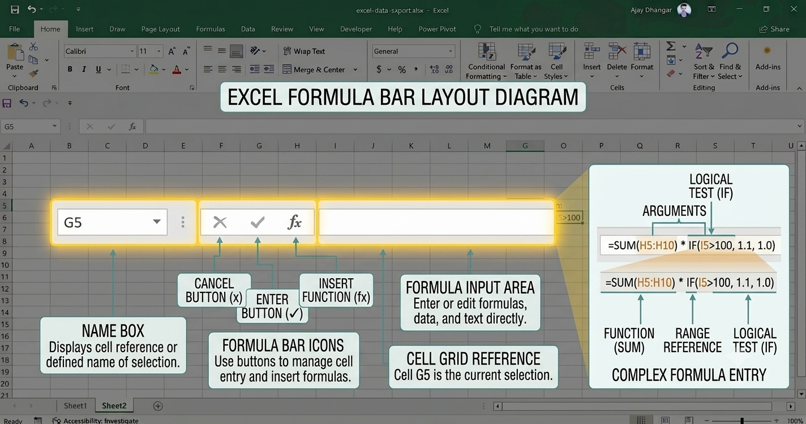

Located directly above the worksheet grid, the **Formula Bar** and **Name Box** form the core command center for viewing, entering, and auditing data in Microsoft Excel. While cells on the grid display final calculated outputs, the Formula Bar reveals the actual underlying logic, text, or formulas behind those numbers.

<AdsComponent />

**Anatomy of the Formula Bar Area**

The Formula Bar layout is divided into three functional components across a single horizontal line:



* **Name Box** *(Far Left)*: Displays the address of the active cell or the name of a selected range.
* **Function Buttons** *(Center)*: Quick action controls to cancel, accept, or insert functions.
* **Formula Edit Box** *(Right)*: The active text box for entering or modifying values, labels, and mathematical logic.

**The Name Box: Navigation & Named Ranges**

The **Name Box** serves as both a position indicator and a high-speed navigation tool.

### 1. Direct Cell Navigation
* Click the **Name Box**, type any target cell address (e.g., `G45` or `XFD100`), and press `Enter` to jump directly to that cell.
* Enter a contiguous cell range (e.g., `A1:D20`) and press `Enter` to instantly highlight that entire block.

### 2. Multi-Sheet Navigation
* Type the sheet name followed by an exclamation mark and cell reference (e.g., `Sheet3!B10`) into the Name Box to jump across different worksheets within the same workbook.

### 3. Creating & Selecting Named Ranges
Instead of memorizing cell coordinates, you can assign descriptive names to cell ranges:
1. Highlight a cell or range (e.g., `C2:C50`).
2. Click the **Name Box**, type a unique identifier (e.g., `Total_Revenue`), and press `Enter`.
3. Clicking the dropdown arrow on the Name Box allows you to select any saved Named Range across the entire workbook instantly.

> **Rule for Named Ranges**: Names must start with a letter or underscore, cannot contain spaces, and cannot match standard cell addresses like `A1` or `SUM`.

**Formula Bar Controls & Shortcuts**

When editing data in the Formula Bar, three small control buttons activate between the Name Box and the text field:

| Control Icon | Command | Shortcut | Function |
| :---: | :--- | :--- | :--- |
| `✖` | **Cancel** | `Esc` | Discards any current edits in the formula bar without modifying the cell. |
| `✔` | **Enter** | `Ctrl + Enter` | Commits changes while keeping the selection on the **same cell** (unlike `Enter`, which moves selection down). |
| `fx` | **Insert Function** | `Shift + F3` | Opens the **Insert Function** dialog box to search for functions and build arguments step-by-step. |

**Working with Multi-Line Formulas**

When writing complex, nested logic functions (such as multiple nested `IF` or `XLOOKUP` statements), a single-line view can cut off long expressions.

<AdsComponent />

### Expanding the Formula Bar
* **Keyboard Shortcut**: Press `Ctrl + Shift + U` to toggle the Formula Bar between a single line and an expanded multi-line panel.
* **Mouse Drag**: Hover your cursor over the bottom edge of the Formula Bar until it turns into a vertical split arrow (`↕`), then drag downward to expand.

### In-Formula Line Breaks
To make lengthy formulas readable and maintainable, add intentional line breaks:
* Press `Alt + Enter` inside the Formula Bar to create a new line within the same formula string without committing the calculation.

```excel title="Example: Nested IF with Line Breaks"
=IF(A2 > 100, 
   XLOOKUP(B2, CategoryList, DiscountRates, 0), 
   0)

```

**Auditing and Highlighting Cell References**

When you click inside the Formula Bar to edit an equation, Excel triggers **Color-Coded Syntax Highlighting**:

* Each cell or range reference in the formula receives a distinct border color (e.g., `Blue` for `A2`, `Red` for `B2`).
* Matching color-coded outline boxes appear on the active worksheet grid simultaneously.
* You can adjust cell references visually by dragging the colored selection handles directly on the grid while remaining in Formula Bar editing mode.

<AdsComponent />