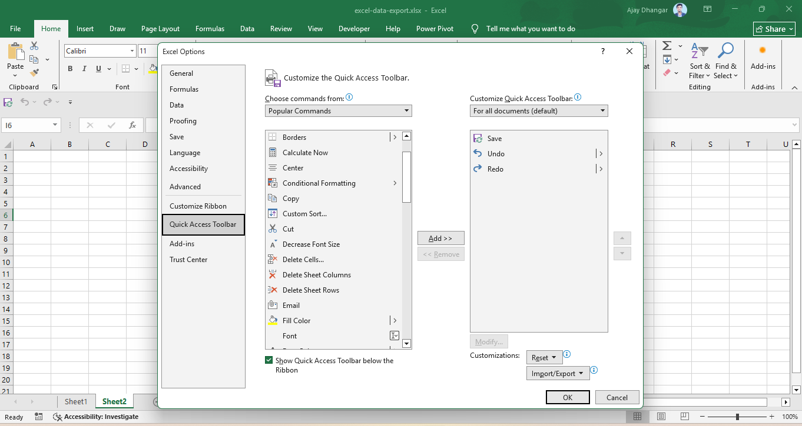
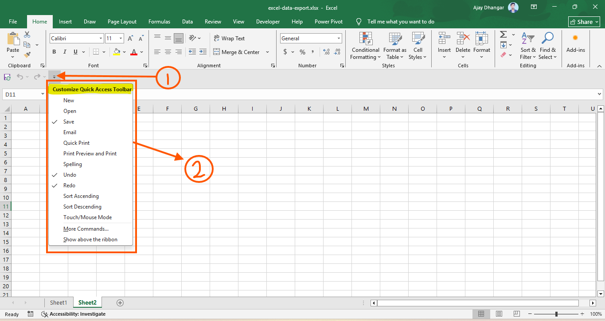

The **Quick Access Toolbar (QAT)** is a customizable toolbar positioned independently of the active Ribbon tab. It provides single-click access to your most frequently used Excel commands, tools, and custom macros from anywhere in the application.

<AdsComponent />

**Overview and Default Configuration**

By default, the Quick Access Toolbar is located in the top-left corner of the title bar (above the Ribbon tabs).

### Default Commands
When you first open Excel, the QAT typically contains a minimal set of primary operational tools:
* **AutoSave** (for OneDrive/SharePoint hosted files)
* **Save** (`Ctrl + S`)
* **Undo** (`Ctrl + Z`)
* **Redo / Repeat** (`Ctrl + Y`)

**Adding and Removing Commands**

You can add almost any Excel command—or even custom macros—to the Quick Access Toolbar for quick access.

### Method 1: Direct Right-Click (Fastest)
1. Locate any command or button on the Ribbon tabs.
2. Right-click the command icon or dropdown menu.
3. Select **Add to Quick Access Toolbar**.

### Method 2: QAT Dropdown Menu

1. Click the small **Customize Quick Access Toolbar** arrow (▼) at the right end of the QAT.
2. Check or uncheck popular built-in commands (such as *New*, *Open*, *Quick Print*, *Sort Ascending*, or *Touch/Mouse Mode*).

### Method 3: Excel Options Dialog (Advanced)
1. Navigate to **File > Options > Quick Access Toolbar** (or right-click the QAT and choose **Customize Quick Access Toolbar...**).
2. Set **Choose commands from** to *Popular Commands*, *Commands Not in the Ribbon*, or *All Commands*.
3. Highlight your desired command in the left box and click **Add >>**.
4. To remove a tool, highlight it in the right-hand panel and click **&lt;&lt; Remove**.

**Repositioning the Toolbar**

Depending on your screen resolution and workspace preference, you can display the Quick Access Toolbar above or below the Ribbon.

| Position | Advantages | How to Set |
| :--- | :--- | :--- |
| **Above the Ribbon** *(Default)* | Saves vertical grid space; keeps the worksheet tall. | QAT Dropdown > **Show Above the Ribbon** |
| **Below the Ribbon** | Easier cursor reach; allows more horizontal space for icons. | QAT Dropdown > **Show Below the Ribbon** |

<AdsComponent />

**Keyboard Shortcuts for QAT Tools**

The Quick Access Toolbar enables automatic numerical keyboard shortcuts:

1. Press the `Alt` key on your keyboard to reveal key tips over the Excel UI.
2. Notice the numbers displayed over each item in your Quick Access Toolbar (`1`, `2`, `3`, ... `9`).
3. Press `Alt + [Number]` to trigger that exact command immediately without touching the mouse.

> **Example:** If your 4th item on the QAT is **Paste Special Values**, pressing `Alt + 4` executes that command instantly.

**Reordering Commands**

1. Open **File > Options > Quick Access Toolbar**.
2. Select the command you want to resequence from the right-hand list.
3. Use the **Move Up** (▲) and **Move Down** (▼) buttons on the far right to reorder the tools.
4. Click **OK** to apply your changes.

**Importing, Exporting, and Resetting**

You can back up your toolbar setup to transfer it to another computer or restore default settings.

### Exporting Settings
1. Go to **File > Options > Quick Access Toolbar**.
2. Click **Import/Export** at the bottom right.
3. Select **Export all customizations** and save the file (`Excel Customizations.exportedUI`).

### Importing Settings
1. Go to **File > Options > Quick Access Toolbar**.
2. Click **Import/Export** > **Import customization file**.
3. Select your `.exportedUI` file to apply your saved layout.

> **Warning:** Importing a customization file overwrites all existing Ribbon and Quick Access Toolbar configurations.

### Resetting to Defaults

To revert the toolbar back to its original state:
* Click **Reset** at the bottom of the Quick Access Toolbar options window, then select **Reset only Quick Access Toolbar**.

<AdsComponent />