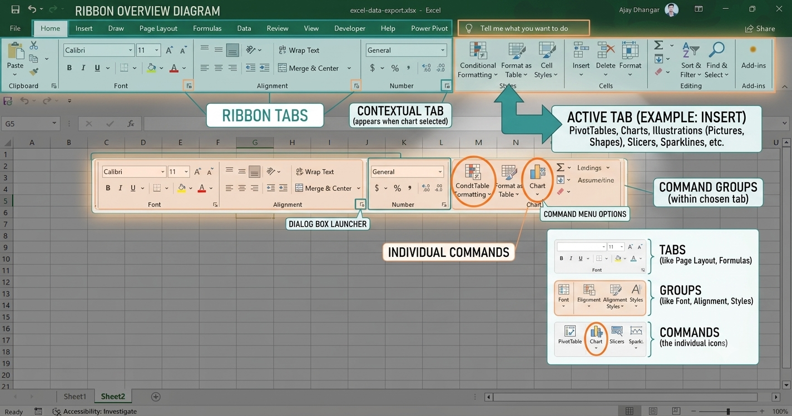
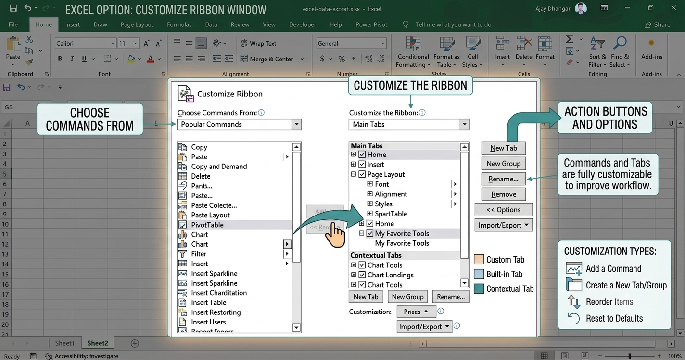
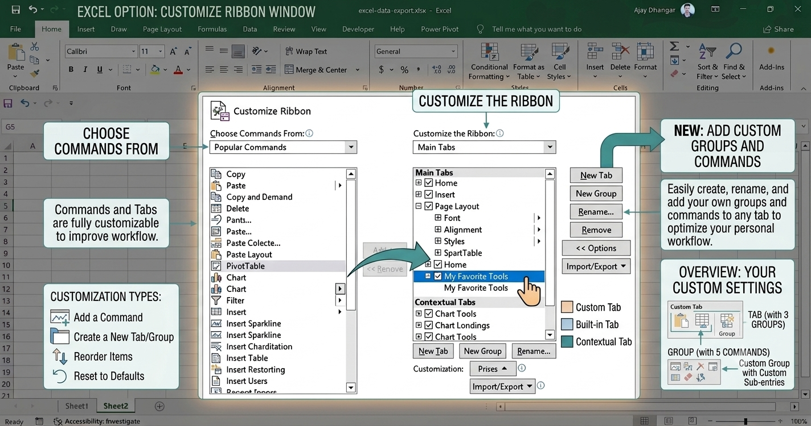
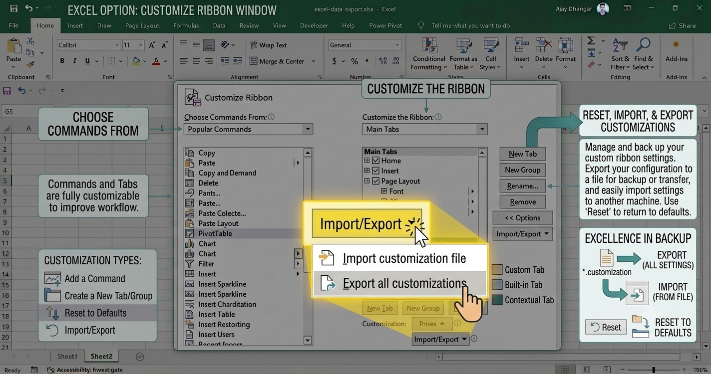

Customizing the Microsoft Excel Ribbon allows you to organize commands, tabs, and groups to align with your personal workflow. While you can reorder and add custom features, customizations apply only to the specific Office application you are editing.

<AdsComponent />

### What You Can vs. Can't Customize

* **Allowed**: You can add custom tabs, insert custom groups, change default tab order, hide unused tabs, and export your setup.
* **Not Allowed**: You cannot reduce the visual size of the ribbon, font, or command icons. Display size can only be changed via system display resolution settings.
* **Scope**: Customizations made in Excel do not automatically transfer to Word or PowerPoint; each application requires separate configuration.

:::tip
If you are using a Microsoft 365 subscription, your customizations can be saved to the cloud and synchronized across multiple devices. Sign in with the same Microsoft account to enable this feature.
:::

### Visibility and Display Modes

Toggle your ribbon workspace using built-in display options:

* **Expand / Collapse Ribbon**: Press `Ctrl + F1`, double-click any ribbon tab, or right-click any tab and choose **Collapse the Ribbon**.

* **Full-Screen Mode Restoration**: If no tabs are visible, click **More** (`...`) at the top right of the screen to temporarily restore controls, then pick a preferred permanent layout from **Ribbon Display Options**.

### Managing Ribbon Tabs

Open the configuration workspace by right-clicking any empty area on the Ribbon and selecting **Customize the Ribbon**.

* **Add a Custom Tab**: Click **New Tab** in the **Customize the Ribbon** window. This automatically creates a new tab along with a custom group.
* **Reorder Tabs**: Highlight a tab under the right-hand list and click the **Move Up** or **Move Down** arrows. *(Note: The **File** tab position cannot be moved.)*
* **Hide / Remove Tabs**: Uncheck the box next to any default or custom tab to hide it. Select a custom tab and click **Remove** to delete it permanently.

### Customizing Groups & Commands

Commands can only be added to custom groups; default built-in groups cannot have their native icons removed or renamed directly.

| Customization Action | Procedure |
| :--- | :--- |
| **Add Custom Group** | Select target tab > Click **New Group** > Click **Rename** to assign a label and display symbol. |
| **Add Commands** | Select custom group > Choose source in **Choose commands from** > Highlight tool > Click **Add**. |
| **Replace Default Group** | Add a **New Group** to the tab > Add target commands from **Main Tabs** > Select original default group > Click **Remove**. |
| **Hide Command Labels** | Right-click custom group > Select **Hide Command Labels**. |

<AdsComponent />

### Resetting and Sharing Customizations

You can restore original workspace layouts or share your user setups across different computers.

* **Reset Single Tab**: Select a modified default tab in the window > Click **Reset** > Choose **Reset only selected Ribbon tab**.
* **Reset Entire Ribbon**: Click **Reset** > Choose **Reset all customizations**. *(Warning: This also resets the Quick Access Toolbar to defaults.)*
* **Export Customizations**: Click **Import/Export** > Choose **Export all customizations** to save your layout as a file.
* **Import Customizations**: Click **Import/Export** > Choose **Import customization file**. *(Note: Importing overwrites all existing ribbon and Quick Access Toolbar settings.)*