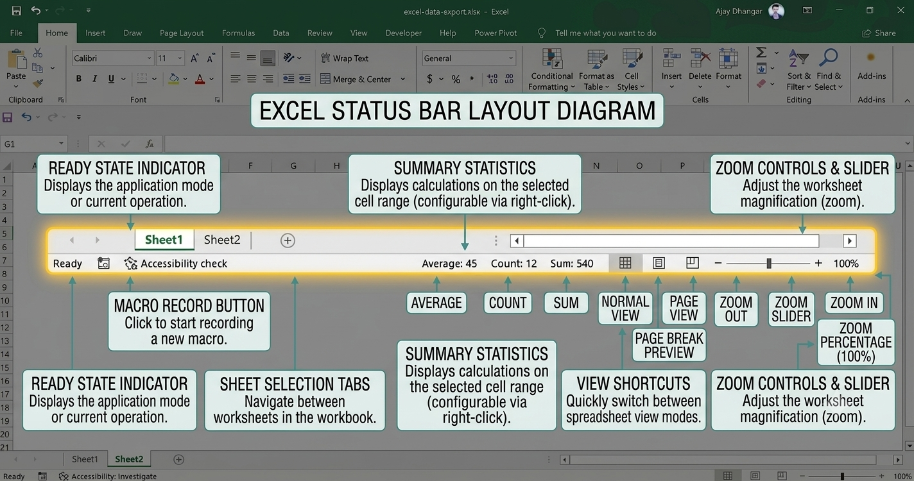
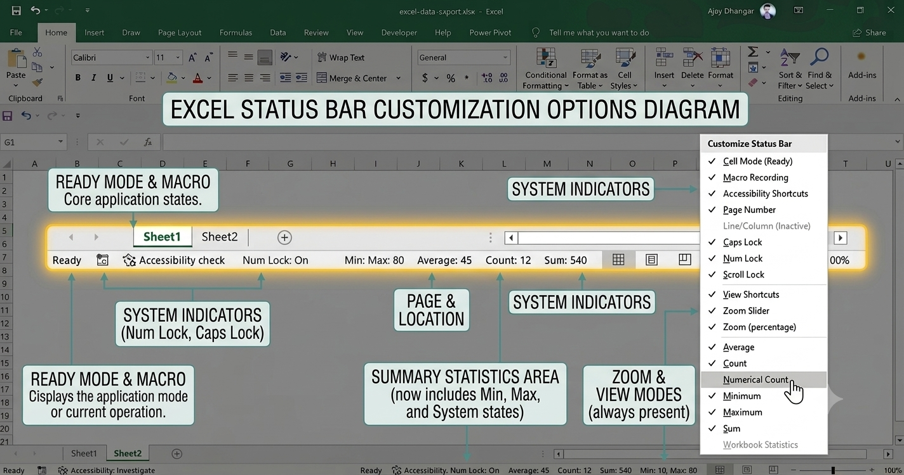

Located at the very bottom of the Excel application window, the **Status Bar** provides real-time information about your current worksheet state, instant statistical summaries of selected data, display view toggles, and zoom controls.

**Anatomy of the Status Bar**

The Status Bar operates quietly in the background, updating dynamically as you navigate cells and highlight data blocks:

* **Cell Mode Indicator** *(Far Left)*: Displays the current operational state of the active cell (`Ready`, `Enter`, `Edit`, or `Point`).
* **Summary Statistics** *(Center)*: Shows dynamic calculations for selected numerical or text ranges without writing formulas.
* **View & Zoom Controls** *(Far Right)*: Enables fast switching between workbook views and sheet magnification levels.

**Automatic Summary Statistics (Quick Stats)**

When you highlight two or more cells, the Status Bar automatically aggregates and displays key mathematical metrics instantly.

### Default Visible Metrics
* **Average**: The calculated arithmetic mean of all selected numeric cells.
* **Count**: The total number of non-empty cells in the selection.
* **Sum**: The combined total value of all numeric cells in the selection.

### Unlocking Additional Metrics
Right-click anywhere on the Status Bar to enable or disable any of the six built-in quick statistics:

| Statistic | Description |
| :--- | :--- |
| **Average** | Calculates the mean of numeric entries. |
| **Count** | Counts all populated cells (text, numbers, and symbols). |
| **Numerical Count** | Counts only cells containing numeric values. |
| **Minimum** | Displays the lowest numeric value in the selection. |
| **Maximum** | Displays the highest numeric value in the selection. |
| **Sum** | Adds all numeric values together. |

:::tip
Left-clicking any summary statistic on the Status Bar automatically copies that exact calculated value directly to your clipboard for quick pasting!
:::

**Understanding Cell Modes**

The left side of the Status Bar indicates how Excel is currently processing your keyboard and mouse inputs:

* **Ready**: Default state. The worksheet is idle and waiting for user input or command execution.
* **Enter**: Active when you start typing in an empty cell.
* **Edit**: Activated when you press `F2` or double-click a cell to modify existing contents. Arrow keys move the text cursor within the cell.
* **Point**: Activated when building a formula and clicking target cells to add references. Arrow keys navigate across worksheet cells to build formula ranges.

**Customizing the Status Bar Context Menu**

Right-clicking the Status Bar opens a comprehensive configuration menu allowing you to toggle workspace status toggles on or off:

### Essential Indicators to Enable
* **Caps Lock / Num Lock / Scroll Lock**: Displays visual alerts when these keyboard locks are engaged.
* **Macro Recording**: Adds a single-click icon to start or stop recording VBA macros.
* **Calculation Mode**: Indicates whether workbook formulas are set to **Automatic** or **Manual**.
* **Track Changes / Signatures**: Displays active security and collaboration permissions.

**View Shortcuts and Zoom Controls**

The far-right section of the Status Bar houses rapid layout and magnification adjustments.

* **Workbook View Buttons**: Switch instantly between **Normal**, **Page Layout**, and **Page Break Preview** views.
* **Zoom Percentage Button**: Click the percentage text (e.g., `100%`) to open the Zoom dialog and select precise magnification scales.
* **Zoom Slider**: Drag the slider left (`-`) or right (`+`) to scale worksheet visibility smoothly between $10\%$ and $400\%$.