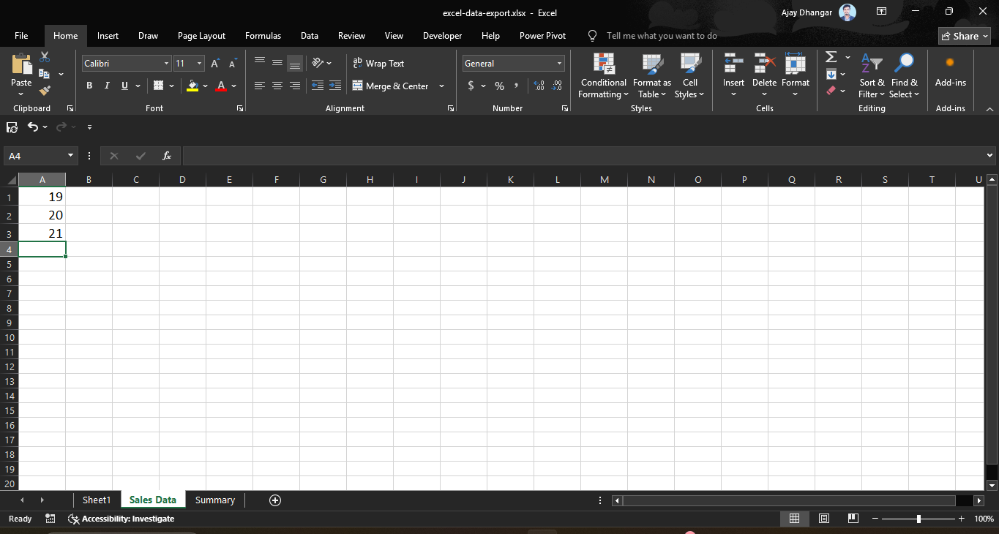

A Microsoft Excel **Workbook** serves as a binder, while individual **Worksheets** (or sheets) act as the pages inside it. Efficiently organizing, structuring, and navigating worksheets is essential for building clean, professional, and scalable spreadsheets.

<AdsComponent />

This comprehensive guide covers everything from basic worksheet operations to advanced management techniques like multi-sheet grouping, color coding, and structural protection.

## 1. Structure of Worksheets & Workbook Layout

Every new workbook starts with at least one worksheet (typically named `Sheet1`). Worksheets are managed via the **Sheet Tab Bar** located at the bottom of the screen, just above the Status Bar.



### Key Elements of the Sheet Tab Bar:
* **Sheet Tabs:** Individual tabs representing each active worksheet.
* **Add Sheet Button (`+`):** Quickly inserts a new blank sheet to the right of the active tab.
* **Tab Navigation Arrows (`|<` `<` `>` `>|`):** Scroll left or right when a workbook contains more sheet tabs than can fit on screen.
* **Horizontal Scroll Bar Separator:** Drag the vertical split bar between the sheet tabs and the horizontal scroll bar to expand or contract the sheet tab view area.

## 2. Basic Worksheet Operations

### Creating New Worksheets
* **Mouse Method:** Click the plus icon (**`+`**) next to the existing sheet tabs.
* **Ribbon Method:** Go to **Home** > **Cells** group > click **Insert** > select **Insert Sheet**.
* **Keyboard Shortcut:** Press `Shift` + `F11` (or `Alt` + `Shift` + `F1`).

### Renaming Worksheets
Clear, descriptive sheet names prevent confusion and improve formula readability (e.g., `=SUM('Q1 Sales'!B2:B10)` instead of `=SUM(Sheet2!B2:B10)`).

1. **Double-click** the target sheet tab.
2. Type the new name.
3. Press `Enter`.

:::info Naming Constraints:
* Sheet names cannot exceed **31 characters**.
* Names cannot contain special characters: `\`, `/`, `?`, `*`, `:`, `[`, or `]`.
* Names cannot be left blank or match an existing sheet in the same workbook.
:::

<AdsComponent />

### Reordering Worksheets
* **Drag-and-Drop:** Click and hold any sheet tab, then drag it horizontally to the desired position. A small downward arrow indicator guides placement.
* **Move Menu:** Right-click the sheet tab > select **Move or Copy...** > choose the target position in the list > click **OK**.


```

Right-Click Tab -> Move or Copy:
+-------------------------------------------------------+
| Move or Copy                                        X |
+-------------------------------------------------------+
| Move selected sheets to book:                         |
| [ current-workbook.xlsx                            v] |
|                                                       |
| Before sheet:                                         |
|   Sheet1                                              |
|   Sales Data                                          |
|   Summary                                             |
|   (move to end)                                       |
|                                                       |
| [ ] Create a copy                                     |
|                                                       |
|                     [  OK  ]     [ Cancel ]           |
+-------------------------------------------------------+

```

### Copying & Duplicating Worksheets

Creating exact copies of a formatted sheet template speeds up monthly or regional reporting.

* **Fast Drag Shortcut:** Hold the `Ctrl` key, click the sheet tab, and drag it to the side. A small `+` icon appears on the cursor cursor indicating a duplicate is being created.
* **Dialog Method:**
  1. Right-click the sheet tab and select **Move or Copy...**.
  2. Select the target location from the **Before sheet** box.
  3. Check the **Create a copy** checkbox.
  4. Click **OK**.

### Deleting Worksheets
* **Right-Click Method:** Right-click the sheet tab and select **Delete**.
* **Ribbon Method:** Go to **Home** > **Cells** group > **Delete** > **Delete Sheet**.

:::warning
Deleting a worksheet **cannot be undone** using `Ctrl` + `Z`. If a sheet contains data, Excel displays a permanent deletion warning prompt.
:::

<AdsComponent />

## 3. Visual Organization & Tab Colors

Applying background colors to sheet tabs creates visual grouping across complex workbooks (e.g., Green for Financial Statements, Blue for Raw Data, Orange for Dashboards).

```

+----------------------------------------------------------------------+
| [ Raw_Data ]  [ Data_Clean ]  [ P&L_Summary ]  [ KPI_Dashboard ] (+) |
| (Grey Tab)    (Grey Tab)      (Green Tab)      (Blue Tab)            |
+----------------------------------------------------------------------+

```

### Changing Tab Color:
1. **Right-click** the sheet tab.
2. Hover over **Tab Color**.
3. Choose a theme color, standard color, or click **More Colors...**.
4. To remove color, select **No Color**.

## 4. Hiding & Unhiding Worksheets

To declutter workbooks or conceal background calculations and lookup tables, you can hide worksheets from view without deleting their data or breaking formulas.

### Hiding a Sheet:
1. **Right-click** the sheet tab you wish to conceal.
2. Click **Hide**.

### Unhiding a Sheet:
1. **Right-click** any visible sheet tab.
2. Select **Unhide...**.
3. In the dialog list, select the hidden sheet you want to display.
4. Click **OK**.

```

Unhide Dialog Box:
+-------------------------------------------------------+
| Unhide                                              X |
+-------------------------------------------------------+
| Unhide sheet:                                         |
| +---------------------------------------------------+ |
| | Ref_Tables                                        | |
| | Background_Calculations                           | |
| | Archived_2025                                     | |
| +---------------------------------------------------+ |
|                                                       |
|                     [  OK  ]     [ Cancel ]           |
+-------------------------------------------------------+

```

<AdsComponent />

## 5. Working with Multiple Sheets (Sheet Grouping)

When you select multiple sheets simultaneously, Excel enters **Group Mode**. Any edit, formatting change, row insertion, or formula typed into the active sheet automatically replicates across **all grouped sheets** at the exact same cell positions.

### How to Group Worksheets:
* **Adjacent Sheets:** Click the first sheet tab, hold `Shift`, and click the last sheet tab.
* **Non-Adjacent Sheets:** Click the first sheet tab, hold `Ctrl`, and click individual sheet tabs to select them selectively.
* **All Sheets:** Right-click any sheet tab and choose **Select All Sheets**.

:::note Indicator
When sheets are grouped, the word **`[Group]`** appears next to the file name in the Excel Title Bar at the top of the screen.
:::

```

+-----------------------------------------------------------------------------------+
| [QAT]                   Annual-Report-2026.xlsx [Group] - Excel                  |  <- Group Mode Indicator
+-----------------------------------------------------------------------------------+
| File  Home  Insert  Draw  Page Layout  Formulas  Data  Review  View  Developer    |
+-----------------------------------------------------------------------------------+
|  1 | Region       Q1 Target     Q1 Actual                                         |  <- Editing here updates
|  2 | North        $10,000       $12,500                                           |     all grouped sheets
+-----------------------------------------------------------------------------------+
| [ Jan ] [ Feb ] [ Mar ] (All 3 selected/grouped)                                  |
+-----------------------------------------------------------------------------------+

```

### How to Ungroup Worksheets:
* Click on any single sheet tab outside the group.
* Or **right-click** any grouped tab and select **Ungroup Sheets**.

:::caution
Always ungroup sheets immediately after completing your multi-sheet edit. Forgetting you are in **`[Group]`** mode can lead to accidental overwriting of critical data across multiple sheets.
:::

<AdsComponent />

## 6. Sheet Protection & Structure Lock

To prevent users from adding, deleting, renaming, hiding, or moving worksheets, protect the workbook structure.

### Locking Workbook Structure:
1. Go to the **Review** tab on the Ribbon.
2. Click **Protect Workbook** in the *Protect* group.
3. Ensure **Structure** is checked.
4. (Optional) Enter a password to prevent unauthorized unlocking.
5. Click **OK**.


```

+-------------------------------------------------------+
| Protect Structure and Windows                       X |
+-------------------------------------------------------+
| Protect workbook for:                                 |
| [X] Structure                                         |
| [ ] Windows                                           |
|                                                       |
| Password (optional):                                  |
| [ **********                                        ] |
|                                                       |
|                     [  OK  ]     [ Cancel ]           |
+-------------------------------------------------------+

```

Once enabled, sheet tab operations like **Insert**, **Delete**, **Rename**, **Move**, **Hide**, and **Tab Color** will be greyed out in the context menu.

<AdsComponent />

## 7. Keyboard Shortcuts Quick Reference

Boost your sheet navigation speed with these essential keyboard shortcuts:

| Action | Windows Shortcut | Mac Shortcut |
| :--- | :--- | :--- |
| **Next Sheet** (Right) | `Ctrl` + `Page Down` | `Option` + `Right Arrow` (or `Fn` + `Ctrl` + `Down`) |
| **Previous Sheet** (Left) | `Ctrl` + `Page Up` | `Option` + `Left Arrow` (or `Fn` + `Ctrl` + `Up`) |
| **Insert New Sheet** | `Shift` + `F11` | `Shift` + `F11` |
| **Select Adjacent Sheets** | `Shift` + Click Tab | `Shift` + Click Tab |
| **Select Non-Adjacent Sheets** | `Ctrl` + Click Tab | `Command` + Click Tab |
| **Duplicate Sheet Drag** | `Ctrl` + Drag Tab | `Option` + Drag Tab |
| **Open Sheet Context Menu** | `Shift` + `F10` (on tab) | `Shift` + `F10` (on tab) |

## Summary Best Practices

* Use **descriptive, concise sheet names** (under 31 chars) and avoid spaces in names if writing complex formulas.
* **Color-code tabs** by category (e.g., raw data inputs vs. final calculation outputs).
* Hide background reference tables to keep the user interface simple for stakeholders.
* Use **Sheet Grouping** (`Shift`/`Ctrl` + Click) to apply standard formatting across uniform monthly or quarterly tabs.
* Remember to **ungroup sheets** immediately after multi-tab updates to prevent accidental data loss.
* Enable **Protect Workbook Structure** before distributing financial models or shared templates.