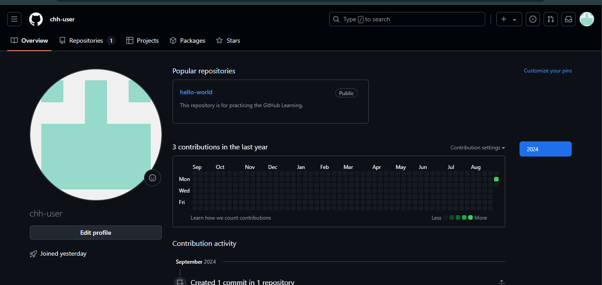

**To work on a project from GitHub, you need to clone the repository to your local machine. This allows you to make changes to the project, work on new features, and contribute to the codebase.**


To clone a repository from GitHub, follow these steps:

1. Go to [GitHub](https://github.com/) and log in to your account. After logging in, you will see your GitHub dashboard.

    <BrowserWindow url="https://github.com/chh-user" bodyStyle={{ padding: 0 }}>
      
    </BrowserWindow>

2. Navigate to the repository you want to clone. You can find repositories on your dashboard, in your profile, or by searching for a specific repository.

    <BrowserWindow url="https://github.com/chh-user?tab=repositories" bodyStyle={{ padding: 0 }}>
      
    </BrowserWindow>

3. Click on the repository you want to clone to open its main page. On the main page, you will see the repository details, code, issues, and other information. For example, let's clone the "hello-world" repository.

    <BrowserWindow url="https://github.com/chh-user/hello-world" bodyStyle={{ padding: 0 }}>
      
    </BrowserWindow>

4. Click on the "Code" button to open the code download options. You can clone the repository using HTTPS, SSH, or GitHub CLI. For this tutorial, we will use HTTPS.

    <BrowserWindow url="https://github.com/chh-user/hello-world" bodyStyle={{ padding: 0 }}>
      
    </BrowserWindow>

5. Copy the HTTPS URL of the repository. You will use this URL to clone the repository to your local machine.

    <BrowserWindow url="https://github.com/chh-user/hello-world" bodyStyle={{ padding: 0 }}>
      
    </BrowserWindow>

6. Open your terminal or command prompt on your local machine. Navigate to the directory where you want to clone the repository. Use the `cd` command to change directories.

    ```bash title="Terminal"
    cd path/to/directory
    ```

7. Clone the repository using the `git clone` command followed by the HTTPS URL you copied earlier. This command will download the repository to your local machine.

    :::tip Note: 
    Replace `chh-user` with the **username** of the repository owner and `hello-world` with the name of the repository you want to clone.
    :::

    ```bash title="Terminal"
    git clone https://github.com/chh-user/hello-world.git
    ```

    

    
8. After cloning the repository, you can navigate to the project directory using the `cd` command.

    ```bash title="Terminal"
    cd hello-world
    ```

9.  You have successfully cloned the repository to your local machine. You can now work on the project, make changes to the code, and push your changes back to GitHub.

    ```pwsh
    # Make changes to the code
    # Add new features
    # Fix bugs
    # Push changes back to GitHub
    ```

Congratulations! You have successfully cloned a repository from GitHub to your local machine. You can now start working on the project, collaborate with others, and contribute to the codebase. Happy coding!