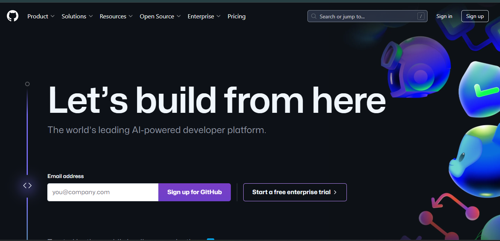
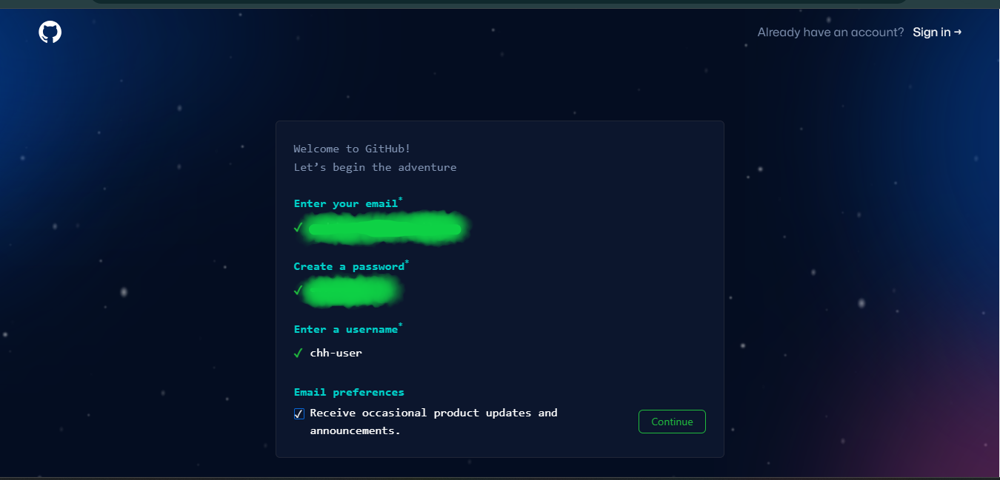
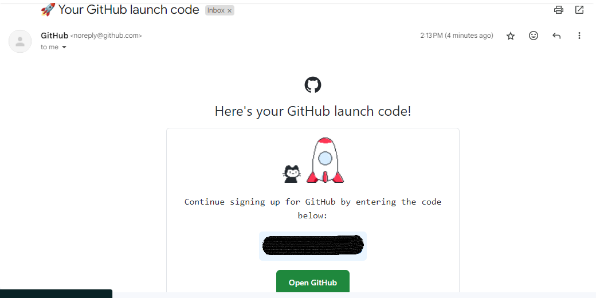
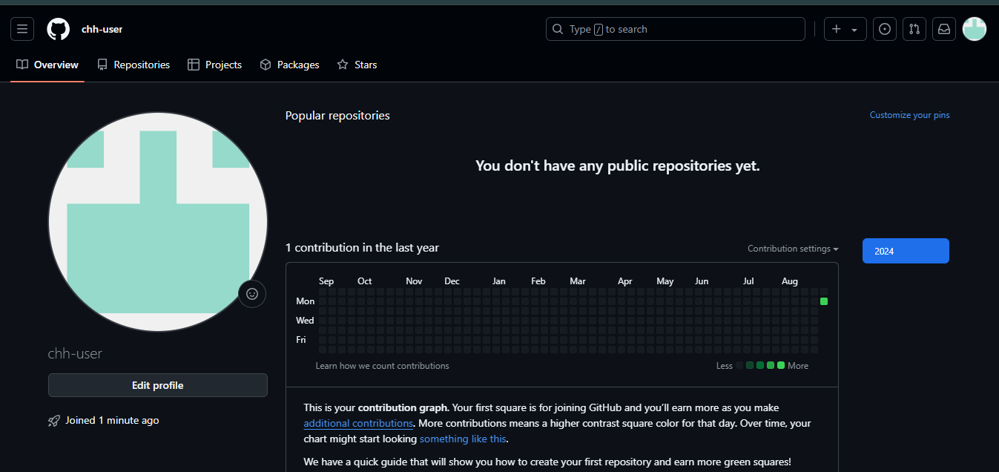

**To get started with GitHub, you need to create a GitHub account. If you already have a GitHub account, you can skip this step.**

## Create a GitHub account

To get started with GitHub, you need to create a GitHub account. If you already have a GitHub account, you can skip this step.

1. Go to [GitHub](https://github.com/) and click on the "Sign up" button.

   <BrowserWindow url="https://github.com" minHeight={300} bodyStyle={{ padding: 0 }}>
   
   </BrowserWindow>

2. Enter your email address, choose a username, and create a password.

   <BrowserWindow url="https://github.com" bodyStyle={{ padding: 0 }}>
   
   </BrowserWindow>

3. Click on the "Create account" button.
4. Verify your email address.

   You will receive an email from GitHub with a link to verify your email address. Click on the link to verify your email address.

   <BrowserWindow url="https://mail.google.com/mail/u/..." bodyStyle={{ padding: 0 }}>
   
   </BrowserWindow>

5. Congratulations! You now have a GitHub account.

   <BrowserWindow url="https://github.com/chh-user" bodyStyle={{ padding: 0 }}>
   
   </BrowserWindow>

Now that you have created a GitHub account, you can start using GitHub to collaborate with others, contribute to open-source projects, and build your portfolio.
