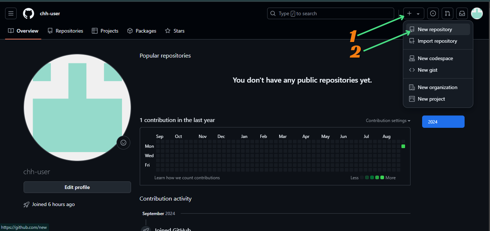
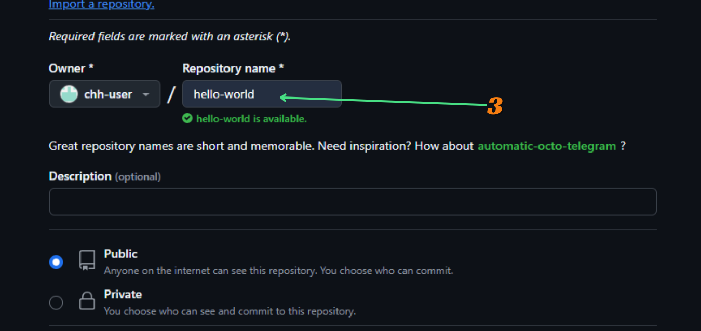
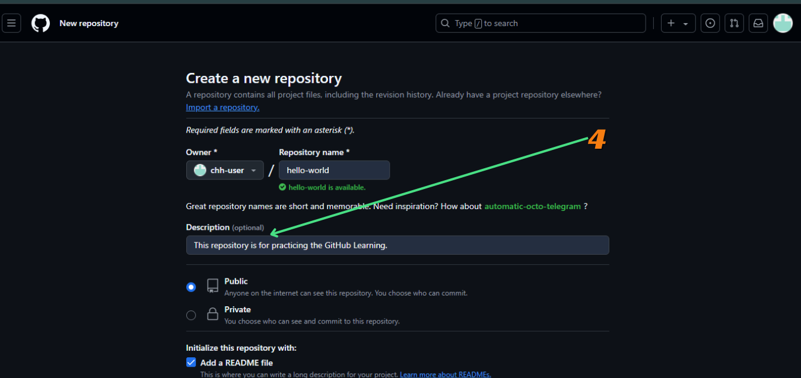
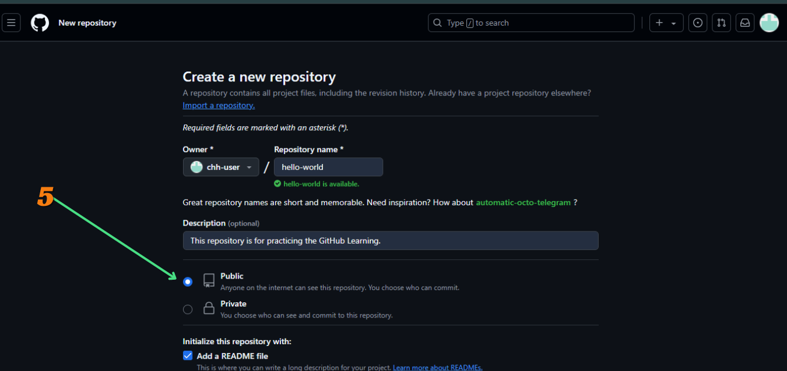
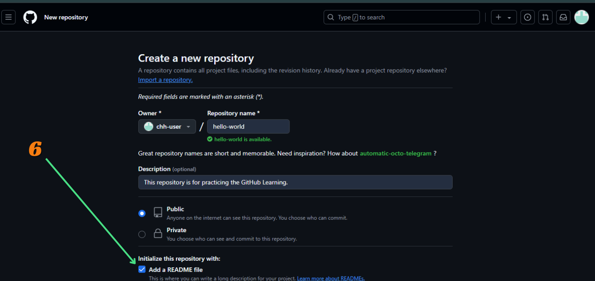
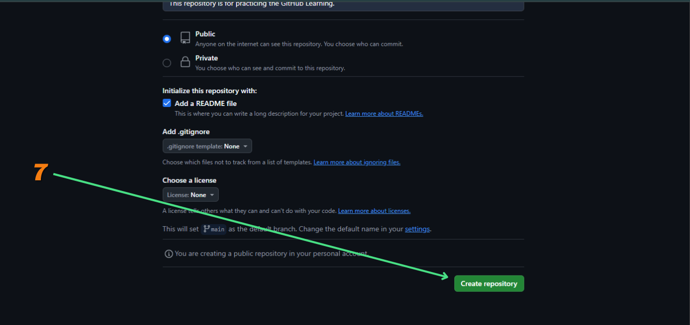
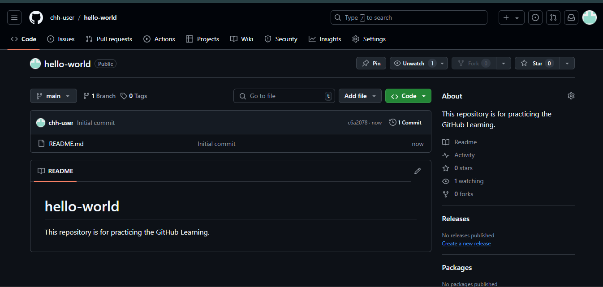

**To get started with GitHub, you need to create a new repository. If you already have a repository, you can skip this step.**

## Create a New Repository

To create a new repository on GitHub, follow these steps:

1. Go to [GitHub](http://github.com/) and log in to your account.

   <BrowserWindow url="https://github.com" bodyStyle={{ padding: 0 }}>
   
   </BrowserWindow>

2. Click on the "+" icon in the top right corner of the page and select "New repository" from the dropdown menu.

   <BrowserWindow url="https://github.com" bodyStyle={{ padding: 0 }}>
   
   </BrowserWindow>

3. Enter a name for your repository in the "Repository name" field. (For example, "hello-world")

   <BrowserWindow url="https://github.com/new" bodyStyle={{ padding: 0 }}>
   
   </BrowserWindow>

4. Optionally, you can add a description for your repository in the "Description" field.

   <BrowserWindow url="https://github.com/new" bodyStyle={{ padding: 0 }}>
   
   </BrowserWindow>

5. Choose the visibility of your repository. You can make it public or private.

   <BrowserWindow url="https://github.com/new" bodyStyle={{ padding: 0 }}>
   
   </BrowserWindow>

6. Select the "Initialize this repository with a README" checkbox if you want to create a README file for your repository.

   <BrowserWindow url="https://github.com/new" bodyStyle={{ padding: 0 }}>
   
   </BrowserWindow>

7. Click on the "Create repository" button to create your new repository.

   <BrowserWindow url="https://github.com/new" bodyStyle={{ padding: 0 }}>
   
   </BrowserWindow>

8. Your new repository is now created. You can start adding files, folders, and code to your repository.

   <BrowserWindow url="https://github.com/chh-user/hello-world" bodyStyle={{ padding: 0 }}>
   
   </BrowserWindow>

Congratulations! You have successfully created a new repository on GitHub. You can now start working on your project, share your code with others, and collaborate with your team using GitHub repositories.
