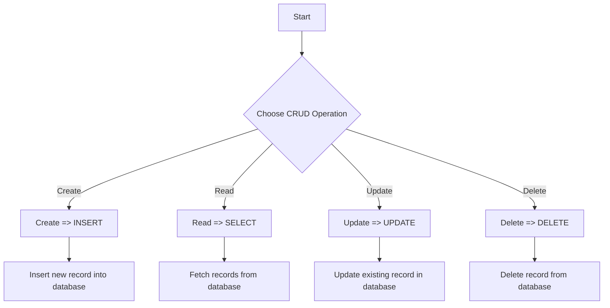

---
id: lesson-1
title: "SQL Database"
sidebar_label: SQL Database
sidebar_position: 1
description: "Learn SQL Database in PHP"
tags: [courses,Advance-level,Introduction]
---  
 

#### Topics Covered:
1. Introduction to SQL and Databases
2. Connecting to a Database with PHP (MySQL, PDO)
3. Performing CRUD Operations (Create, Read, Update, Delete)
4. Prepared Statements and Parameter Binding

### Flowchart 



### 1. Introduction to SQL and Databases

**SQL (Structured Query Language):**
- SQL is used to communicate with databases. It is the standard language for relational database management systems.

**Basic SQL Commands:**
- **CREATE DATABASE:** Creates a new database.
- **CREATE TABLE:** Creates a new table in the database.
- **INSERT INTO:** Inserts new data into a table.
- **SELECT:** Retrieves data from a database.
- **UPDATE:** Updates existing data within a table.
- **DELETE:** Deletes data from a table.

```sql
-- Example SQL Commands
CREATE DATABASE myDatabase;
CREATE TABLE users (
    id INT AUTO_INCREMENT PRIMARY KEY,
    username VARCHAR(50) NOT NULL,
    email VARCHAR(100) NOT NULL
);

INSERT INTO users (username, email) VALUES ('john_doe', 'john@example.com');
SELECT * FROM users;
UPDATE users SET email='john_updated@example.com' WHERE username='john_doe';
DELETE FROM users WHERE username='john_doe';
```

### 2. Connecting to a Database with PHP (MySQL, PDO)

**Using MySQLi:**

```php
<?php
$servername = "localhost";
$username = "root";
$password = "";
$dbname = "myDatabase";

// Create connection
$conn = new mysqli($servername, $username, $password, $dbname);

// Check connection
if ($conn->connect_error) {
    die("Connection failed: " . $conn->connect_error);
}
echo "Connected successfully";
?>
```

**Using PDO:**

```php
<?php
$dsn = 'mysql:host=localhost;dbname=myDatabase';
$username = 'root';
$password = '';

try {
    $pdo = new PDO($dsn, $username, $password);
    $pdo->setAttribute(PDO::ATTR_ERRMODE, PDO::ERRMODE_EXCEPTION);
    echo "Connected successfully";
} catch (PDOException $e) {
    echo "Connection failed: " . $e->getMessage();
}
?>
```

### 3. Performing CRUD Operations (Create, Read, Update, Delete)

**Create (INSERT):**

```php
<?php
$sql = "INSERT INTO users (username, email) VALUES ('jane_doe', 'jane@example.com')";
if ($conn->query($sql) === TRUE) {
    echo "New record created successfully";
} else {
    echo "Error: " . $sql . "<br>" . $conn->error;
}
?>
```

**Read (SELECT):**

```php
<?php
$sql = "SELECT id, username, email FROM users";
$result = $conn->query($sql);

if ($result->num_rows > 0) {
    while($row = $result->fetch_assoc()) {
        echo "id: " . $row["id"]. " - Name: " . $row["username"]. " - Email: " . $row["email"]. "<br>";
    }
} else {
    echo "0 results";
}
?>
```

**Update (UPDATE):**

```php
<?php
$sql = "UPDATE users SET email='jane_updated@example.com' WHERE username='jane_doe'";
if ($conn->query($sql) === TRUE) {
    echo "Record updated successfully";
} else {
    echo "Error updating record: " . $conn->error;
}
?>
```

**Delete (DELETE):**

```php
<?php
$sql = "DELETE FROM users WHERE username='jane_doe'";
if ($conn->query($sql) === TRUE) {
    echo "Record deleted successfully";
} else {
    echo "Error deleting record: " . $conn->error;
}
?>
```

### 4. Prepared Statements and Parameter Binding

**Using MySQLi:**

```php
<?php
$stmt = $conn->prepare("INSERT INTO users (username, email) VALUES (?, ?)");
$stmt->bind_param("ss", $username, $email);

$username = "mike_doe";
$email = "mike@example.com";
$stmt->execute();

echo "New records created successfully";

$stmt->close();
$conn->close();
?>
```

**Using PDO:**

```php
<?php
$stmt = $pdo->prepare("INSERT INTO users (username, email) VALUES (:username, :email)");
$stmt->bindParam(':username', $username);
$stmt->bindParam(':email', $email);

$username = "anna_doe";
$email = "anna@example.com";
$stmt->execute();

echo "New records created successfully";
?>
```

:::tip
- Always use prepared statements to protect against SQL injection.
- Choose PDO over MySQLi for more flexibility and support for multiple databases.
- Properly handle errors and exceptions to debug issues effectively.
- Keep your database connection credentials secure and avoid hardcoding them in your scripts.
:::