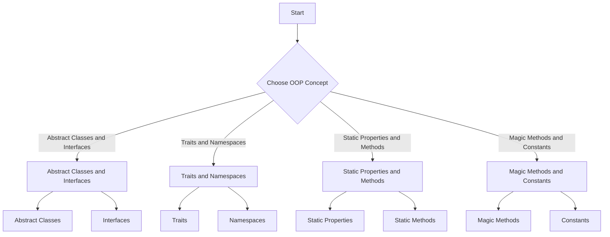

---
id: lesson-1
title: "Advanced OOP Concepts in PHP"
sidebar_label: OOP Concepts
sidebar_position: 1
description: "Learn Advanced OOP Concepts in PHP"
tags: [courses,Advance-level,Introduction]
---  
 

#### Topics:
1. Abstract Classes and Interfaces
2. Traits and Namespaces
3. Static Properties and Methods
4. Magic Methods and Constants

#### Flowchart  



### 1. Abstract Classes and Interfaces

**Abstract Classes:**
- Abstract classes cannot be instantiated.
- They can have abstract methods that must be defined in child classes.

```php
<?php
abstract class Animal {
    abstract protected function makeSound();
    
    public function move() {
        echo "Moving...";
    }
}

class Dog extends Animal {
    public function makeSound() {
        echo "Bark!";
    }
}

$dog = new Dog();
$dog->makeSound(); // Output: Bark!
$dog->move(); // Output: Moving...
?>
```
###  Output 

<BrowserWindow>
    <div>
        <p>Bark!<br />Moving...<br /></p> 
    </div>
</BrowserWindow>

**Interfaces:**
- Interfaces define methods that must be implemented by classes.
- A class can implement multiple interfaces.

```php
<?php
interface Shape {
    public function area();
}

class Circle implements Shape {
    private $radius;
    
    public function __construct($radius) {
        $this->radius = $radius;
    }
    
    public function area() {
        return pi() * $this->radius * $this->radius;
    }
}

$circle = new Circle(5);
echo $circle->area(); // Output: 78.539816339745
?>
```
###  Output 

<BrowserWindow>
    <div>
        <p>78.539816339745</p> 
    </div>
</BrowserWindow>

### 2. Traits and Namespaces

**Traits:**
- Traits are a mechanism for code reuse in single inheritance languages.
- Traits can have methods that can be used in multiple classes.

```php
<?php
trait Logger {
    public function log($message) {
        echo "Log: $message";
    }
}

class User {
    use Logger;
}

$user = new User();
$user->log("User created."); // Output: Log: User created.
?>
```
###  Output 

<BrowserWindow>
    <div> 
        <p>Log: User created.<br /></p>
    </div>
</BrowserWindow>

**Namespaces:**
- Namespaces allow you to group related classes, interfaces, functions, and constants together.

```php
<?php
namespace MyApp\Models;

class User {
    public function __construct() {
        echo "User model";
    }
}

// Accessing the class from a namespace
$user = new \MyApp\Models\User(); // Output: User model
?>
```
###  Output 

<BrowserWindow>
    <div> 
        <p>User model</p> 
    </div>
</BrowserWindow>
