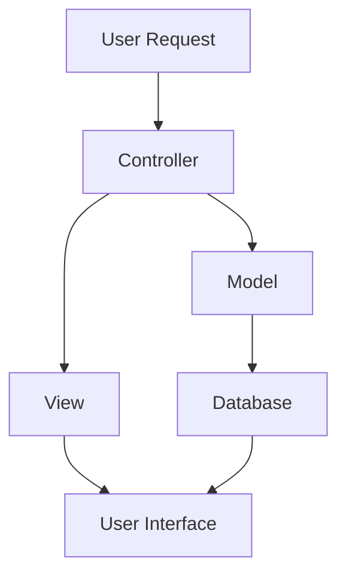

---
id: lesson-2
title: " MVC Architecture"
sidebar_label: MVC
sidebar_position: 2
description: "Learn MVC Architecture in PHP"
tags: [courses,Advance-level,Introduction]
---  

**MVC (Model-View-Controller)** is a design pattern used in PHP frameworks to separate application logic into three interconnected components:

- **Model:** Manages the data and business logic of the application. It represents the data structure and interacts with the database.
  
- **View:** Handles the presentation layer. It is responsible for rendering the user interface and presenting data from the model.
  
- **Controller:** Manages the user input and interacts with the model to update the view. It acts as an intermediary between the model and view.

**Mermaid Diagram:**

:::note
1. **User Request** triggers the **Controller**.
2. The **Controller** interacts with the **Model** to process data.
3. The **Model** communicates with the **Database** for data operations.
4. The **Controller** updates the **View** with the processed data.
5. The **View** renders the **User Interface** for display.
:::

:::tip
- **Choose a Framework** based on your project requirements and familiarity.
- **Leverage Built-in Features** of frameworks to save development time and improve security.
- **Follow MVC Principles** to keep your code organized and maintainable.
- **Read Documentation:** Frameworks come with extensive documentation, so refer to it often for best practices and troubleshooting.
- **Stay Updated:** Frameworks frequently release updates; keep your knowledge and dependencies current.
:::