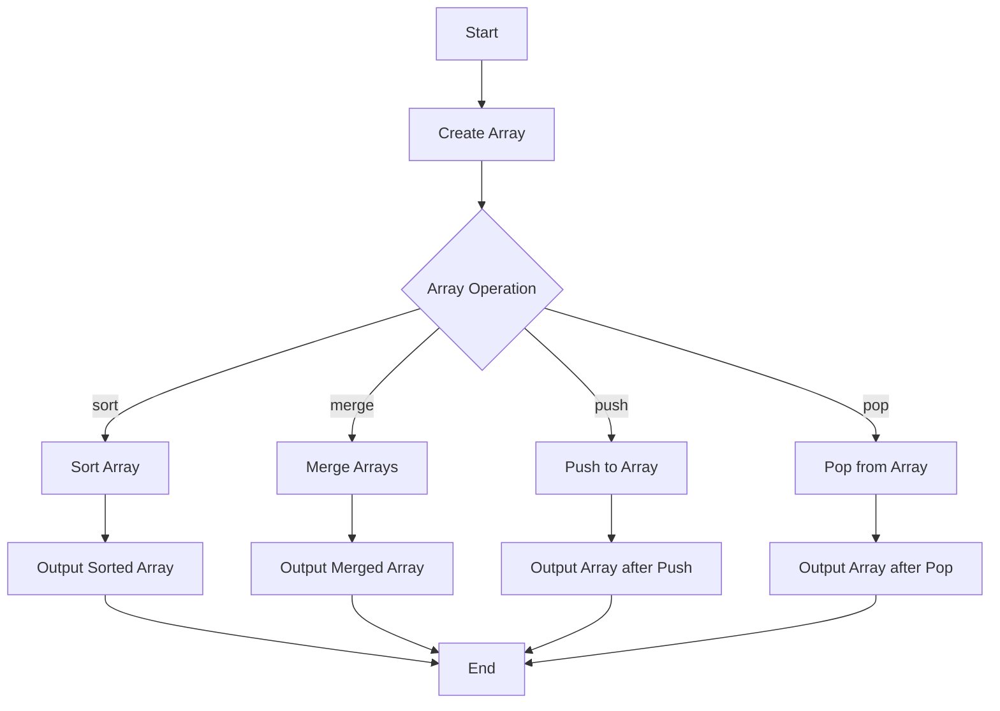

---
id: lesson-1
title: "Arrays in PHP"
sidebar_label: Arrays
sidebar_position: 1
description: "Learn Arrays in PHP"
tags: [courses,beginner-level,php,Introduction]
---    
 

#### Topics Covered:
1. **Indexed Arrays**
2. **Associative Arrays**
3. **Multidimensional Arrays**
4. **Array Functions (sort, merge, push, pop)**


### Flowchart



### Indexed Arrays

Indexed arrays use numeric indexes.

```php
<?php
$fruits = array("apple", "banana", "cherry");

// Accessing array elements
echo $fruits[0]; // Output: apple

// Adding elements
$fruits[] = "date";

// Looping through indexed array
foreach ($fruits as $fruit) {
    echo $fruit . " ";
}
?>
```

#### Output:
<BrowserWindow>
   <p>apple banana cherry date</p>
</BrowserWindow>

### Associative Arrays

Associative arrays use named keys.

```php
<?php
$person = array("name" => "Alice", "age" => 25, "city" => "New York");

// Accessing array elements
echo $person["name"]; // Output: Alice

// Adding elements
$person["email"] = "alice@example.com";

// Looping through associative array
foreach ($person as $key => $value) {
    echo "$key: $value ";
}
?>
```

#### Output: 

<BrowserWindow>
   <p>name: Alice age: 25 city: New York email: alice@example.com </p>
</BrowserWindow> 

### Multidimensional Arrays

Multidimensional arrays contain other arrays.

```php
<?php
$students = array(
    array("name" => "John", "age" => 20, "grade" => "A"),
    array("name" => "Jane", "age" => 22, "grade" => "B"),
    array("name" => "Doe", "age" => 21, "grade" => "C")
);

// Accessing multidimensional array elements
echo $students[1]["name"]; // Output: Jane

// Looping through multidimensional array
foreach ($students as $student) {
    foreach ($student as $key => $value) {
        echo "$key: $value ";
    }
    echo "<br>";
}
?>
```

#### Output: 

<BrowserWindow>
   <p>name: name: John age: 20 grade: A </p>
   <p>name: name: John age: 22 grade: B </p>
   <p>name: Doe age: 21 grade: C  </p>
</BrowserWindow> 

### Array Functions

#### sort()

Sorts an indexed array in ascending order.

```php
<?php
$numbers = array(4, 2, 8, 6);
sort($numbers);
print_r($numbers); // Output: Array ( [0] => 2 [1] => 4 [2] => 6 [3] => 8 )
?>
```

#### merge()

Merges two or more arrays.

```php
<?php
$array1 = array("red", "green");
$array2 = array("blue", "yellow");
$result = array_merge($array1, $array2);
print_r($result); // Output: Array ( [0] => red [1] => green [2] => blue [3] => yellow )
?>
```

#### push()

Adds one or more elements to the end of an array.

```php
<?php
$stack = array("orange", "banana");
array_push($stack, "apple", "raspberry");
print_r($stack); // Output: Array ( [0] => orange [1] => banana [2] => apple [3] => raspberry )
?>
```

#### pop()

Removes the last element of an array.

```php
<?php
$stack = array("orange", "banana", "apple", "raspberry");
$fruit = array_pop($stack);
print_r($stack); // Output: Array ( [0] => orange [1] => banana [2] => apple )
?>
```

### Example  

```php
<?php
// Indexed array
$fruits = array("apple", "banana", "cherry");
echo "First fruit: " . $fruits[0] . "<br>";

// Associative array
$person = array("name" => "Alice", "age" => 25, "city" => "New York");
echo "Person's name: " . $person["name"] . "<br>";

// Multidimensional array
$students = array(
    array("name" => "John", "age" => 20, "grade" => "A"),
    array("name" => "Jane", "age" => 22, "grade" => "B"),
    array("name" => "Doe", "age" => 21, "grade" => "C")
);
echo "Second student name: " . $students[1]["name"] . "<br>";

// Array functions
$numbers = array(4, 2, 8, 6);
sort($numbers);
echo "Sorted numbers: ";
print_r($numbers);
echo "<br>";

$array1 = array("red", "green");
$array2 = array("blue", "yellow");
$result = array_merge($array1, $array2);
echo "Merged array: ";
print_r($result);
echo "<br>";

$stack = array("orange", "banana");
array_push($stack, "apple", "raspberry");
echo "After push: ";
print_r($stack);
echo "<br>";

$fruit = array_pop($stack);
echo "After pop: ";
print_r($stack);
?>
```

### Output

<BrowserWindow>
    <div>
        <p>First fruit: apple</p>
        <p>Person's name: Alice</p>
        <p>Second student name: Jane</p>
        <p>Sorted numbers: Array ( [0] => 2 [1] => 4 [2] => 6 [3] => 8 )</p>
        <p>Merged array: Array ( [0] => red [1] => green [2] => blue [3] => yellow )</p>
        <p>After push: Array ( [0] => orange [1] => banana [2] => apple [3] => raspberry )</p>
        <p>After pop: Array ( [0] => orange [1] => banana [2] => apple )</p>
    </div>
</BrowserWindow>


:::tip
- Use `print_r()` for a quick view of array contents during development.
- Remember to handle edge cases like empty arrays when performing array operations.
- Explore PHP's extensive array functions library for efficient array manipulation.
:::