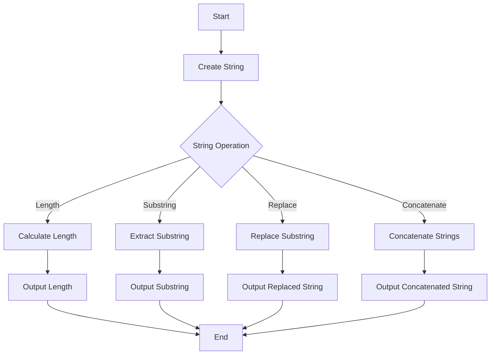

---
id: lesson-2
title: "Strings in PHP"
sidebar_label:  Strings 
sidebar_position: 2
description: "Learn Strings in PHP"
tags: [courses,beginner-level,php,Introduction]
---    

#### Topics Covered:
1. **String Creation and Manipulation**
2. **String Functions (length, substring, replace, concatenate)**
3. **String Formatting and Escaping**
4. **Regular Expressions**


### String Creation and Manipulation

PHP strings can be created using single quotes, double quotes, or the `heredoc` syntax.

### Flowchart



```php
<?php
// Single quotes
$singleQuoted = 'Hello, World!';

// Double quotes
$doubleQuoted = "Hello, World!";

// Heredoc syntax
$heredoc = <<<EOD
This is a string
spanning multiple lines
using heredoc syntax.
EOD;

echo $singleQuoted . "<br>";
echo $doubleQuoted . "<br>";
echo $heredoc . "<br>";
?>
```

<BrowserWindow>
  <p>Hello, World!</p>
  <p>Hello, World!</p>
  <p>This is a string</p>
  <p>spanning multiple lines</p>
  <p>using heredoc syntax.</p>
</BrowserWindow>


### String Functions

#### Length

```php
<?php
$str = "Hello, World!";
$length = strlen($str);
echo "Length of the string: " . $length . "<br>";
?>
```

<BrowserWindow>
  <p>Length of the string: 13</p>
</BrowserWindow>

#### Substring

```php
<?php
$str = "Hello, World!";
$substring = substr($str, 7, 5);
echo "Substring: " . $substring . "<br>";
?>
```

<BrowserWindow>
   <p>Substring: World</p>
</BrowserWindow>

#### Replace

```php
<?php
$str = "Hello, World!";
$replaced = str_replace("World", "PHP", $str);
echo "Replaced string: " . $replaced . "<br>";
?>
```

<BrowserWindow>
   <p>Replaced string: Hello, PHP!</p>
</BrowserWindow>


#### Concatenate

```php
<?php
$str1 = "Hello";
$str2 = "World";
$concatenated = $str1 . ", " . $str2 . "!";
echo "Concatenated string: " . $concatenated . "<br>";
?>
```

<BrowserWindow>
   <p>Concatenated string: Hello, World!</p>
</BrowserWindow>


### String Formatting and Escaping

#### String Formatting

```php
<?php
$name = "Alice";
$age = 25;
$formatted = sprintf("My name is %s and I am %d years old.", $name, $age);
echo "Formatted string: " . $formatted . "<br>";
?>
```

<BrowserWindow>
    <p>Formatted string: My name is Alice and I am 25 years old.</p>
</BrowserWindow>


#### Escaping Characters

```php
<?php
$str = "He said, \"Hello, World!\"";
echo "Escaped string: " . $str . "<br>";
?>
```

<BrowserWindow>
  <p>Escaped string: He said, "Hello, World!"</p>
</BrowserWindow>


### Regular Expressions

#### Matching Patterns

```php
<?php
$str = "The quick brown fox jumps over the lazy dog.";
$pattern = "/quick/";
if (preg_match($pattern, $str)) {
    echo "Pattern found!<br>";
} else {
    echo "Pattern not found.<br>";
}
?>
```

<BrowserWindow>
   <p>Pattern found!</p>
</BrowserWindow>


#### Replacing Patterns

```php
<?php
$str = "The quick brown fox jumps over the lazy dog.";
$pattern = "/quick/";
$replacement = "fast";
$replaced = preg_replace($pattern, $replacement, $str);
echo "Replaced string: " . $replaced . "<br>";
?>
```

<BrowserWindow>
  <p>Replaced string: The fast brown fox jumps over the lazy dog.</p>
</BrowserWindow>


### Example PHP Script

```php
<?php
// String creation
$singleQuoted = 'Hello, World!';
$doubleQuoted = "Hello, World!";
$heredoc = <<<EOD
This is a string
spanning multiple lines
using heredoc syntax.
EOD;

// Output strings
echo $singleQuoted . "<br>";
echo $doubleQuoted . "<br>";
echo $heredoc . "<br>";

// String functions
$str = "Hello, World!";
echo "Length: " . strlen($str) . "<br>";
echo "Substring: " . substr($str, 7, 5) . "<br>";
echo "Replaced: " . str_replace("World", "PHP", $str) . "<br>";
echo "Concatenated: " . ("Hello" . ", " . "World!" . "<br>");

// String formatting
$name = "Alice";
$age = 25;
echo sprintf("Formatted: My name is %s and I am %d years old.<br>", $name, $age);

// Escaping characters
echo "Escaped: " . "He said, \"Hello, World!\"" . "<br>";

// Regular expressions
$pattern = "/quick/";
$subject = "The quick brown fox jumps over the lazy dog.";
echo "Pattern match: " . (preg_match($pattern, $subject) ? "Found" : "Not found") . "<br>";
echo "Pattern replace: " . preg_replace($pattern, "fast", $subject) . "<br>";
?>
```

### Output

<BrowserWindow>
    <div>
        <p>Hello, World!</p>
        <p>Hello, World!</p>
        <p>This is a string<br />spanning multiple lines<br />using heredoc syntax.</p>
        <p>Length: 13</p>
        <p>Substring: World</p>
        <p>Replaced: Hello, PHP!</p>
        <p>Concatenated: Hello, World!</p>
        <p>Formatted: My name is Alice and I am 25 years old.</p>
        <p>Escaped: He said, "Hello, World!"</p>
        <p>Pattern match: Found</p>
        <p>Pattern replace: The fast brown fox jumps over the lazy dog.</p>
    </div>
</BrowserWindow>


:::tip
- Use single quotes for strings without variables or special characters to improve performance.
- Use double quotes for strings that require variable interpolation or special characters.
- Utilize PHP's extensive set of string functions for efficient string manipulation.
- Regular expressions are powerful for pattern matching but can be complex; use tools like [regex101](https://regex101.com/) for testing.
:::
