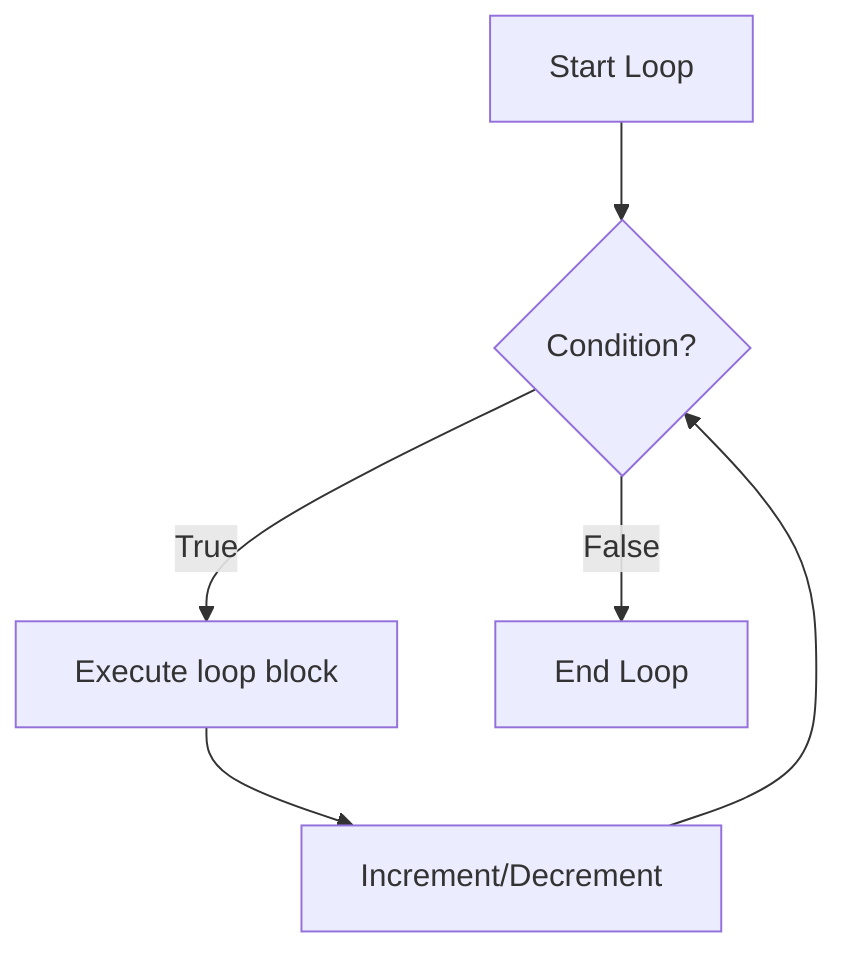

---
id: lesson-2
title: "Loops in PHP"
sidebar_label:  Loops
sidebar_position: 2
description: "Learn Loops in PHP"
tags: [courses,beginner-level,php,Introduction]
---   

 
1. **for Loop**
2. **while Loop**
3. **do-while Loop**
4. **foreach Loop**
 

### for Loop

```php
<?php
for ($i = 0; $i < 5; $i++) {
    echo "The number is: $i <br>";
}
?>
```

### while Loop

```php
<?php
$i = 0;
while ($i < 5) {
    echo "The number is: $i <br>";
    $i++;
}
?>
```

### do-while Loop

```php
<?php
$i = 0;
do {
    echo "The number is: $i <br>";
    $i++;
} while ($i < 5);
?>
```

### foreach Loop

```php
<?php
$colors = array("red", "green", "blue");
foreach ($colors as $color) {
    echo "The color is: $color <br>";
}
?>
```

### Break and Continue Statements

#### break Statement

```php
<?php
for ($i = 0; $i < 10; $i++) {
    if ($i == 5) {
        break;
    }
    echo "The number is: $i <br>";
}
?>
```

#### continue Statement

```php
<?php
for ($i = 0; $i < 10; $i++) {
    if ($i == 5) {
        continue;
    }
    echo "The number is: $i <br>";
}
?>
```

### Mermaid Diagram




### Example 

```php
<?php
// Conditional Statements
$number = 5;

if ($number > 0) {
    echo "The number is positive.<br>";
} elseif ($number < 0) {
    echo "The number is negative.<br>";
} else {
    echo "The number is zero.<br>";
}

$day = "Wednesday";

switch ($day) {
    case "Monday":
        echo "Today is Monday.<br>";
        break;
    case "Tuesday":
        echo "Today is Tuesday.<br>";
        break;
    default:
        echo "Today is neither Monday nor Tuesday.<br>";
}

// Loops
for ($i = 0; $i < 3; $i++) {
    echo "for loop iteration: $i<br>";
}

$i = 0;
while ($i < 3) {
    echo "while loop iteration: $i<br>";
    $i++;
}

$i = 0;
do {
    echo "do-while loop iteration: $i<br>";
    $i++;
} while ($i < 3);

$colors = array("red", "green", "blue");
foreach ($colors as $color) {
    echo "foreach loop color: $color<br>";
}

// Break and Continue
for ($i = 0; $i < 5; $i++) {
    if ($i == 3) {
        break;
    }
    echo "Break example iteration: $i<br>";
}

for ($i = 0; $i < 5; $i++) {
    if ($i == 3) {
        continue;
    }
    echo "Continue example iteration: $i<br>";
}
?>
```

### Output

<BrowserWindow>
    <div>
        <p>The number is positive.</p>
        <p>Today is neither Monday nor Tuesday.</p>
        <p>for loop iteration: 0</p>
        <p>for loop iteration: 1</p>
        <p>for loop iteration: 2</p>
        <p>while loop iteration: 0</p>
        <p>while loop iteration: 1</p>
        <p>while loop iteration: 2</p>
        <p>do-while loop iteration: 0</p>
        <p>do-while loop iteration: 1</p>
        <p>do-while loop iteration: 2</p>
        <p>foreach loop color: red</p>
        <p>foreach loop color: green</p>
        <p>foreach loop color: blue</p>
        <p>Break example iteration: 0</p>
        <p>Break example iteration: 1</p>
        <p>Break example iteration: 2</p>
        <p>Continue example iteration: 0</p>
        <p>Continue example iteration: 1</p>
        <p>Continue example iteration: 2</p>
        <p>Continue example iteration: 4</p>
    </div>
</BrowserWindow>

:::tip
- Use `if-else` statements to execute different blocks of code based on conditions.
- Use `switch-case` for selecting one of many blocks of code to execute.
- Use loops (`for`, `while`, `do-while`, `foreach`) for repeated execution of a block of code.
- Use `break` to exit a loop or switch statement.
- Use `continue` to skip the current iteration of a loop and move to the next iteration.
:::