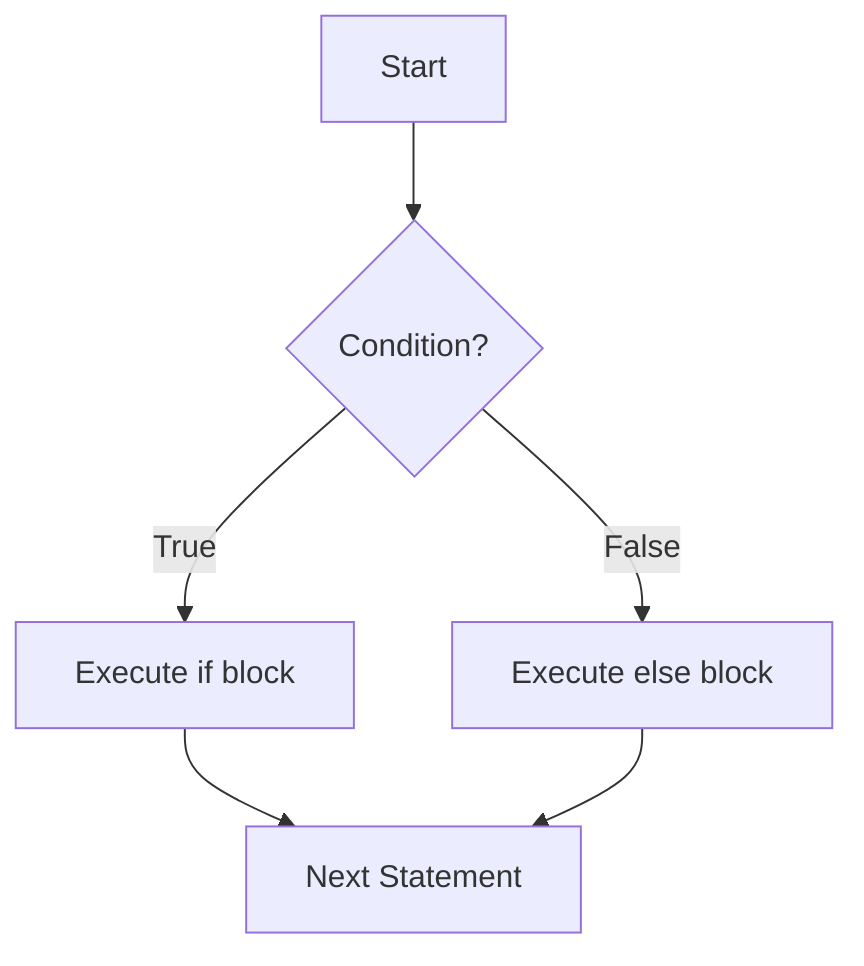
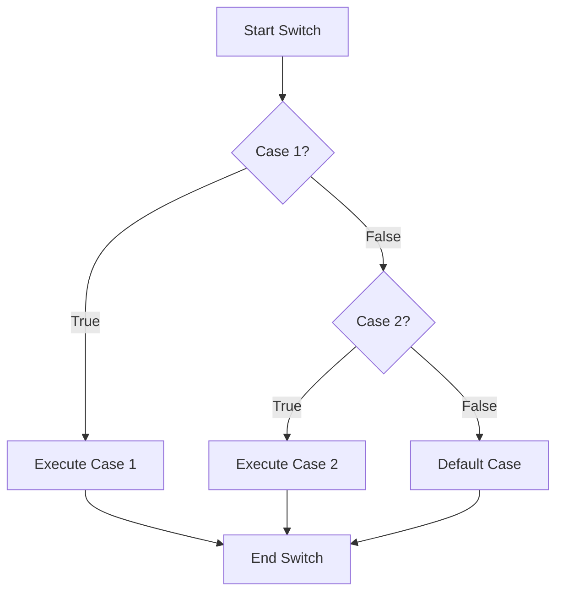

---
id: lesson-1
title: "Conditional Statements in PHP"
sidebar_label: Conditional Statements
sidebar_position: 1
description: "Learn Conditional Statements in PHP"
tags: [courses,beginner-level,php,Introduction]
---   

 
1. **if Statement**
2. **if-else Statement**
3. **switch-case Statement**

### Flowchart



### if Statement

```php
<?php
$number = 10;
if ($number > 0) {
    echo "The number is positive.";
}
?>
```

### if-else Statement

```php
<?php
$number = -10;
if ($number > 0) {
    echo "The number is positive.";
} else {
    echo "The number is negative.";
}
?>
```

### switch-case Statement

#### Flowchart



```php
<?php
$day = "Monday";
switch ($day) {
    case "Monday":
        echo "Today is Monday.";
        break;
    case "Tuesday":
        echo "Today is Tuesday.";
        break;
    default:
        echo "Today is neither Monday nor Tuesday.";
}
?>
```

