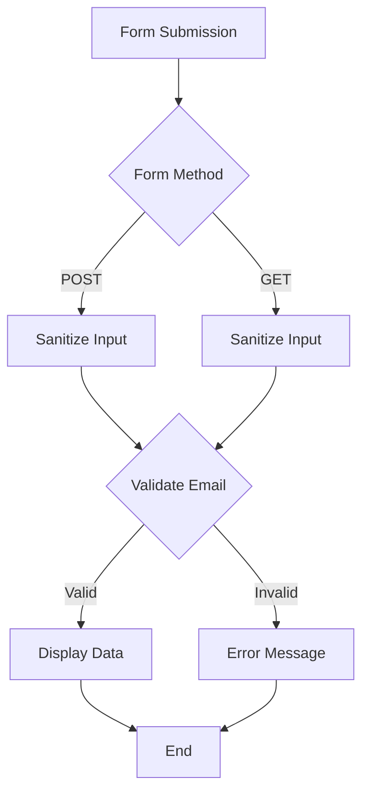

---
id: lesson-1
title: "Forms and User Input in PHP"
sidebar_label:  Forms and User Input 
sidebar_position: 1
description: "Forms and User Input in PHP"
tags: [courses,beginner-level,php,Introduction]
---   

#### Topics Covered:
1. **Creating HTML Forms**
2. **Handling Form Data with PHP** 

### Creating HTML Forms

HTML forms are used to collect user input. The `<form>` element can contain various types of input elements like text fields, radio buttons, checkboxes, etc.

### Flowchart




```html
<!DOCTYPE html>
<html>
<body>

<h2>PHP Form Example</h2>
<form action="process_form.php" method="post">
  Name: <input type="text" name="name"><br><br>
  Email: <input type="email" name="email"><br><br>
  <input type="submit" value="Submit">
</form>

</body>
</html>
```

### Handling Form  

The `process_form.php` file handles the form data submitted by the user.

```php
<?php
if ($_SERVER["REQUEST_METHOD"] == "POST") {
    // Collecting value of input field
    $name = $_POST['name'];
    $email = $_POST['email'];
    
    echo "Name: " . htmlspecialchars($name) . "<br>";
    echo "Email: " . htmlspecialchars($email) . "<br>";
}
?>
```