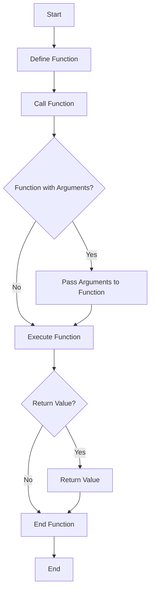

---
id: lesson-1
title: "Functions in PHP "
sidebar_label:  Functions
sidebar_position: 1
description: "Learn Functions in PHP"
tags: [courses,beginner-level,php,Introduction]
---     

#### Defining and Calling Functions

In PHP, functions are defined using the `function` keyword, followed by the function name, parentheses `()`, and a block of code enclosed in curly braces `{}`.


#### Flowchart



```php
<?php
// Defining a function
function sayHello() {
    echo "Hello, World!";
}

// Calling the function
sayHello();
?>
```

#### Output:
<BrowserWindow> 
   <p>Hello, World!</p>
</BrowserWindow>


### Function Arguments and Return Values

Functions can accept parameters and return values.

```php
<?php
// Function with parameters
function greet($name) {
    return "Hello, $name!";
}

// Calling the function with arguments
echo greet("Alice");
?>
```

#### Output:
<BrowserWindow> 
   <p>Hello, Alice!</p>
</BrowserWindow>
